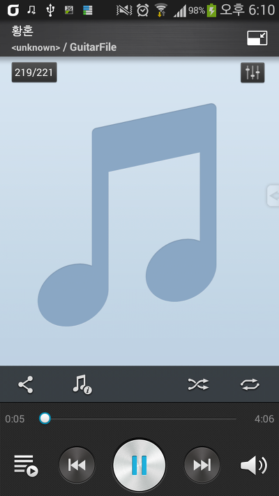

베가 시크릿 노트의 MusicPlayer입니다

베가 아이언때부터 본격적으로(?) 수정되기 시작한 어플 UI인대요

요즘 팬택 UI는 뭔가 갤럭시 UI보다 더 깔끔한거 같아요

UI바꾸지 말고 저 어플 아이콘부터 어떻게좀 하지;

UI는 아래와 같습니다

상단바에는 아래처럼 표시됩니다

[DownLoad]

[VEGAMusicPlayer.apk](https://github.com/itmir913/archive/releases/download/itmir-attachments/411-VEGAMusicPlayer.apk)