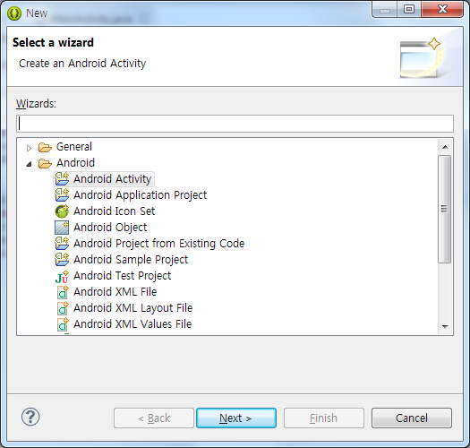
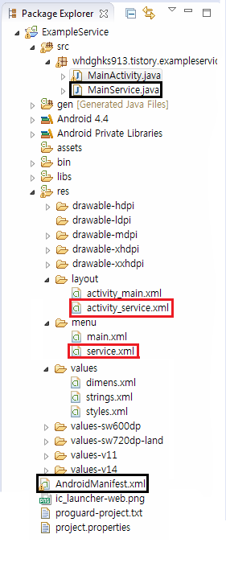
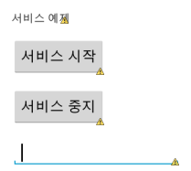

안녕하세요

이번에는 서비스(Service)에 대해 알아보겠습니다

서비스는 어플을 만들때 자주 쓰이는 기능입니다

빨리 서비스에 대해 언급하고 싶어서 너무 입이 간질간질 했답니다 ㅋㅋㅋㅋㅋ

말씀드린대로(?) 20번대 강좌에서는 어플을 만들때 실질적으로 필요한 요소를 하나씩 배워보겠습니다

## 23. Service (서비스)에 대해 알아보자

### 23-1 서비스란?

간단하게 말하면 모습이 없는 그림자? 랄까요?

설정에서 볼수 있는 실행 중 탭의 모습입니다

저처럼 서비스는 보이지는 않지만 실행중인 어플들을 의미한다 라고 이해하시면 편합니다

이제부터 서비스가 뭔지, 그리고 어떻게 만드는지에 대해 알아보겠습니다

### 23-2 java파일을 하나 생성해 봅시다

일단 서비스도 java파일로 구성되어 있으므로 한번 해봤던 액티비티 생성을 해보겠습니다

컨트롤 + N을 누르면 아래 화면이 나타납니다

액티비티 만들때처럼 추가해 주고요

이름도 지어줍니다 저는 MainService라고 지었습니다 ㅎㅎ

완료하셨다면 Finish를 눌러 마쳐주세요

자, 그럼 하나의 액티비티가 생성되었습니다

이를 그대로 사용하면 일반 화면이 되는데요

이제 서비스파일(말이 애매하네요;)을 만들어 보겠습니다

아래는 기본적으로 액티비티를 만들고나서 수정/삭제 해야되는 파일들을 체크한 사진입니다

**검은색 : 수정**, **빨간색: 삭제**

서비스는 모습(화면)이 없습니다 그러므로 layout파일과 menu파일은 필요가 없으므로 삭제해 주시면 됩니다

AndroidManifest.xml은 아래와 같이 수정해 줍니다

<**activity**

    android:name="whdghks913.tistory.exampleservice.Service"

    android:label="@string/title\_activity\_service" >

</activity>

위와 같은 모습을

<**service**

    android:name="whdghks913.tistory.exampleservice.Service"

    android:label="@string/title\_activity\_service" />

이렇게 바꿔주세요

달라진게 있다면 activity를 service로 바꾸는거 외에는 없죠?ㅋㅋ

마지막으로 Service.java파일을 수정해 주어야 합니다

일반 화면은 Activity라는것을 상속하지만 서비스는 Service를 상속해서 만들어 집니다

public class Service extends Activity {

    @Override

    protected void onCreate(Bundle savedInstanceState) {

        super.onCreate(savedInstanceState);

setContentView(R.layout.activity\_service);

    }

@Override

public boolean onCreateOptionsMenu(Menu menu) {

// Inflate the menu; this adds items to the action bar if it is present.

getMenuInflater().inflate(R.menu.service, menu);

return true;

}

}

위 코드를 아래와 같이 수정해 봅시다

변한 부분을 알아보기 쉽게 굵은글씨와 취소선을 사용했습니다

public class MainService extends **Service** {

    @Override

    public void onCreate() {

**super.onCreate();**

    }

**@Override**

**public int onStartCommand(Intent intent, int flags, int startId) {**

**// TODO Auto-generated method stub**

**return super.onStartCommand(intent, flags, startId);**

**}**

**@Override**

**public IBinder onBind(Intent intent) {**

**// TODO Auto-generated method stub**

**return null;**

**}**

**@Override**

**public void onDestroy() {**

**// TODO Auto-generated method stub**

**super.onDestroy();**

**}**

}

안드로이드의 서비스는 Service를 상속해서 만들어 집니다 (빨간색 밑줄)

그리고 위에 있는 세가지 메소드 onCreate(), onBind(), onDestroy()는 필수적으로 포함되어야 하는 메소드들 입니다

onBind()에 대해서는 이 강좌에서는 언급하지 않고 조금 시간이 지난뒤에 다뤄보겠습니다

### 23-3 메인 화면 레이아웃

레이아웃은 아래와 같이 짜주세요

간단하게 버튼을 사용하여 서비스를 시작, 중지할수 있도록 했습니다

또한 각각의 버튼에는 android:onClick옵션을 달아주세요

저 EditText는 직접 mp3 경로를 입력하는 공간입니다~

xml파일은 따로 올리지 않겠습니다 ㅎ

참조 : [[Development/App] - #6 버튼을 만들어 보자](http://itmir.tistory.com/295)

저는 각각의 버튼의 onClick옵션을

android:onClick="startServiceMethod"

android:onClick="stopServiceMethod"

이렇게 주었습니다

이제 MainActivity.java로 넘어와서 서비스를 실행하는 메소드를 각각 만들어 줍시다

public void **startServiceMethod**(View v){

    Intent Service = new Intent(this, **MainService.class**);

**Service.putExtra("FilePath", editText1.getText().toString());**

**startService(Service);**

}

서비스 시작 버튼에 연결된 메소드에는 위와 같이 코드를 작성해 줍니다

이때 주의깊게 봐야 하는것들이 있습니다

바로 startService();부분 입니다

사실 이 구문은 비슷하지만 전에 배운적이 있습니다

버튼을 배울때 배웠는데요 액티비티 전환 명령과 유사합니다

액티비티를 이동할때 쓰인 명령어와 딱히 다를게 없다는 것을 발견할수 있습니다!

Intent myintent = new Intent(this, (이동할 액티비티 이름).class);

**startActivity**(myintent);

Intent Service = new Intent(this, (실행할 서비스 이름).class);

**startService**(Service);

이렇게 비교해 보면 다른게 명령어 하나 라는것 말고는 찾아볼수가 없습니다

이처럼 서비스도 startService()라는 간단한 문구 하나로 실행이 가능하다 라는것을 알수 있습니다

그다음 Service.putExtra("FilePath", editText1.getText().toString());

이부분은 mp3경로를 입력하여 입력한 값을 Intent를 이용하여 서비스로 보내기 위해 사용하고 있습니다

(나중에 Intent에 대해 자세하게 배울예정)

다음은 서비스 정지 버튼입니다

public void **stopServiceMethod**(View v){

    Intent Service = new Intent(this, **MainService.class**);

**stopService(Service);**

}

서비스 시작과 다른게 하나 뿐입니다

startService()

stopService()

꼭 익혀두세요~

마지막으로 EditText처리를 해줘야 합니다

EditText editText1;

...

editText1 = (EditText) findViewById(R.id.editText1);

### 23-4 서비스로 어떤 예제를 만드나요?

전에 음악 재생 강좌 기억하시나요?

[[Development/App] - #18 소리를 재생해 보자 - MusicPlayer](http://itmir.tistory.com/364)

이 예제의 문제점이라면 어플을 종료할경우 소리가 꺼지는 문제가 있습니다

그러나 서비스를 배운다면 백그라운드에서도 노래가 흘러나오는 시중 뮤직 플레이어와 같은 기능을 만들수 있습니다

그래서 이번에는 저 예제를 좀더 심화 시켜보겠습니다

### 23-5 서비스.java

자 이제 서비스 파일을 본격적으로 수정해 봅시다

나중에 몰아서 배우겠지만 일반적으로 서비스는 아래 메소드가 순차적으로 실행됩니다

onCreate() → onStartCommand() → Service Running → onDestroy()

이 순서를 잘 기억하여 서비스를 구상하면 됩니다

그럼 우리가 만들고자 하는것은 백그라운드에서 동작하는 뮤직 어플이므로 한번 구현해보겠습니다

이번에는 우리가 직접 경로를 입력하여 소리를 재생할수 있도록 해봅시다

이번 예제는 이전 강의의 완벽한 학습을 필요로 합니다 꼭 마스터 한다음 진행하세요

[[Development/App] - #20 쓰레드(Thread)와 핸들러(Handler)](http://itmir.tistory.com/366)

[[Development/App] - #18 소리를 재생해 보자 - MusicPlayer](http://itmir.tistory.com/364)

[[Development/App] - #6 버튼을 만들어 보자](http://itmir.tistory.com/295)

처음에 아래 문구를 추가해 주세요

MediaPlayer music;

String FilePath;

그다음 onCreate메소드 안에 아래 문구가 필요합니다

music = new MediaPlayer();

music.**setOnCompletionListener**(new OnCompletionListener() {

    @Override

    public void onCompletion(MediaPlayer mp) {

        // TODO Auto-generated method stub

**stopSelf();** // 서비스 종료

    }

});

setOnCompletionListener이라는 처음보는 리스너가 등장합니다

이는 이름에서 유추할수 있드시 노래가 끝나면 실행되는 메소드 입니다

그 아래에 있는 stopSelf();는 서비스를 스스로 종료하는(?) 명령입니다

즉 노래가 끝나면 자동으로 서비스가 종료되는 거죠

onStartCommand()안에는 아래 문구를 넣어주세요

FilePath = **intent.getStringExtra("FilePath");**

**File mp3File = new File(FilePath);**

if(**! mp3File.exists()**){

    Toast.makeText(this, "파일이 없습니다", Toast.LENGTH\_LONG).show();

    stopSelf();

}else{

new Thread(task).start();

}

처음보는 문구들도 많이 있네요 ㅋ

MainActivity.java에서 putExtra를 사용한거 기억하시나요?

intent.getStringExtra("FilePath");은 이렇게 집어넣은 String을 가져오는 구문입니다

그 아래에 있는 File mp3File = new File(FilePath);은 파일을 관리할때 사용하는데요

나중에 배울기회가 있을겁니다

지금은 이것보다 아래에 있는 **if(! mp3File.exists())**이 더 중요합니다

if(! mp3File.exists())

mp3File.exists()은 얻은 파일의 경로가 존재할경우 true, 없을경우 false를 반환합니다

그런대 앞에 ! 연산자가 있으니 반대가 되겠죠?

저 경우는 있을경우 false, 없을경우 true가 됩니다

참조 : [[Development/Java] - 계산을 할수 있는 연산자에 대해 알아보자! - 2편](http://itmir.tistory.com/158)

파일이 없을경우 없다는 알림을 띄우고 서비스를 종료합니다

그러나 파일이 존재할경우 쓰래드를 실행합니다

onStartCommand()메소드가 끝난지점 바로 아래에 추가해 주세요

Runnable task = new Runnable(){

    public void run(){

        try {

**music.setDataSource(FilePath);**

            music.prepare();

**music.start();**

        } catch (Exception e) {

            // TODO Auto-generated catch block

            e.printStackTrace();

        }

    }

};

위 구문은 쓰레드와 소리 재생 강좌가 합쳐졌다는 의의가 있습니다

파일이 있을경우 DataSource를 지정하고 재생을 시작합니다

onDestroy()에는 아래 문구를 넣어주세요

if(music.isPlaying()){

    music.stop();

    music.release();

}

서비스가 종료될때 재생을 중단합니다

이미 배운 구문이므로 자세한 설명은 하지 않겠습니다

자 이렇게 해서 서비스에 대해 조금 살펴보았습니다

실제로 작동을 잘 하는지 테스트 해보겠습니다

[임베드 콘텐츠: https://play-tv.kakao.com/embed/player/cliplink/vb6b7qJJEaSwIyyELSqKSKw?service=daum\_tistory](https://play-tv.kakao.com/embed/player/cliplink/vb6b7qJJEaSwIyyELSqKSKw?service=daum_tistory)

(소리가 안들리면 볼륨을 높혀주세요)

서비스는 알림창에 띄워 진행상황을 알리거나, 파일 다운로드 등 여러군대 쓰이므로 꼭 숙지해야 합니다

단계별 프로젝트(?)를 통해 점차적으로 조금씩 어떻게 서비스를 이용하는지 배울 예정이고

점차 심화/응용한 예제를 들고 오겠습니다!

[ExampleService.zip

다운로드](./file/ExampleService.zip)

---

## 첨부파일

- [ExampleService.zip](https://github.com/itmir913/archive/releases/download/itmir-attachments/ExampleService.zip) `1.4 MB`
