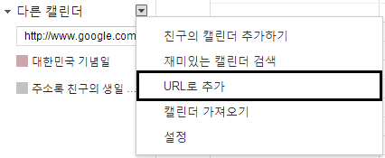
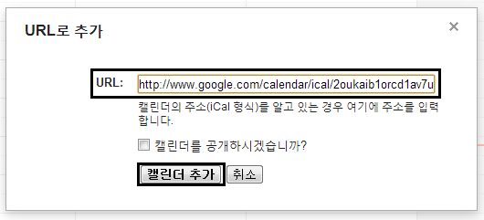
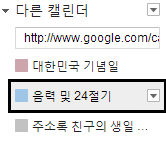
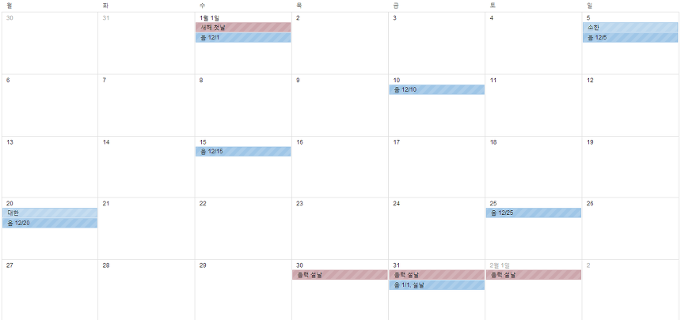
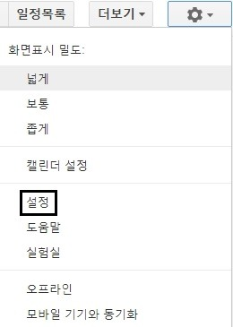
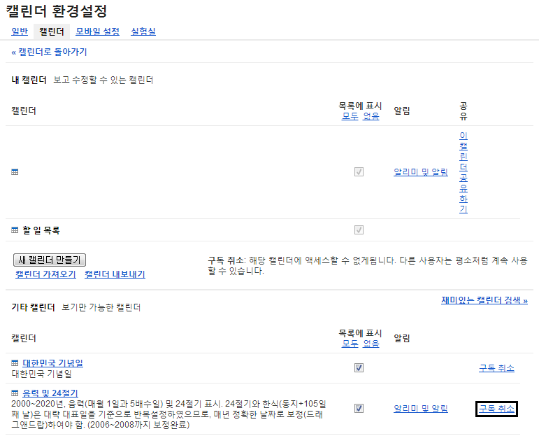

안녕하세요. ㅎㅎ

이번에는 구글 캘린더 팁을 들고 왔습니다.

구글 캘린더는 음력이 표시되지 않아 불편합니다.

그래서 찾아보니 좋은 방법이 있어 소개하려 합니다.

왼쪽 하단에 있는 다른 캘린더 ▼를 눌러 URL로 추가를 눌러주세요.

그럼 나타나는 창에 아래 문구를 입력해 주세요.

http://www.google.com/calendar/ical/2oukaib1orcd1av7ufj8qec2b8%40group.calendar.google.com/public/basic.ics

[code.txt](./files/code.txt)

또는 이메일을 입력하라고 하면 아래를 입력하세요.

dfqd944v7sda3pn5h1jbjn12ks@group.calendar.google.com

그 다음 캘린더 추가를 눌러주시면 됩니다.

다른 캘린더 란에 입력 및 24절기가 나타났습니다

그 뒤에 위처럼 음력과, 24절기 달력이 나타납니다.

삭제 방법은 아래와 같습니다.

먼저 설정에 들어가서,

캘린더 환경설정의 "캘린더"란에 들어간다음,

음력 및 24절기 구독 취소를 눌러주시면 됩니다.

출처 : <http://www.appmaru.com/?document_srl=580&mid=gosu>

---

## 첨부파일

- [code.txt](./files/code.txt)
