  

스터디체커 어플에 대해 우연히 발견하게 되어 며칠동안 삽질한 결과를 기록하고자 합니다.

스터디체커는 안드로이드 마켓에서 다운로드가 가능합니다.

<http://play.google.com/store/apps/details?hl=ko&id=com.mjsoft.apps.sc>

설치하신다음 실행하시면 아래와 같은 메인화면이 나타납니다.

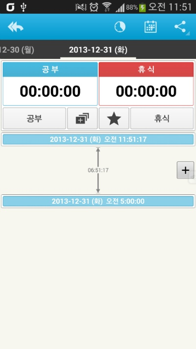

저는 이미 조금 손을 본 상태이기 때문이지만 처음 설치하면 위와는 조금 다를겁니다.

저기서 "공부"버튼을 누르면 지금부터 공부 기록이 가능합니다.

그리고 "휴식"버튼을 누르면 지금부터 휴식 시간 기록이 됩니다.

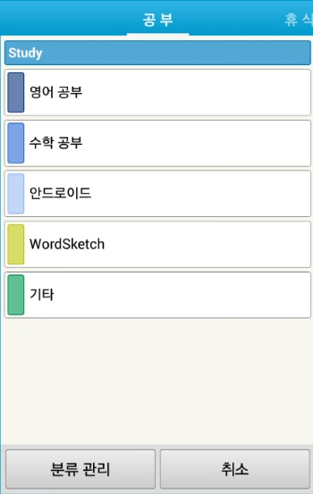
   
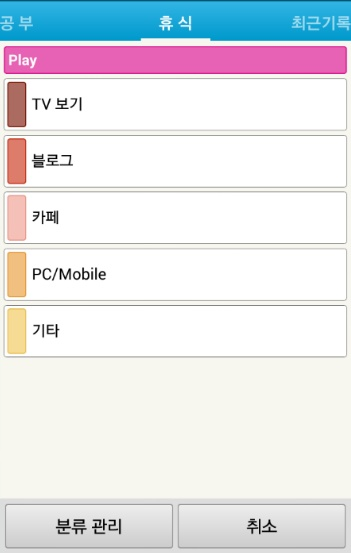

처음 설치하신다음 분류 관리를 눌러 저처럼 개성넘치게 수정해 주세요. ㅎㅎ

공부/휴식에서 한 아이탬을 터치하면 지금부터 기록이 시작됩니다.

아래는 제가 사용한 내역 예제입니다. ㅎㅎ

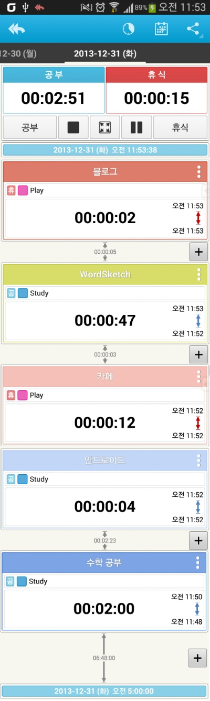

이런씩으로 하루 일과표처럼 운영이 가능합니다. ㅎㅎ

그 다음, 또 하나의 기능이 있다면 그래프로 통계 확인이 가능합니다.

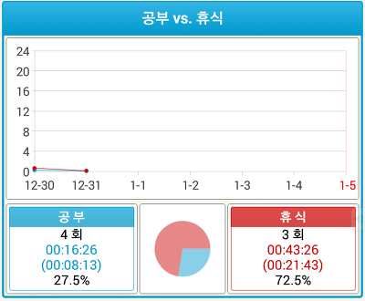
   
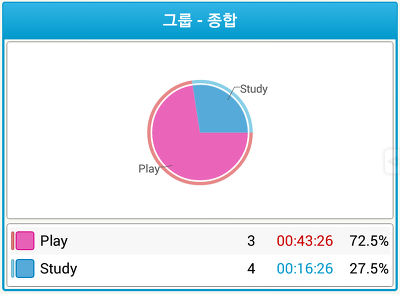

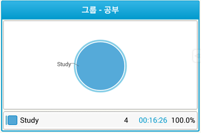
   
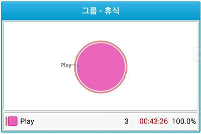

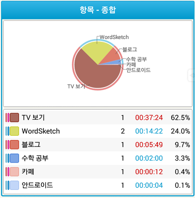
   
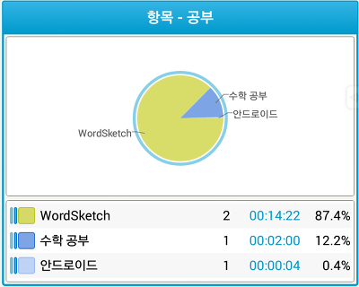

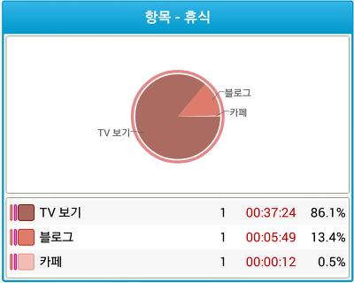

한 눈에 알아보기 쉽도록 그래프와 표를 제공합니다.

이번주/오늘/이번달에 얼마만큼 공부와 휴식을 했나?를 손쉽게 확인할 수 있습니다.

아래부터는 크랙 관련 기록입니다.

며칠간의 구글링 끝에 **작동이 잘 되는 pro버전**을 찾아내긴 했습니다. ㅎㅎ

그리고 일부 수정하여 현재 작동 확인 모두 완료했습니다.

찾아낸 파일들의 특징을 보면,

1. fake파일 ㅡㅡ

2. 최신 pro 버전이나 하루가 지나면 기록 안 됨 = 라이센스 크랙이 이루어지지 않은 앱

3. 약간 구버전이고, 라이센스 오류 있음 (실행 X)

**4. 구버전이나 작동 확인!!**

저는 4번 apk파일을 그냥 쓰기는 조금 귀찮아서(?) 최신 어플 아이콘으로 변경하고

필요 없는 권한 2개(인터넷 연결, 마켓 라이센스 확인)를 지웠습니다.

어디까지나 학습용이므로 ㅎㅎ...

그래도 3번파일과 4번파일을 비교 분석하여 어디가 수정되었는지 확인이 가능했습니다.

저번에 포스팅한 DRM 라이센스 관련 글에서 소개했던 **무조건 true 반환 방법**이 사용되었습니다.

[[Development/App] - 안드로이드 어플 라이센스 크랙하기 (DRM Crack)](/archive/itmir/2013/408)

수정된 파일은 smali\com\a\a\a\a\t.smali입니다.

.method public a()Z

    .locals 8

    const/4 v0, 0x1

**const/4 v1, 0x0**

    이하 생략

.end method

.method public a()Z

    .locals 8

    const/4 v0, 0x1

**return v0**

    이하 생략

.end method

ㅋㅋㅋㅋㅋㅋㅋㅋㅋㅋㅋㅋㅋㅋㅋㅋㅋㅋㅋㅋㅋㅋㅋㅋㅋㅋㅋㅋㅋㅋㅋㅋㅋㅋㅋㅋㅋㅋㅋㅋㅋㅋㅋㅋㅋㅋㅋㅋㅋㅋㅋㅋㅋㅋㅋㅋㅋㅋㅋ

정말 간단하지 않습니까?

0x1은 true, 0x0은 false라고 했는데,

여기서는 0x1을 바로 return해버리고 있습니다. ㅋㅋ

return이 실행되면 값이 반환된다는 의미도 있지만 아래 있는 구문들은 별 의미가 없습니다.

그러므로 어떤 경우든 true가 반환되는 것이지요. ㅎ

이 파일 말고 다른 파일도 수정되었던데, 그건 왜 수정되었는지 이유를 모르겠어서 따로 살펴보진 않겠습니다.

저는 학습용으로만 apk를 뜯어봤습니다.

pro버전 라이센스 건너뛰기가 이렇게 간단하게 뚤립니다.

그러므로 꼭 안드로이드 난독화를 적용하여 디컴파일을 아에 막아버리게 하던가 근본적인 대책이 있어야 하지 않을까요? ㅋ

ps. 무료버전은 날짜가 하루만 기록되고 이후로는 기록이 안 되니, 이 앱이 마음에 드신다면 Pro 버전을 사용해 보는 것도 나쁘지는 않을거 같습니다.

ps. 저는 이 앱을 유료로 구매하였습니다.