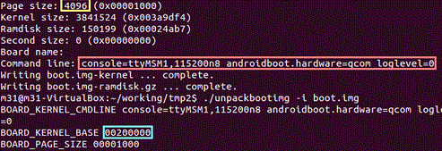
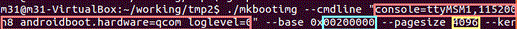

이 강좌에서 boot.img를 분해하고 조립(?)하는 방법을 배워보겠습니다.

일단 첨부파일을 모두 받아주세요.

또한 이 강좌를 위해선 우분투가 있어야 하며, 또한 각종 터미널 사용법은 아셔야 진행하실수 있습니다.

그리고 원본 boot.img를 준비해주세요.

모든 파일을 한 폴더로 모아주세요.

그리고 터미널을 켜서 그 폴더로 이동해 줍니다.

이 강의에선 이해하기 쉽게 boot라는 폴더를 사용하겠습니다.

다음 명령어로 폴더에 들어갑니다.

cd ~/바탕화면/boot

그뒤 권한을 부여해줘야 합니다.

chmod 777 unpackbootimg

chmod 777 split\_bootimg.pl

chmod 777 mkbootimg

권한을 모두 주셨으면 본격적으로 작업에 들어갈까요?ㅎ

./split\_bootimg.pl boot.img

입력하시게 되면 Page size, Command line이 나타나게 됩니다.

꼭 기억해 두세요!

그 다음

./unpackbootimg -i boot.img

을 입력하시게 되면 BOARD\_KERNEL\_BASE이 나타납니다. 이것도 중요합니다!

이제 램디스크 압축을 풀어봅시다.

gzip -d boot.img-ramdisk.gz

위 명령어를 입력하게 되면, cpio가 나타나게 됩니다.

이 파일을 ramdisk라는 폴더를 만들어 그 폴더 안에 넣어 주세요.

cd ramdisk 명령어를 쳐서 ramdisk 폴더로 이동합니다.

cpio -i -F boot.img-ramdisk

이제 위 명령어를 입력하시면, cpio의 내용물이 풀려지게 됩니다.

이제 boot.img-ramdisk 파일은 삭제하셔도 됩니다.

  

마음것 램디스크를 수정하세요!!

램디스크를 모두 수정하셨다면 합쳐야 합니다.

램디스크 파일이 들어있는 폴더속에서

find . | cpio -o -H newc -O ../ramdisk

cd ..

gzip ramdisk

를 입력하시면 램디스크 파일이 나타나게 됩니다.

이제 커널과 램디스크 파일을 합쳐야 합니다.

./mkbootimg --cmdline "(아까 얻은 Command line값)" --base 0x(아까 얻은 base값) --pagesize (아까 얻은 pagesize 값) --kernel boot.img-kernel --ramdisk ramdisk.gz -o make-boot.img

(위 mkbootimg명령어는 길어보이지만 한줄로 한번에 입력하셔야 합니다)

아래는 M31님의 게시글안 사진 일부입니다.

이 두 사진을 참고하셔서 입력하시면 됩니다.

이제 완료되었습니다!

make-boot파일이 완성되었습니다!

이것을 이제 기기에 적용하면 끝나게 됩니다.

위 명령어는 txt파일로 올려두었습니다.

[boot.img 분해 조립.txt](./files/boot.img 분해 조립.txt)

[mkbootimg](https://github.com/itmir913/archive/releases/download/itmir-attachments/48-mkbootimg)

[unpackbootimg](https://github.com/itmir913/archive/releases/download/itmir-attachments/48-unpackbootimg)

[split\_bootimg.pl](./files/split_bootimg.pl)

요즘 나온 스마트폰들은 대부분 ramdiskaddr을 지정해 주어야 부팅이 됩니다.

만약 부트 이미지 분해시 ramdiskaddr이 나올경우 아래 mkbootimg링크를 따라 들어가 업데이트된 파일을 받은다음 ./mkbootimg 명령어 마지막 부분(-o)전쪽에 "--ramdiskaddr 0x값" 을 넣어 주시면 됩니다.

[2013/03/24 - [강좌/팁/Ubuntu 강좌] - mkbootimg](/archive/itmir/2013/181)

[2013/01/27 - [강좌/팁/Ubuntu 강좌] - 우분투 64Bit unpackbootimg 오류 해결법](/archive/itmir/2013/34)

---

## 첨부파일

- [boot.img 분해 조립.txt](./files/boot.img 분해 조립.txt)
- [mkbootimg](https://github.com/itmir913/archive/releases/download/itmir-attachments/48-mkbootimg) `32 KB`
- [split_bootimg.pl](./files/split_bootimg.pl)
- [unpackbootimg](https://github.com/itmir913/archive/releases/download/itmir-attachments/48-unpackbootimg) `17 KB`