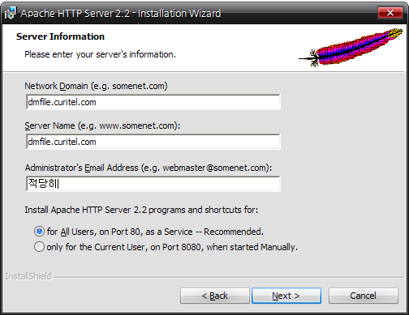
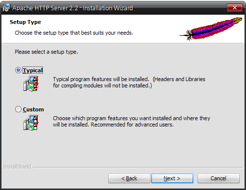
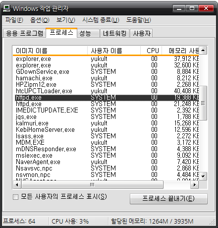
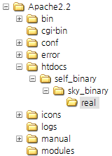
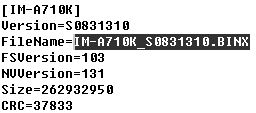
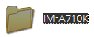
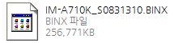
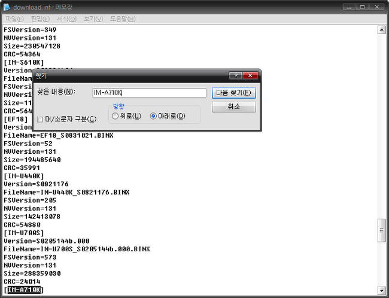
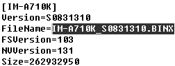
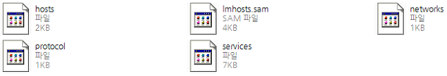

스카이는 BINX를 이용하여 셀프 업데이트를 합니다

그럼 이를 이용하면 다른 기종의 펌웨어나 유출된 버전을 먼저 맛볼수 있습니다

방법은 두가지 정도 있는대요

하나는 완전 쉬운 방법

하나는 아파치를 이용하는 방법 입니다

(1). BINX 교체

먼저 기기가 인식되어야 합니다

그리고 binx는 당연히 가지고 계셔야 겠죠?

또한 타이밍이 아주 중요합니다 ㅎ

일단 정상적으로 셀업을 진행해 주세요

c:\user\사용자명\appdata\local\temp

이 경로의 폴더로 진입합니다

귀찮으시면 시작-실행에 %temp%를 치셔도 됩니다

그럼 binx확장자를 가지고 있는 파일을 볼수 있는대요

우리는 이걸을 이용할겁니다

바꾸실 binx의 이름을 temp에 있는 binx의 이름과 같게 해주세요

그다음 셀업창에서 다운로드 100% 에서 업데이트중 으로 넘어가는 타이밍에 정확이 이동해 주세야 합니다

그 전에는 파일이 사용중이라 이동할수 없습니다

예를들어 이동할 binx가 바탕화면에 있다면 이 파일을 temp의 binx와 이름을 같게한뒤 100%타이밍에 맞춰 드레그 하면 되죠 ㅎ

다시시도 누르셔도 될것 같스므니다

이렇게 간단하게(?)변경할수 있습니다

(2).아파치 서버 이용

1. 아파치 웹 서버를 다운로드 받습니다.

2. 아래와 같이 설정 후 설치합니다.

3. 작업 관리자를 실행 후 아래와 같이 httpd.exe가 돌아가는지 확인합니다.

만약 뜨지 않는다면

C:\Program Files\Apache Software Foundation\Apache2.2\bin 폴더에

httpd라는 프로그램이 있습니다 그걸 실행하십시오

4. C:\Program Files\Apache Software Foundation\Apache2.2\htdocs (윈도우 버전이나 윈도우 설치 드라이브에 따라 다를 수 있습니다.) 에 들어갑니다. 안에 index.html이 있을겁니다.

5. htdocs 폴더 안에 아래와 같이 폴더를 차례대로 만들어줍시다.

6. download.inf를 다운로드합니다. (hosts파일을 수정하셨다면 원본으로 되돌려주세요. 만일 지금 hosts가 뭐지? 먹는건가? 그딴거 몰라, 외치고 있다면 이 괄호의 내용은 가볍게 무시하셔도 좋습니다.) 방금 전 만든 real 폴더 안에 넣어줍니다.

 → <http://dmfile.curitel.com/self_binary/sky_binary/real/download.inf>

그다음 SK에서 KT라면 download.inf파일을 엽니다 그리고 내칸쯤에 [IM-A740S] 라는것이 있습니다

이걸

[IM-A740S]

Version=S0210178

FileName=IM-A710K\_S0831318.BINX

FSVersion=281

NVVersion=131

Size=273147719

CRC=52712

만약 KT에서 SK라면

[IM-A710K]

Version=S0831318

FileName=IM-A740S\_S0210178.BINX

FSVersion=103

NVVersion=131

Size=271203467

CRC=29919

이렇게 바꿔줍시다.

7. 셀업에 필요한 binx 파일을 구합니다.binx는 host를 바꾸기 전에 해야합니다.

직접 구하려면 아래의 방법을 사용하시면 됩니다만

이건 SK에서 KT껄로 바꾸는것입니다.

http://dmfile.curitel.com/self\_binary/sky\_binary/real/IM-A710K/IM-A710K\_S0831162.BINX

http://dmfile.curitel.com/self\_binary/sky\_binary/real/IM-A740S/IM-A740S\_S0210178.BINX

이게 안된다면

host가 이미 바꾼것입니다

-------------------------------------------------------------------------------------------

이외 기종 셀업용 binx 파일 다운로드 방법

(1) 6번에서 받은 download.inf 파일을 엽니다.

(2) 자신의 기종 부분을 찾습니다. 아래 사진에 표시된 'FileName' 부분을 복사해둡니다.

(3) [http://dmfile.curitel.com/self\_binary/sky\_binary/real/(자신의 모델명)/(방금 복사한부분)] 를 웹 브라우저의 주소창에 입력하시면 자신의 기종에 알맞는 binx파일을 받으실 수 있습니다.

ex) http://dmfile.curitel.com/self\_binary/sky\_binary/real/IM-A710K/IM-A710K\_S0831162.BINX

-------------------------------------------------------------------------------------------

8. 아까 만든 'real'폴더 안에 자신의 모델명으로 폴더를 만듭니다. (아래는 예시입니다.)

9. 그 폴더 안에 binx파일을 넣어둡니다.

10. 아까 받은 download.inf파일을 열어서 자신의 모델명 부분을 찾습니다.

11. 'FileName'항목이 자신이 구한 binx파일의 이름과 같은지 확인합니다. 다르다면 자신이 구한 binx파일의 이름으로 바꿔준 뒤 저장합니다.

12. C:\WINDOWS\system32\drivers\etc 로 들어갑니다.

13. hosts파일이 있을겁니다. 일단 다른 곳으로 복사해 두는 등 백업,알집을 압축을 한 뒤 첨부파일로 덮어씁니다. (나중에는 반드시 원본으로 되돌려 놓아야 하므로 꼭 백업하세요.)

14. 셀업합니다.

15. hosts파일을 원본파일로 다시 바꿔줍니다.

셀업은 반드시 셀업모드에서 진행하세요.

아 힘들군요

아파치 셀업은 <http://cafe.naver.com/skydevelopers/9610>

M31님의 글을 인용하였습니다

이렇게 binx에 대한 설명을 마치겠습니다
