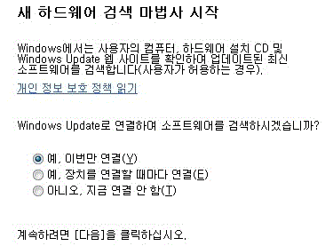
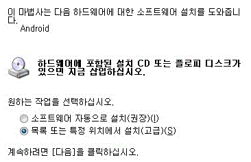
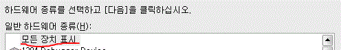
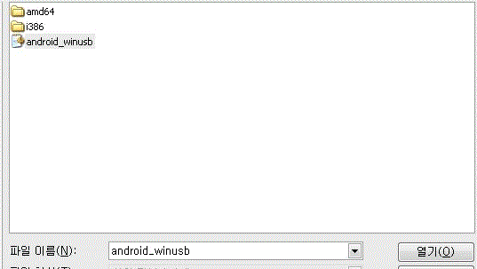

CWM Recovery를 설치하는 방법에 대해 포스팅 해보도록 하겠습니다

먼저 준비물이 필요한대요

1). 첨부파일 (새폴더님 게시글 첨부파일 이용)

2). Vega USB 드라이버

3). 루트 익스플로러

4). 터미널 에뮬레이터 (따로 Fastboot로 진입할수 있는 기기는 없어도 됩니다)

5). Fastboot드라이버

6). 기기의 recovery.img 파일

이 모든것을 준비해 주시길 바랍니다

그럼 시작하겠습니다

1. Vega USB 드라이버 설치

[이 링크](http://www.vegaservice.co.kr/down/software/main.sky)를 클릭하여 자신의 기기에 맞는 USB드라이버를 설치해 주세요

따로 사진과 언급은 하지 않겠습니다...

2. 루트익스플로러로 파일 삭제

/system에 있는 boot-from-recovery.p 파일과

/system/etc/install-recovery.sh파일을 제거해 주셔야 합니다

파일의 이름만 바꾸셔도 되고 백업해 두셔도 됩니다

이 파일들은 순정 리커버리로 되돌리는 역활을 하기 때문에 지우셔야 합니다

3. Fastboot모드로 재부팅

스마트폰 자체에 fastboot로 진입할수 있는 키가 있다면 진입해 주세요

만약 없다면 터미널 에뮬레이터를 열어 주신뒤 다음과 같이 입력해 주세요

su

reboot fastboot

그럼 fastboot로 재부팅 하게 됩니다

검은 화면에 SKY든 하얀화면의 SKY든 fastboot는 기기마다 모양이 조금씩 다릅니다

아니면 adb-windows reboot fastboot 명령어로 진입하셔도 됩니다

4. 컴퓨터와 연결

이상태에서 바로 USB로 컴퓨터와 연결해 주세요

윈도우7이신분들은 대부분 기기를 자동으로 인식하고 설치할겁니다

만약 드라이버가 설치되지 않았다는 표시가 뜨면 fastboot드라이버를 설치해야 합니다

인식되신 분들은 바로 5번으로 넘어가 주세요

그리고 첨부파일의 fastboot를 압축푼뒤 기기의 recovery파일을 그 폴더에 넣어주세요

fastboot드라이버를 설치하는 방법입니다 (참고: <http://cafe.naver.com/skydevelopers/5870>)

fastboot 드라이버 설치방법

첨부파일중 fastboot driver을 받아주신뒤 제어판에서 장치관리자를 들어가시면 ?Android가 있을겁니다

마우스 오른쪽 클릭, 드라이버 업데이트를 눌러줍시다

  
이 사진은 XP의 사진으로 추정됩니다

다음을 눌러주세요  
  
특정 위치에서 설치를 눌러주신후  
  
직접 찾아야 합니다  
  
모든 장치 표시를 선택해 주세요  
  
그 다음에서 디스크 있음을 눌러주신뒤  
  
찾아보기를 눌러서  
  
Fastboot Drivers폴더에 들어간뒤 android\_winusb를 클릭/열기 해주시면 완료됩니다  

그럼 설치가 끝나게 됩니다

윈도우7도 위와 비슷합니다

나중에 사진을 더 추가하도록 하겠습니다

5. CMD열기

시작-실행-cmd를 열어줍시다

그뒤 fastboot폴더가 있는 위치로 이동해 주세요

이동방법은 cd c:\fastboot

위와 같은 명령어 또는

압축푼 폴더를 Shift키+마우스 오른쪽키를 누르시면 여기서 명령창 열기라는 메뉴가 생기는대요 이걸로 가셔도 됩니다

아무튼 폴더로 이동하시고

fastboot-windows devices

fastboot-windows flash recovery recovery.img

를 입력하시면 됩니다

waiting for device이 개속 뜨면 드라이버가 재대로 설치되지 않아서 그런겁니다

Send ... OK

Write ... OK

가 뜨게되면 완료입니다

6. 완료

이재 리커버리로 재부팅 하세요

정상적으로 뜨게되면 완료입니다 ㅎ

명령어는 txt로 올려두었습니다

[ CWM 설치 명령어.txt](http://itmir.tistory.com/attachment/cfile30.uf@251FA84B5104D8BC311E26.txt)

[ Fastboot Driver.zip](http://itmir.tistory.com/attachment/cfile9.uf@1528354B5104D8C020B14B.zip)

[ Fastboot.zip](http://itmir.tistory.com/attachment/cfile7.uf@151CD84B5104D8C4357833.zip)

[2013/01/27 - [강좌/팁/SmartPhone 강좌] - Boot.img Recovery.img 원클릭 적용툴](http://itmir.tistory.com/27)
