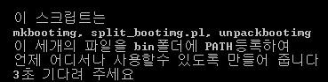

제목을 만들기가 힘들군요..

더 설명하자면,

mkbootimg, split\_bootimg.pl, unpackbootimg

이 세개의 파일을 터미널 어디서나 실행할수 있도록 bin에 PATH로 등록해 주는 스크립트입니다.

요즘 쉘 스크립트 만드는게 너무 재밌어서 계속 만들게 되네요. ㅋㅋㅋㅋ

아무튼 사용법은 첨부파일을 받아서 모든 파일을 한폴더에 넣으신 후,

PATH.sh에 권한을 주신 다음, 터미널로 실행 또는 터미널에서 ./PATH.sh 하시면 됩니다.

그럼 친절하게 한글로 나와있습니다.

원리를 말씀드릴 것이야 없겠지만, 굳이 말하자면...

세개의 파일을 모두 ~/bin혹은 /bin에 복사합니다.

이때 cp \* ~/bin을 이용하기 때문에 세개의 파일 외 추가할 것이 있으시면

압축풀으신후 한폴더에만 넣으신뒤 sh를 실행하면 모두 패치 적용됩니다.

그 뒤 PATH명령을 내립니다.

단 /bin의 경우는 이미 되어 있으므로 이 작업을 생략합니다.

그 다음 권한을 준 뒤 함께 옮겨졌던 PATH.sh를 삭제하는 방식입니다.

위 사진과 비슷(?)합니다.

간단하니 뜯어보시면 모두 아실만한 구조입니다.

그럼 유용하게 사용하셨으면 합니다~

[PATH.zip](./file/PATH.zip)

---

## 첨부파일

- [PATH.zip](https://github.com/itmir913/archive/releases/download/itmir-attachments/PATH.zip) `21 KB`
