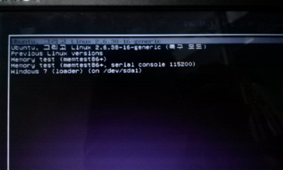
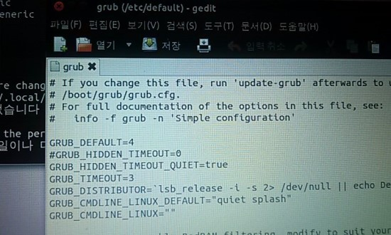

아마 우분투만 본OS로 사용하시는 분은 극히 드믈거란 생각이 듭니다.

왜냐하면 윈도우에서 인터넷 뱅킹등의 일을 할 수 있기 때문이죠.

여담인데, 인터넷 뱅킹이 되는 나라 중 유일하게(?) 리눅스에서 안되는 나라가 우리나라라고 합니다. 확실하진 않지만요..ㅋㅋ

아무튼 대부분 우분투를 사용하신다면 우분투와 윈도우 모두 깔아 쓰실 듯 싶습니다.

그런대 윈도우가 설치된 상태에서 우분투를 설치하게 되면 어떻게 될까요?

리눅스의 부트로더인 Grub가 윈도우의 부트로더를 덮어씌우게 됩니다.

그리고 기본으로 부팅되는 것이 우분투가 될 것입니다.

이제 이것을 바꿔주어야 합니다.

위 사진이 Grub입니다.

사진 보시면 아시다싶이 기본은 Ubuntu로 잡혀있네요.

이것을 Windows7으로 바꿔주는 방법은 2가지가 있습니다.

Grub는 grub와 Grub2가 있습니다.

이것은 같은 버전의 우분트라도 PC마다 설정 파일의 위치가 다르다는 뜻입니다.

그러므로 자신의 환경에 맞게 방법을 선택하시면 됩니다.

1. /etc/default/grub 파일 수정 (Grub2의 경우)

/etc/default/grub이 있을경우 이 파일을 수정해야 합니다.

루트계정은 비번을 안쳐도 되므로 여러가지에서 편합니다.

**sudo gedit /etc/default/grub**

이렇게 치시고 su비번을 치시게 되면 에디터 창이 나오게 됩니다.

whdghks@Ubuntu:~$ sudo gedit /etc/default/grub

[sudo] password for whdghks:

이때 아무것도 없는 빈파일이 나타나거나 혹은 파일이 없다는 오류가 나타나게 된다면 2번 방법을 시도해 주시길 바랍니다.

grub를 열어보면

grub_default     0

이런 구문을 보실 수 있을겁니다. (대문자로 되어있을수도 있음)

이제 이 값을 변경해 주면 됩니다.

값은 어떻게 나오게 될까요?

아래 sudo update-grub 부분 밑에 설명하겠습니다.

그뒤 타임 아웃 시간도 지정할수 있습니다. 단위는 (초)입니다.

timeout     10

파일을 수정하신 후, 저장을 하기 바랍니다. (sudo또는 루트계정이 아닐경우 저장이 되지 않습니다.)

이제 수정하셨다면 반영을 해야겠죠?

**sudo update-grub**

whdghks@Ubuntu:~$ sudo update-grub

Generating grub.cfg ...

Found linux image: /boot/vmlinuz-3.0.0-12-generic

Found initrd image: /boot/initrd.img-3.0.0-12-generic

Found memtest86+ image: /boot/memtest86+.bin

Found Windows 7 (loader) on /dev/sda1

done

이렇게 마무리게 됩니다

여기서 순서, 즉 default값에 들어갈 숫자에 대해 언급하겠습니다.

이게 좀 애매 합니다...

그냥 막노동으로 하셔도 됩니다;;

저는 어떻게 했냐면요

Ubuntu, with Linux 2.6.38-16                               0

Ubuntu, with Linux 2.6.38-16 (복구 모드)               1  
Previous Linux versions                                     2  
Memory test (memtest86+)                                   3  
Memory test (memtest86+, serial console 115200)   3  
Windows 7 (loader) (on /dev/sda1)                     4

이렇게 생각하였습니다.

우분투부터 0, 1,

Previous Linux versions이 2이고요.

Memory test가 두개니까 하나로 취급하고 3

윈도우가 4로 생각하였습니다.

또 sudo update-grub할때 Found가 4개니까 뭐 어떻게 하다가 값을 맟췄지만, 아직도 자세한 원리는 모릅니다..

그냥 값 설정하고 재부팅 하면 결과가 나올 듯 합니다. ㄷ

2. /boot/grub/menu.lst 파일 수정 (Grub)

/etc/default/grub 파일이 없고 /boot/grub/menu.lst 파일이 있는 경우 이것을 수정해야 하는데요.

**sudo gedit /boot/grub/menu.lst**  
**sudo update-grub**

방법은 1번과 같으므로 또 다시 언급하지는 않겠습니다.

이렇게 팁을 마치겠습니다.

그런데 좀 찜찜하네요 -_-

default의 값에 대해서 말이죠...
