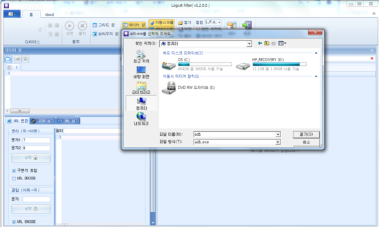
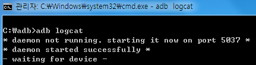

사용자가 cm/miui등을 포팅할때, 혹은 일반 오류의 원인을 알고 싶을때 우리들은 log를 확인해 봅니다.

쉽게 로그를 볼수 있는 방법이 있는데요.

먼저 프로그램을 이용하는 방법입니다.

프로그램의 이름은 LogcatFilter로 어디선가 구하게된 프로그램 입니다.

<http://cafe.naver.com/logcatfilter>

위 카페에서 제작, 배포되고 있는듯 합니다.

첨부파일에 있는 LogcatFilter의 버전은 1.2.0.0버전으로 현재까지 최신버전입니다.

프로그램을 실행하면,

adb를 선택할수 있습니다.

adb를 선택한뒤 작업하시면 됩니다.

한글로 되어 있어 모르시는 분은 없을거라 생각됩니다.

여러므로 편리한 프로그램 입니다. ㅎㅎ

jdm0620님께서 배포하시고 계십니다.

두번째 방법으로는 adb를 이용하는 방법입니다.

첨부파일의 adb.zip은 adb를 압축해놓은것 입니다.

압축 풀어주신뒤에 cmd를 열으셔서

adb devices

adb logcat

명령어를 내리시면 logcat이 나오게 됩니다.

또한 adb logcat > log.txt

를 입력하시게 되면 logcat이 adb가 있는 폴더의 log.txt에 기록되게 됩니다.

