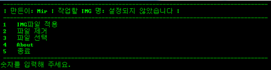
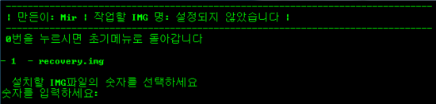
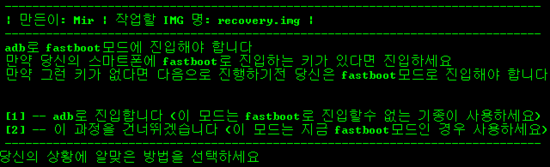
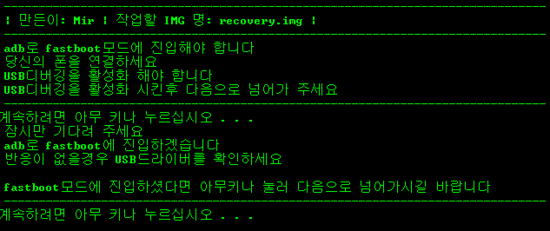
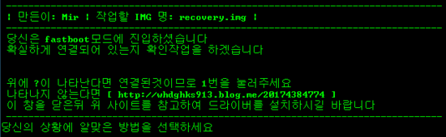
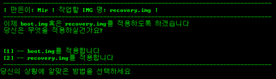
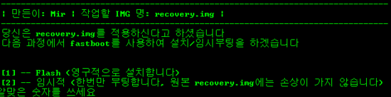

또 만들었습니다.

물론 구조는 Zip Signer와 APK Manager와 비슷(?) 합니다

(완전 같죠)

---스샷---

어디서 많이본 사진..

이 사진도 어디서 많이...

1번을 선택하면 친절히 나옵니다. 설명 ㅋㅋ

이렇게 바로 진입할수 있습니다.

연결이 되어 있으면 원래 ?이 나타나야 합니다. 아시겠죠?  
  

적용할 img를 선택한뒤

임시로/영구적으로 설치선택이 가능합니다.

아무튼 이런 기능이 있는 img원클릭 설치툴을 올리겠습니다.

[ img.zip](/attachment/cfile2.uf@196EE9355104E42C1E6D9C.zip)

이글은

[2013/01/27 - [강좌/팁/SmartPhone 강좌] - 단 한번만 img로 부팅/리커버리진입 해보자!](http://whdghks913.tistory.com/63)

[2013/01/27 - [강좌/팁/SmartPhone 강좌] - Boot.img Recovery.img 원클릭 적용툴](http://whdghks913.tistory.com/27)

이 두개의 글과 연관이 있으며 비슷합니다.
