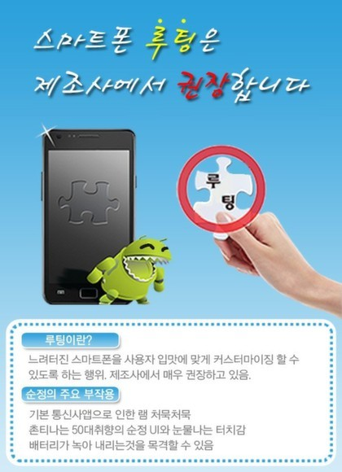

"루팅이란 리눅스에서 최고 권한을 얻는 행위이다"

많은 사람들이 "루팅"에 대해 알아가는 중으로 생각됩니다.

이 글에서는 제가 생각하는 루팅의 장 단점을 한번 서술해 보도록 하겠습니다.

**1. 루팅이란?**

처음에 설명하였듯이 루팅이라는것은 영어로는 Root/Rooting라고 하며 리눅스 계열의 OS에서 최고 관리자 권한을 얻는 것입니다.

우리가 흔히 사용하고 있는 윈도우의 Administrator 계정과 비슷한 의미입니다.

사실 루팅은 안드로이드에서 시작된것이 아닙니다.

컴퓨터에 들어가는 OS중 윈도우, 리눅스, 맥 등이 있는대요 안드로이드는 리눅스를 기반으로 하는 운영체제 입니다.

안드로이드가 리눅스를 기반으로 하고 있으니 리눅스의 특징을 가지고 있습니다.

혹시 우분투 라는 OS를 아시나요?

제 게시판을 보면 강좌 부분에 Ubuntu 강좌를 보실수 있으실 것입니다.

대중적인 리눅스 OS를 뽑으라면 다들 우분투를 뽑을것 입니다.

이런 리눅스 OS를 보면 sudo/su라는 명령어가 있는대요 이것이 바로 최고 관리자 권한을 얻는 명령어 입니다.

이처럼 안드로이드에서도 sudo/su라는 명령어를 얻어 최고 관리자 권한을 얻을수 있게 하는것이 바로 루팅입니다.

**2. 루팅을 하면 뭐가 추가 될까?**

결론부터 말하자면 /system/bin/su(혹은 /system/xbin/su)와 /system/xbin/busybox가 추가 된다고 알고 계시면 됩니다.

추가로 /system/app/Superuser.apk가 들어가게 되는대요 이 어플이 루트 권한을 다른 어플에게 주거나 막는 행동을 하게 됩니다.

**3. 루팅은 어떻게 할까?**

이부분은 많은 개발자 분들이 고민하시고 계신 부분이 될것입니다.

범용적인 루팅툴은 아마 슈퍼 원클릭 이라는 루팅툴이 있는데요.

이와 마찬가지로 기기마다 루팅을 하는 방법은 다양합니다.

어떤기종은 개발자가 만든 리커버리라는 것에 진입하여 su가 담긴 파일을 설치하는 방식도 있고,

슈퍼 원클릭 처럼 스마트폰을 컴퓨터에 연결하여 프로그램으로 루팅할수도 있습니다.

또한 위 방법이 먹히지 않는다면 직접 update.zip에서 boot.img를 수정하여 루팅용 부트이미지를 재작할수도 있습니다.

프로요 버전까지는 진저브레이크라는 어플로 핸드폰 안에서 루팅이 가능하기도 합니다.

갤럭시기종은 테그라크 커널을 이용하여 루팅을 하는 경우도 있습니다.

XDA라는 한 스마트폰 개발자 포럼에서 한분이 갤럭시 s3등에 들어가 있는 CPU의 보안 취약점을 뚫어서 루팅을 할수도 있습니다.

**4. 루팅을 통해 얻은 이익**

이익을 구지 말하자면 루팅을 통해 스마트폰을 살때부터 깔려있던 나쁜 기본어플을 단칼에 베어 버릴수도 있고,

사람의 머리에 해당하는 CPU를 오버클럭하여 빠른 성능 항샹을 꾀할수 있습니다.

또한 지긋지긋한 순정의 UI나 기능에서 벗어나 다양한 커스텀롬을 설치할수도 있습니다.

배터리를 빨리 닳지 않게 하는 스크립트나 인터넷 속도를 높여주는 스크립트를 사용할수도 있지요.

**5. 루팅을 통해 얻은 짜증**

일단 A/S에는 절대적으로 불리한 입장에 처할수 있습니다.

루팅을 하게되면 스마트폰의 메인보드에 치명적인 손상이 올수도 있기에 스마트폰 제조사들은 그닥 추천하지 않는 방법입니다.

(스마트폰 루팅은 제조사에서 권장합니다.)

또한 절대로 풀수없는 이름하여 슈퍼 벽돌에 걸릴수 있습니다.

이경우 보드를 교체하거나 다른폰을 써야 합니다.

스마트폰의 주민등록번호라 할수 있는 imei가 손상되어 모든 통신이 마비되는 경우도 생깁니다.

**6. 결론**

왜 우리가 루팅을 하냐 하면 더 빠른 속도를 만들기 위해

나만의 간지나는 폰을 만들기 위해 등 여러가지 이유가 있을수 있습니다.

그런대 모두 다른 이유를 들여다 보면 한가지 공통점을 찾을수 있습니다.

그건 바로 제조사가 만든 스마트폰이 마음에 들지 않았지 때문입니다.

그럼 제조사는 더 빠른 스마트폰을 만들면 안되는 건가요?

자체적으로 최적화를 빠릿하게 만들어서 루팅을 하게 되는 이유를 만들지 않으면 안되나요?

기본어플을 좀만 더 적게 투입하면 안될까요?(이부분은 통신사가 좀만 배려해 줬으면 합니다.)

루팅은 나쁘지도, 불법도 아닌 행동이라 생각됩니다.

자신의 기기의 최고 관리자 권한을 얻는게 불법인가요?

스마트폰이 망가지는 결과에 책임질수만 있다면 누구든지 해도 된다고 생각하고 있습니다.

맨날 폰만 찍어내지 말고 제조사는 한번쯤 기존 기기에 대해 더 고민해 주면 안되는 건가요?...

사용자가 루팅의 필요성을 느끼지 못하게 빠른 성능을 만들어 주는 제조사가 많이 있었으면 합니다.
