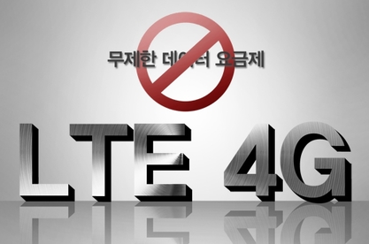
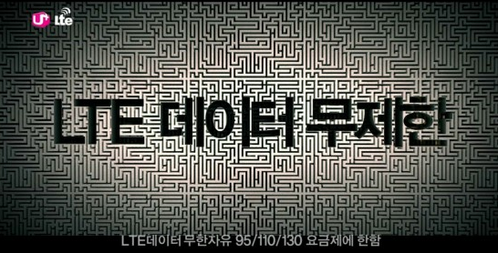
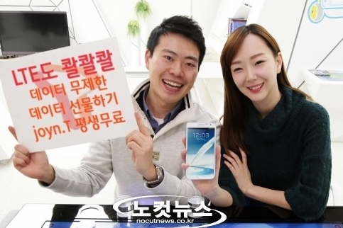
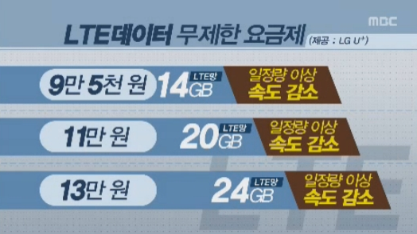

안녕하세요? 미르입니다.

처음 이 게시판에 포스팅 하는데요. 오늘은 LTE 무제한 요금제에 대해 알아보겠습니다.

지금 영업정지 처분을 받고 있는 U+가 LTE 무제한 요금제를 선보였습니다.

LTE는 무제한 요금제 도입 예정이 없다. 라고 한 이통 3사..

3G무제한 요금제를 도입한 이후로 상위 10%의 유저들이 3g총 트레픽의 절반 이상 차지하는 모습을 보며,

KT/SKT/LG U+는 lte에는 무제한 요금제를 도입하지 않겠다 라는 선언을 하였습니다.

지난 25일쯤 U+가 LTE무제한 요금제를 발표했습니다.

아마도 영업정지 기간에 빠져나간 가입자들을 붙잡기 위해 꺼낸 초강수 카드가 아닌가 생각됩니다.

다음 표는 3개 통신사의 LTE무제한 요금제를 비교한 표입니다.

|  |  |  |  |  |  |  |  |
| --- | --- | --- | --- | --- | --- | --- | --- |
|  | SKT | KT | | | LG U+ | | |
| 요금제 이름 | LTE 109 | LTE-950 | LTE-1100 | LTE-1300 | 무한자유95 | 무한자유110 | 무한자유130 |
| 한달 요금 | 11만9천900원 | 10만4천500원 | 12만천원 | 14만3천원 | 10만4천500원 | 12만천원 | 14만3천원 |
| 음성 제공 (분) | 1050 | 650 | 1050 | 1250 | 750 | 1200 | 1500 |
| 문자 제공 (건) | 1050 | 650 | 1050 | 2500 | 650 | 1000 | 1000 |
| 데이터 | 무제한 | | | | | | |
| 기준  데이터 | 18GB | 14GB | 20GB | 25GB | 14GB | 20GB | 24GB |
| 초과시  추가제공 | 3GB | | | | | | |
| 속도제한 | 제한 가능 | 2Mbps | | | | | |
| 기타 | LTE 선물 가능 | 망내 무료통화 제공 | | | 데이터 무제한 최초출시 | | |

(표의 오른쪽이 안보이신다면 PC또는 PC버전으로 봐주시면 감사드리겠습니다.)

티스토리 표는 구현하기가 참 힘들군요...

아무튼 오타가 나지 않는 이상 위 표를 참고하시면 될듯 합니다.

여기서 잠깐,

기준 데이터를 모두 소진한다면?

표와 마찬가지로 기준데이터를 초과한다면 추가제공으로 3GB가 매일 주어집니다.

그런대 그 주어진 3기가도 소진해 버린다면?...

속도 제한이 걸리게 되는대요 SKT는 망 트레픽에 따라 제한을 가능하게 두었고 나머지는 2Mbps의 속도로 무제한 이용이 가능합니다...

2Mbps의 속도는 (고화질의) 동영상을 제외하고 인터넷을 원활하게 할수 있는 속도입니다만,

LTE 최대속도인 75Mbps의 30분1정도의 속도이니...

SKT만의 특징을 살펴보자면,

데이터 선물하기가 가능하다고 합니다.

단 학교폭력에 악용될수 있으므로 전송을 19세 이상부터 가능하게 했다고 합니다.

이렇게 해서 lte무제한 요금제에 대해 간단하게 알아봤는대요.

제생각에는 구지 무제한 요금제를 도입해야 하나? 라는 생각이 듭니다.

무제한을 위해서 기본 10만원 이상의 통신료에 기기값 까지 더하면 15만원은 훌쩍 넘길탠데,

그렇게 해서 무제한을 누릴 필요가 있을까요?

그리고 lte로 뭘 하시기에 데이터를 많이 사용하는지 궁금합니다 +_+...ㅋㅋ

+2016-10-16

LTE 데이터의 사용량이 많아진 요즘은 생각이 바뀌었습니다.

저는 적은 통화/문자, 많은 데이터가 필요합니다.

이상 포스팅을 마치겠습니다~

(수정사항 또는 오타/오류 지적해 주세요)
