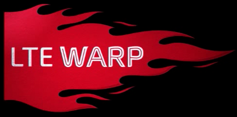

드..디..어 돌아왔습니다!

Apple버전 이후 약 2달정도의 시간이 소요되었네요. ㄷㄷ

(그동안 CM등의 뻘짓 했다는건 비밀)

이번버전은 최대한 빠르게 만들고 싶었습니다.

또한 사용자의 입장에서 최고의 편의성도 발휘할 수 있는 롬을 만들고 싶었습니다.

본문을 끝까지 읽어주시면 감사드립니다~ (힘들게 작성했는대 읽어주시는게 힘들진 않잖아요...)

오늘은 **불타는 금요일****Fire Friday!!**

그래서 마음먹고 업로드 합니다!

다들 좋은밤 보내시길 바랍니다~~

빠른 속도를 자랑하는 Mir Rom BRAVE!!!!!

(단 일부 개인의 체감에 따라 다를수 있음ㅋ)

**0. 체인지 로그 & 저작권**

**[체인지 로그]**

[2012-11-06~2012-11-07]

롬 설명 기능 추가

CM10부트애니 추가

커널 변경

아로마 인스톨러 수정

[2012-11-02~ 2012-11-03]

OverClock thanks for Cheongang(withgodyou)

Frontswap, Cleancache 추가

[~ 2012-11-01]

커널 마이너 패치 (Mirkernel) 2.6.35.9

(자세한 체인지 로그는 롬에 내장되어 있습니다)

**[저작권 목록]**

천강 (withgodyou)님 커널 제공

lewhell (hong7657)님 테마 제공

Rodney (jumanss), ㄱ (wkddbwjd249)님 테마 제공

카시안 (ehdrbx)님 테마 제공

LitX (wnstj970715)님 스크립트 제공

Hydrogen (rnrneks258)님 스크립트 제공, init.d트윅 제공

뽀로로 (shine1997), 키위맛 쉐이크 (mider10)님 스크립트 제공

김태연 (naty04)님 스크립트 제공

herlocks, SiRyuA님 아로마 한글화 관련 도움

과학인 (goodekdrms)님 init.d트윅 제공

다음과 같은 자료를 제공해주신 위 분들께 다시한번 감사드립니다~

(롬내부 저작권 관련 작성되어 있습니다)

**1. 신기술 도입 안내!!**

이번에 도입된 기능이 몇가지 있는데요.

하나하나 소개해 드리겠습니다.

1. OTA

이기능은 바로바로 스마트폰에서 최신버전의 롬을 받을수 있는 방법입니다.

어플로 지원하며 빠르게 WiFi나 3G에서 약 300mb의 롬을 받아서 바로 재부팅 하여 적용할 수 있습니다.

또한 이 기능은 다운받은 롬도 적용할 수 있는 기능이 있습니다.

설치중 DATA와 캐쉬를 제거하는 기능도 있습니다. (어플내 기능)

마지막으로 원래 이 어플은 영어이지만 제가 한글화를 해서 들어가 있습니다~

**제 OTA는 리커버리로 바로 진입해서 설치가 가능합니다!**

**따로 리커버리로 진입해서 설치하는 수고를 덜하게 됩니다!!**

2. 어플의 아이콘 변경

미라크a의 어플 아이콘은 너무 유치합니다;;

차라리 베가레이서의 아이콘이 간지(?)나는데요ㅋㅋ

그래서 모든 부분의 아이콘을 간지나는 베레의 아이콘으로 변경하였습니다.

(사실 베레아이콘 안좋아 하시는 분들도 계시는데요 그래도 기본 아이콘 보단 간지나기 때문에)

작은화면의 베가레이서를 만나보실수 있으십니다!

3. 각종 최적화

롬을 초기 버전부터 보셨던 분들중 init.d를 보신다면 Zipalign이라는 init.d스크립트를 보실수 있으십니다.

근대 이게 사실 적용된건지도 잘 알수가 없었습니다.

그래서 롬에 내장된 모든 Apk를 Zipalign하였습니다.

(일부 중요 시스탬 앱/설치 앱 제외)

Zipalign은 어플의 읽기 속도등을 향상시켜주는 것이라는데요 최고 속도를 내기 위해 오랜시간동안 Zipalign작업을 하였습니다. [[Zipalign에 대해 알고싶으신분 클릭]](http://search.naver.com/search.naver?sm=tab_hty.top&where=nexearch&ie=utf8&query=Zipalign)

4. 벨소리 복구 & 최적화

저번 모든 롬에는 벨소리가 모두 무음처리 되었습니다. -\_-

알람이 안울리죠 ;;;;;;

벨소리도 안울리죠 ;;;;;;;

사용자 분들이 불편해 하시기에 수정하였습니다.

이제 벨소리가 정상적으로 울리게 됩니다 ㅎㅎ

또한 기본 안드로이드 벨소리를 좋은 벨소리(?)로 한두 개 정도 바꿨습니다 ㅎㅎ

벨소리 최적화 라는건 OGG를 최적화 하였다는 뜻입니다.

필요없는 부분은 제거한 것 같습니다 (그렇다고 안들리는 것은 아닙니다 ^\_^)

5. 아로마 인스톨러 판올림

2.5에서 2.56버전으로 판올림 되었습니다.

모든 터치 좌표가 입력됨에 따라 터치감이 아주 좋아 졌습니다!

6. 각종 트윅 내장

아로마 인스톨러의 스크립트 설치 부분을 보면, 설치 안함을 제거하고 자체 최적화를 집어 넣었습니다.

자동으로 CPU관련 조절과 트윅이 내장되어 있습니다.

**2. 아로마 인스톨러 안내**

아로마 인스톨러란 무엇일까요?

바로 좋은겁니다!

제가 설정해둔 설치 메뉴가 나타나는데요. 이것을 여러분이 직접 "터치"하면서 설정하는 겁니다!

바로바로 cwm에서도 Touch를 사용하여 롬을 설치합니다.

아주 좋습니다!!

정성스럽게 만들었습니다~ 많이 터치해 주세요~ (그렇다고 하루종일 누르시면 안됩니다 -\_-)

**3. 용어정리**

제 롬을 오래 써주신 분들은 모두 아실것이지만,

처음 써주시는 분들은 아마 잘 모르실겁니다.

아래를 참고해 주세요~

미라크a란? : 나쁜겁니다.

팬택이란? : 나쁜겁니다.

아샌이란? : 먹는겁니다 냠냠 맛나다~

CWM이란? : 팬택이 안만들어 주는겁니다.

OS업글이란? : 팬택빼고 모든 회사가 정성스럽게 해주는 겁니다.

제 롬은 벽돌에 대한 기본상식과 팬택에 대한 증오심과 폰에 관심이 많은분만 사용하실수 있습니다!

**4. 주의**

1. 팬택에게 플래폼 소스 오픈에 대한 항의를 넣습니다. (A750K만)

2. 데이터 유실에 대한 대비를 해둡시다.

3. 롬을 설치한다음 평가를 한줄이라도 좋습니다. 환영합니다~

4. 벽돌이 될수 있으므로 설치중에 전원을 중단하지 마세요.

5. 모두 설치하셨으면 미르교에 가입하시는 겁니다?!

본격적인 주의 들어갑니다.

6. 많이 설치가 어려울수 있으신데요. 제가 도와드릴수 있는 부분도 한계가 있습니다.

간단한 질문은 모두 삭제/무시 처리할태니 원망하지 마세요...

7. 모던홀드 MP3부분은 동작하지 않습니다 - 순정 카메라 어플을 넣으시면 카메라로 작동합니다.

**8. A750K만 지원합니다 A740S등 타기종 분들이 설치하실경우 안정된 작동을 보장하지도 않고 장담하지도 못합니다.**

**5. 롬 설치 & 다운**

(1) OTA를 통한 다운로드

OTA도 아로마 인스톨러를 적용한 롬이 업로드 됩니다.

Mir Rom Updater어플을 실행하신후 업뎃 확인을 하시면 됩니다.

(2) 컴퓨터를 통한 다운로드

Download : [[다운로드]](https://dl.dropbox.com/s/y2f60xz40g3xbx6/signedMir_Rom_BRAVE.zip) [[링크를 통한 다운로드]](https://www.dropbox.com/s/y2f60xz40g3xbx6/signedMir_Rom_BRAVE.zip)

링크가 터져 다른 링크를 만들었습니다 : <https://www.dropbox.com/s/wfgl9uf1xasr39n/signedMir_Rom_BRAVE.zip>

클릭하게 되면 롬파일을 다운로드 하게 됩니다.

아로마 인스톨러를 적용한 롬으로 약 300mb의 용량입니다.

다운을 완료하려면 약 2~3분 정도의 시간이 소요됩니다아.

다운 받으신후 파일을 바로 sdcard에 넣으신후 리커버리로 진입해 설치하시면 됩니다.

암호는 걸지 않겠습니다 여러분을 믿겠습니다!!

처음 롬 설치/재 설치시 부팅시간이 오래걸릴 수 있습니다.

차분하게 기다려 주시기 바랍니다.

만약 부팅시간이 10분이상으로 넘어갈경우 벽돌의 가능성이 있으니 다시한번 재설치 해주시면 감사하겠습니다.

[> 6. 롬 설치 사진 (요약글)](http://blog.naver.com/PostView.nhn?blogId=whdghks913&logNo=20169200768&categoryNo=75&parentCategoryNo=0&viewDate=&currentPage=1&postListTopCurrentPage=1&userTopListOpen=true&userTopListCount=5&userTopListManageOpen=false&userTopListCurrentPage=1#)

**7. 설치완료 & 찬양**

설치를 완료하신후 재부팅을 하셔서 빠른 속도를 체험 하신뒤!

컴퓨터를 키십니다.

네이버 로그인을 하십니다.

Cafe & Blog에 접속합니다.

미르를 찬양합니다 [중요]

이걸 완료 하시면 완벽합니다!

**8. 후기 작성 & 버그 리포트**

제가 사용자가 아닌 개발자의 입장으로 롬을 만들기 때문에 (사용자의 입당으로 이해하려고 노력합니다 그러므로 불편한 것이 꼭 있습니다. (없으면 제 분신)

그런점과 이점은 다른 롬보다 뛰어나다 하시는 점 있으시면 모두 알려주세요~

새로 게시글을 작성하셔도 됩니다.

덧글을 작성하셔도 됩니다.

아무말 없어도 됩니다

꼭 알려주세요~

ps. 제가 실시간 모니터링 하는게 아니기 때문에 게시글을 올리신후 제 게시글에 게시글 링크 걸어주시면 바로 확인할수 있습니다~

또한 모든 오류 & 버그를 확인하기가 매우 어렵습니다. ㄷㄷ

만약 오류를 발견하시게 되신다면 빨리 덧글로 알려주세요!

게시글로 알려주실경우 처리가 늦어지게 됩니다.

**9. 소감**

고생해서 만든 롬 좋게 봐주세요~

그리고 팬택한태 모두 A750K와 A740S에 대한 플랫폼 소스 오픈을 건의합시다!

혹시 버그가 있다면 빨리 알려주시길 바랍니다!

**10. 한마디**

많이 힘들게 재작된 롬입니다.

좀 있으면 CM도 나올수 있는 기회가 생겼기에..

좀 쉬겠습니다...

(라고 하면서 몰래 할꺼라는건 비밀)

정말 글하나 쓰긴 힘들군요...

끝까지 읽어 주신 모든분들께 감사드립니다~

(이글은 아주 전 BRAVE 버전명을 지우고 [버전명] 이렇게 해서 비밀 글로 간직해 왔다는건 비밀)

빠른 하루 되세요~
