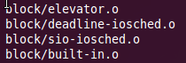
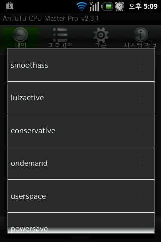
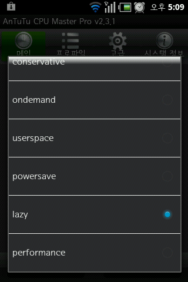
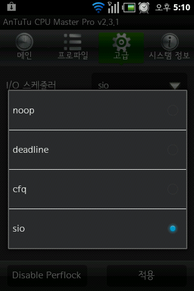

deadline은 기본커널에 있는대 컴파일 되지 않게 설정 되있더라고요 ㅋㅋ

그.래.서 살며시 스페이드 바를 두번....적용 ㅋㅋ

다행히 오류 없이 컴파일이 되더라고요 ㅋㅋ

보이시죠? 컴파일 되는 모습이 ㅋㅋ

적용이 됩니다~

그리고 smartass2는 컴파일 자체가 안되서 잠시 빼두었습니다

이거 뺀뒤 적용 스샷(처음 올리죠?ㅋㅋㅋ) 첨부합니다~

자 제말이 거짓은 아닙니다~!

이제 더 많은 것을 해보고 싶네요 ㅇㅅㅇ

명령어

./make.sh

[ 2012-08-23 sio,deadline추가.zip](/attachment/cfile10.uf@2671B93D5106016526A491.zip)
