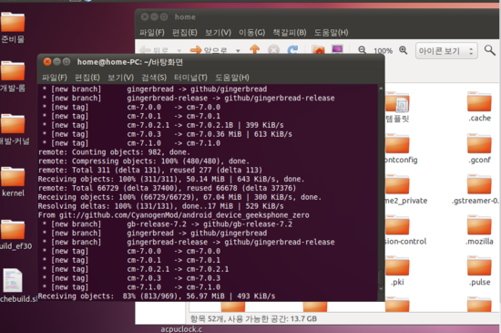

아아;;

첫째날 부터 막히는 불편한 진실...

커널 소스 받는 부분부터 힘드네요 ㅋㅋ

아무튼 제목 그대로 도전 해 봅니다!!

어처피 5일 안에 이것은 끝이 나겠죠?

그리고 이 게시판도 아래로 처박히는 거죠 ㅋㅋ

repo명령어를 이용해 개속 시도하지만 오류가 뜨는건 안비밀;;

그래서 검색해본 결과

편법이 있더라고요 ㅋㅋㅋㅋㅋ

바로 바로바로바로...

저도 잘 모르겠어요..

아무튼 ./douchebuild.sh를 치면 어쩌구 나오는 대에서 y, sdk어쩌구 에서 y를 누르니 지가 알아서 해주네요...

기다려 봅니다...

저장 위치는 홈폴더에서 보기-숨김파일 보기 선택후

홈폴더 android system 기타 하위 폴더

에 있었던거 같았습니다...

꼭 성공 했으면 합니다

+추가

소스를 모두 다운받으면 ~/android/system폴더에 위치하게 됩니다~

참고 사이트 : <http://blog.naver.com/dlgns1357?Redirect=Log&logNo=80157523357>

<http://donginl.tistory.com/4>

<http://donginl.tistory.com/5>

<http://blog.naver.com/khm265/140152273530>
