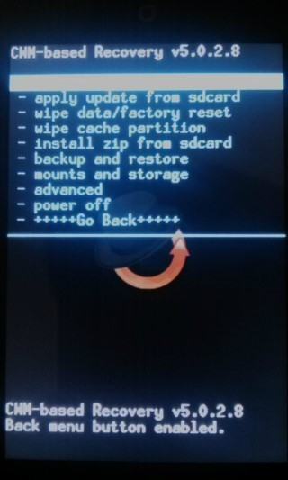

안녕하세요~

제가 "나도 CM7을 포팅해 보자" 라는 종류의 글을 몇번 적어보려 합니다

일단 포팅의 맛보기로 CWM을 포팅하는 방법을 적은 강좌를 작성해 보도록 하겠습니다

어디까지나 초보자를 위한 글이기 때문에 어려운 용어는 되도록 사용하지 않도록 하겠습니다

이 블로그는 마우스 오른쪽을 지원하지 않을 예정이기 때문에 명령어는 첨부해 두도록 하겠습니다

[ CWM Porting.txt](/attachment/cfile21.uf@017FDB4851065504075C1F.txt)

또한 이글은 부족한 자료가 있을경우 보충될 예정입니다 ㅎㅎ

시작하기전 손가락 한번만 눌러주시면 감사드리겟습니다 ㅠㅠ

그럼 시작하겠습니다 잘따라와 주세요!

**※주의: 이방법은 일반적인 Ramdisk를 사용하는 스마트폰에 가능하며****initramfs를 사용하는 일부 삼성폰에는 적용되지 않습니다**

**1. 우분투 설치/빌드환경을 구축하자!**

일단 우분투를 설치하셔야 합니다

설마 CWM을 포팅하시는대 우분투를 모르시는 분은 없겠죠?...

우분투를 설치할수 있는 방법은 다양합니다

가상머신에 설치, Wubi로 설치, 멀티부팅으로 설치 등이 있는대요

다른 블로그에 아주 자세하게 포스팅 되어 있기 때문에 살짝 넘어가려 합니다 ㅎㅎ

설치하실때 꼭 64비트로 설치해 주세요 (빌드 오류가 적습니다)

우분투를 설치하셨으면 부팅해 주세요

그다음 터미널을 열어주시면 됩니다

이제 버전에 따라 각각 명령어를 입력해 주세요

(1) 우분투 10.10~11.10버전 분들이 공통으로 입력하셔야 하는 구문

$ sudo apt-get install git-core gnupg flex bison gperf build-essential \

  zip curl zlib1g-dev libc6-dev lib32ncurses5-dev ia32-libs \

  x11proto-core-dev libx11-dev lib32readline5-dev lib32z-dev \

  libgl1-mesa-dev g++-multilib mingw32 tofrodos python-markdown \

  libxml2-utils xsltproc

(2) 우분투 10.10 을 쓰시고 계시면 다음을 추가로 입력해 주세요

$ sudo ln -s /usr/lib32/mesa/libGL.so.1 /usr/lib32/mesa/libGL.so

(3) 우분투 11.10 사용하시고 계시면 위 명령어와 다음을 추가로 입력해 주세요

$ sudo apt-get install libx11-dev:i386

(4) 우분투 12.10을 이용하시고 계신다면 위 명령어는 필요없고 아래 명령어를 입력해 주세요

$ sudo apt-get install git-core gnupg flex bison gperf build-essential \

  zip curl libc6-dev libncurses5-dev:i386 x11proto-core-dev \

  libx11-dev:i386 libreadline6-dev:i386 libgl1-mesa-glx:i386 \

  libgl1-mesa-dev g++-multilib mingw32 openjdk-6-jdk tofrodos \

  python-markdown libxml2-utils xsltproc zlib1g-dev:i386

$ sudo ln -s /usr/lib/i386-linux-gnu/mesa/libGL.so.1 /usr/lib/i386-linux-gnu/libGL.so

**2. Repo를 다운받아 소스를 다운받기 위한 준비를 하자!**

이제 소스를 다운받아야 하는대요

우리가 cm의 소스등을 받기위해 repo라는 것을 사용합니다

위와 마찬가지로 터미널에 입력해 주시면 됩니다

mkdir -p ~/bin

export PATH=$PATH:~/bin

cd ~/bin

curl https://dl-ssl.google.com/dl/googlesource/git-repo/repo > ~/bin/repo

chmod a+x ~/bin/repo

그럼 /home/(사용자 계정명)/bin/repo가 생기게 됩니다

이제 소스를 받을 폴더를 만들어 줘야 겠지요?

대부분의 사람들이 ~/android/system이라는 폴더에 소스를 받게 됩니다

(여기서 게속 나오는 ~/은 내폴더(홈폴더)를 줄여서 나타낸것입니다 원래는 /home/(사용자 계정명)/android/system이 되겠죠?)

그냥 마우스 오른쪽으로 android/system을 만드셔도 되지만 폼나게 명령어로 처리하는 방법은

mkdir ~/android/system

을 입력하시면 됩니다

**3. 소스를 받아볼까?**

이제 repo에게 소스를 어디서 받을지 알려줘야 됩니다

그래야 착한 아이가 소스를 가져오죠 ㅋㅋ

2에서 만들어둔 android/system폴더에 터미널로 들어가야 합니다

아시다 싶이 폴더를 이동하는 명령어는 cd입니다..

cd ~/android/system

명령어로 이동해 주세요

repo를 통한 소스 다운로드

이제 repo에게 뭘 받을건지 설정해 주는 시간이 왔습니다..

cm의 버전에 따라 아래의 명령어를 입력해 주시면 됩니다

repo init -u git://github.com/CyanogenMod/android.git -b jellybean

JellyBeen버전 (CM10을 받는경우)

repo init -u git://github.com/CyanogenMod/android.git -b ics

ICS버전 (CM9를 받는경우)

repo init -u git://github.com/CyanogenMod/android.git -b gingerbread

GB버전 (CM7을 받는경우)

repo init -u git://github.com/CyanogenMod/android.git -b froyo

Froyo버전 (CM6을 받는경우)

더 아래버전도 있지만 생존여부를 모르고 다운받으실 분도 없으실것 같아 4가지만 적습니다

(제가 몰라서 안적은건 함정)

명령어를 입력하면 이메일 주소와 user 이름을 치라 할것입니다

y를 해주시면 설정이 끝나게 됩니다

이제 소스를 받아봅시다 ㅎㅎ

repo sync -j(숫자)

위 명령어를 입력하시되 (숫자)부분에 진짜 숫자를 넣으셔서 다운받으시면 됩니다

EX) repo sync -j4

그럼 쭉쭉 받게 됩니다

아마 많이 끊길탠대요 /archive/itmir/2013/33 이 게시글을 살펴주시면 감사드리겠습니다

단 repo로 받게되면 몇몇 기기정보가 누락되어 받아집니다

그래서 제가 직접 누락된것을 보충하여 cm7소스를 배포하고 있습니다

/archive/itmir/2013/43

위 게시글을 들어가셔서 cm7소스를 다운받으시길 추천드립니다

**4. 진짜로 빌드 해볼까? - 아니**

자 이제 소스를 모두 다운받으셨을듯 합니다

그렇다면

make -j4 otatools

를 입력해 주세요

(지금부터 나오는 대부분의 명령어는 cd ~/android/system에서 작업하셔야 합니다)

본격적으로 빌드 준비하기전 unpackbootimg를 설정해 줘야 합니다

[ unpackbootimg](/attachment/cfile3.uf@20473E4D510642992727D6)

이 파일을 /bin에 넣어야 합니다

넣는 방법은 sudo를 통한 넣기 또는 루트계정으로 들어가서 넣기가 있는대요

그냥

sudo cp unpackbootimg /bin

sudo chmod 777 /bin/unpackbootimg

를 해주시면 됩니다

또한 자바를 깔으셔야 오류가 덜난다고 합니다

/archive/itmir/2013/51

이글의 중간부분쯤 java설치부분을 따라해 주시고

http://deviantcj.tistory.com/373

이 블로그의 java추가방법을 참고해 주세요

(thanks 삽질)

(원래 빌드하기 까다롭습니다 절반정도 왔으니 힘내세요!)

그다음 cwm을 포팅할 기기의 순정 boot.img와 순정recovery.img를 준비해 주세요

(adb로 추출하는 방법이 /archive/itmir/2013/91 에 간략하게 기록되어 있군요)

더보기

넥서스S의 경우 이미 구글의 드라이버 sh바이너리 지원이 끊긴 기종이라 CM에서 벤더를 함께 제공하지 않으면

따로 다른곳에서 벤더소스를 구해 와야 합니다.

저는 TheMuppets라는 허브를 이용했습니다. (sleepy님께 감사를..)

CM 소스 다운 및 breakfast 명령어까지는 이미 되었다고 가정하고(#2강좌의 CM10.1주소 참고) 시작합니다.

1. 필요한 벤더 소스 구분

디바이스 소스 폴더에 들어갑니다. 제 넥서스S의 경우 device/samsung/crespo군요.

self-extractors라는 폴더로 들어가면 필요한 게 뭔지 알 수 있습니다.

cypress폴더를 제외한 나머지 폴더명을 잠시 적어둡니다.

넥서스S의 경우 akm, broadcom, imgtec, nxp, samsung, widevine이니 이 기준으로 설명하겠습니다.

2. 벤더 파일 다운로드

터미널을 켜고 CM소스의 vendor폴더로 이동합니다.(저는 CM10.1의 소스를 cm10이라는 폴더에 받았습니다)

cd ~/cm10/vendor

이제 git clone명령어로 다운을 받을 차례입니다.

(git clone명령어의 경우

git clone 허브주소 -b 브랜치이름

의 구조로 구성되어 있습니다)

git clone git://github.com/TheMuppets/proprietary\_vendor\_akm.git -b cm-10.1

git clone git://github.com/TheMuppets/proprietary\_vendor\_broadcom.git -b cm-10.1

git clone git://github.com/TheMuppets/proprietary\_vendor\_imgtec.git -b cm-10.1

git clone git://github.com/TheMuppets/proprietary\_vendor\_nxp.git -b cm-10.1

git clone git://github.com/TheMuppets/proprietary\_vendor\_samsung.git -b cm-10.1

git clone git://github.com/TheMuppets/proprietary\_vendor\_widevine.git -b cm-10.1

허브에서 벤더를 차례대로 다운받았습니다.

ls를 쳐 보면 허브 이름과 동일한 폴더들이 다운되었을 겁니다.

3. 폴더명 변경

mv명령을 활용하여 폴더명을 바꿔줍니다.

mv proprietary\_vendor\_akm akm

mv proprietary\_vendor\_broadcom broadcom

mv proprietary\_vendor\_imgtec imgtec

mv proprietary\_vendor\_nxp nxp

mv proprietary\_vendor\_samsung samsung

mv proprietary\_vendor\_widevine widevine

[출처] #10. 최신의 디바이스 벤더소스를 다운받아보자.

**5. 언제 빌드하지? - 벤더생성**

이제 자신의 폰에 맞게 디바이스 소스를 생성해 주어야 합니다

순정 boot.img를 ~/android폴더에 넣어주세요

다른분들은 mydroid에 넣으시라 하는대 상관 없습니다 ㅋㅅㅋ

그다음

. build/envsetup.sh

를 입력하셔서 빌드 환경을 업데이트 해주세요

(모든(?) 빌드 명령어들은 . build/envsetup.sh을 입력하신 다음부터 사용하실수 있습니다

그러니 터미널을 한번 닫고 새로 열으시면 다시 실행해 줘야 하는 명령어 입니다)

이제 mkvendor.sh를 이용하여 boot.img를 분해합시다

build/tools/device/mkvendor.sh 제조사 기기명 ~/android/boot.img

제조사와 기기명을 입력하신다음 타이팅 해주세요 ㅎㅎ

(이때 한글또는 -을 넣으시면 오류나니 넣지마세요)

이제 조금만 더 가시면 됩니다..

터미널이 아닌 폴더로 이동해 주세요

~/android/system/device/제조사/기기명

위 폴더로 들어가 주세요

그럼 recovery.fstab 파일과 boardconfig.mk 가 있습니다

이제 이것을 cwm에 맞게 또는 자신의 기기에 맞게 수정하셔야 합니다

먼저 약간 간단한(?) recovery.fastab을 수정해 봅시다

이것은 순정 recovery.img를 뜯어 주시면 램디스크 파일안 etc/recovery.fastab에 있습니다...

뜯는 방법은 /archive/itmir/2013/48를 참고해 주시면 됩니다

본문에 추가하면 길이가 너무 길어지므로 추가하지 못하는점 이해해 주세요...

recovery.fstab을 수정하셨으면 boardconfig.mk를 열어주세요

BOARD\_KERNEL\_BASE := 0x10000000

BOARD\_KERNEL\_PAGESIZE := 2048

# fix this up by examining /proc/mtd on a running device

BOARD\_BOOTIMAGE\_PARTITION\_SIZE := 0x00800000

BOARD\_RECOVERYIMAGE\_PARTITION\_SIZE := 0x1400000

BOARD\_SYSTEMIMAGE\_PARTITION\_SIZE := 0x22400000

BOARD\_USERDATAIMAGE\_PARTITION\_SIZE := 0x105c0000

BOARD\_FLASH\_BLOCK\_SIZE := 131072

위와 같은 구문을 보실수 있습니다

이제 이것을 기기에 맞게 수정하시면 됩니다

adb shell cat /proc/mtd 또는 터미널 에뮬레이터 어플에서

su

cat /proc/mtd

을 입력하시면 위 PARTITION\_SIZE를 알수 있는 화면이 나옵니다

mtd의 내용과 같게 boardconfig.mk를 수정해 주세요

BOARD\_FLASH\_BLOCK\_SIZE는 감이 잘 안오시는 분들이 계실탠대요 mtd를 보시면 erasesize가 있습니다

이 값은 16진수입니다 이것을 10진수로 변환해 주신다음 넣어 주시면 됩니다

그다음 부트이미지를 분해할때 나오는 KERNEL BASE값과 PAGESIZE값이 boardconfig에 기록된 값과 같은지 확인해 주시면 됩니다 ㅎㅎ

**6. 본격적 빌드를... 흐흐**

우린 방금 BoardConfig.mk를 수정했습니다..

이 mk를 한글자라도 수정했으면 다음 명령어를 실행해야 합니다

make clobber

이제 리커버리 이미지를 만드는 준비과정을 해줍시다!

lunch full\_기기명-eng

이제 마지막 입니다!!

진짜 리커버리 이미지를 생성해 봐요!

make -j4 recoveryimage

수고하셨습니다 ㅎㅎ..

이제 ~/android/system/out/target/product/기기명 폴더안에 recovery.img가 생성되었습니다 ㅎㅎ

이 이미지를 fastboot등을 이용해 부팅해 확인해 주시면 됩니다!

↑ 직접 포팅한 CWM 리커버리 (CM7소스로 작업할경우 5.0.2.8버전으로 빌드됨)

리커버리의 화면이 비정상 일경우

화면 비정상 리커버리 해결법

어떤 기종의 경우 CWM을 포팅할경우 화면이 좌우 짤려 나온다 혹은 화면이 4개로 나뉜다등의 문제가 일어날수 있는대요

이때는 graphics.c를 수정하시면 해결됩니다 미라크a의 경우 logo.rle파일도 집어넣어야 해결되더라고요..

graphics.c를 수정해야 합니다

이때 해당 기기와 같은 해상도의 스마트폰 디바이스 폴더에 들어가 graphics.c를 훔쳐오면 됩니다

예를 들어 미라크A 기기의 경우 갤럭시 Ace(코드명: Copper)의 graphics.c를 훔쳐오면 됩니다

graphics.c파일을 훔치셧으면 device/제조사/기기명 폴더에 넣어주세요

그다음 BoardConfig에 다음 구문을 추가해 줍시다

BOARD\_CUSTOM\_GRAPHICS           := ../../../device/제조사/기기명/graphics.c

logo.rle를 추가한다면 device\_기기명.mk에 아래 구문을 넣으시면 됩니다

PRODUCT\_COPY\_FILES += \

    device/제조사/기기명/logo.rle:root/logo.rle \

    device/제조사/기기명/logo.rle:root/initlogo.rle

Recovery.img를 빌드하며 발생하는 몇몇 오류 해결법

Recovery.img를 빌드하며 발생하는 몇몇 오류 해결법

빌드하며 발생하는 오류는 구글링 해서 답을 얻으시면 됩니다

제가 격은 빌드 오류는 /archive/itmir/2013/41 에 모두 정리해 두었으니 참고 하시면 될듯 합니다 ㅎㅎ

  

#포팅 #CWM포팅 #cm7포팅 #cm7 #cwm #리커버리 #리커버리 포팅 #큼칠 포팅 #cm7 포팅 #cm7 vhxld #cwm 포팅 #포팅방법