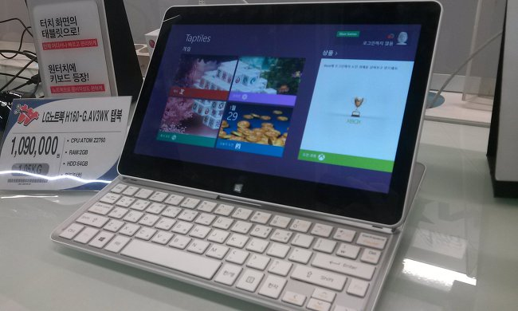
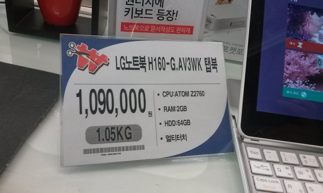
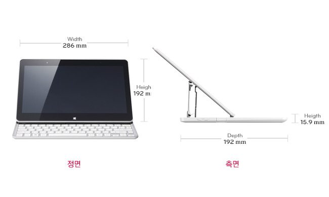
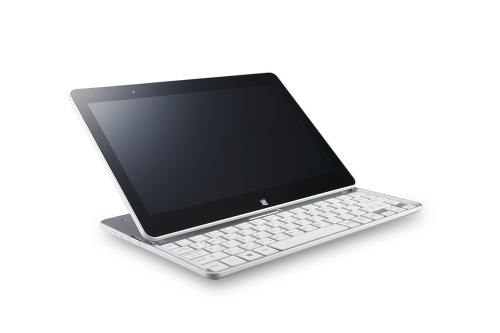

오늘 친구랑 홈플러스에 놀러갔습니다~

거기서 요즘 광고에 나오고 있는 탭북을 보았습니다.

다음은 전시되어 있는 사진입니다.

아아아아아아! 가지고 싶긴 하네요. ㅋㅋㅋ

솔직하게 빌드용으론 힘들겠지만 간단한 작업에는 원활하지 않을까? 라는 느낌이 드는군요.

램 2GB는 그렇게 큰게 느껴지진 않네요..

그리고 하드용량이 64GB라니 너무 작은거 아닙니까?

이 글이 판매용글, 리뷰가 아니기 때문에 제맘대로 막 쓸겁니다. +\_+

용량 저따구로 작아서 뭐가 깔리기라도 할까요?...??????

저걸로 게임한다는게 힘들지만 제가 2년전에산 U230도 하드가 300GB인대 64GB는 너무 작다 느껴집니다.

윈도우 깔면 50기가는 쓸수나 있을까요?

뭐 살게 아니기 때문에 넘어가고..

CPU가 아톰이라니....

탭북에 들어간 인텔® ATOM 듀얼 코어 Z2760 프로세서에 대해 검색해보니...

ㅋㅋㅋㅋㅋㅋㅋㅋㅋㅋㅋㅋㅋㅋㅋㅋㅋㅋㅋㅋㅋㅋㅋㅋㅋㅋㅋ

ㅋㅋㅋㅋㅋㅋㅋㅋㅋㅋㅋㅋㅋㅋㅋㅋㅋㅋㅋㅋㅋㅋㅋㅋㅋㅋㅋㅋㅋ

사는게 아니래요. ㅋㅋㅋ

단가가 비싼가봐요? 저 기술이..

탭/북 이렇게 움직이는 기술이 비싼가?

근대 저거 부러지면.. ㄷㄷㄷㄷㄷㄷㄷ ㅋㅋㅋㅋㅋㅋㅋㅋㅋ

으아! 저게 바로 높이 입니다. ㅋㅋㅋ

아오 사진 해상도가 너무 높네요 ㄷㄷ 낮췄습니다.

아무튼 딱 보면 가지고 싶긴 하군요...

[더이상의 설명은 생략한다!](http://www.lge.co.kr/lgekr/product/detail/LgekrProductDetailCmd.laf?catid=2100&prdid=EPRD.258609)

스펙은 흠... 장난감으로는 나쁘진 않은거 같은데, 그냥 간지용으로 사면 좋을듯 하네요. 갖고싶어라~
