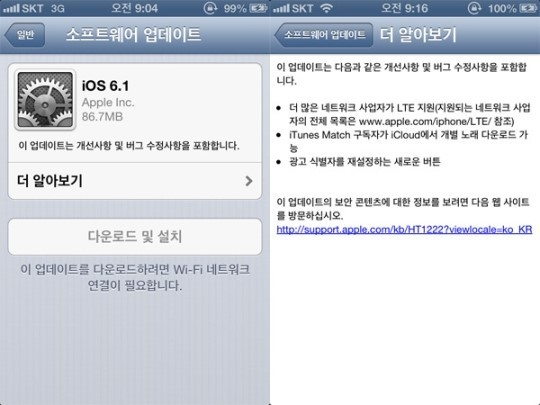
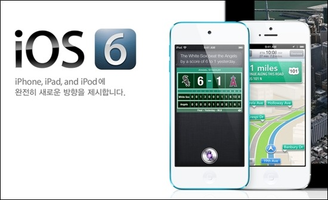
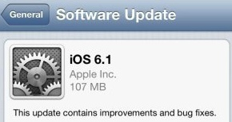
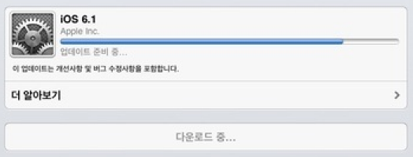

아이폰의 운영체제 IOS

지난 9월에 IOS 6이 발표된다음 몇번의 베타버전이 끝나고 드디어

IOS 6.1 정식버전이 발표되었습니다.

이번 업데이트에서 가장큰 업데이트라 하면 LTE가 개선되었다 하는데요.

더욱 많은 네트워크 사업자를 지원한다고 합니다.

이부분은 아이폰5 사용자가 아니라면 크게 메리트 있진 않을것 같습니다.

또한 시리의 언어가 더욱 다양해 졌다 합니다.

어처피 한국어는 이미 지원됬기 때문에 이부분도 국내 사용자 에겐 좋다! 할만큼의 에너지를 뽑아내진 못할 듯 합니다.

그 언어를 사용하시는 분들은 좋겠죠?

그리고 자잘한 버그가 수정되었다 합니다.

출시부터 욕*처*먹은 지도 어플리케이션의 오류를 수정했고,

잠금 화면에서 음악 조절이 가능해졌다고...

아이튠즈 매치 구독자가 아이클라우드의 개별 노래를 직접 다운로드 할 수 있게 수정되었다고 합니다.

근대 뉴스 돌아다니며 얻은 사진중 영어로된 IOS 6.1 업데이트 사진을 구했습니다.

한국어로 된 사진은 본문 위에 있는데요.

영어판의 용량은 107mb이고 한국판의 용량은 86.7mb군요?!

언어팩에 따라 용량이 원래 다른가...?

그리고 IOS 6의 문제라 여겨졌던 WIFI연결과 속도에 관한 패치가 이루어졌다고 합니다.

하지만 변한게 없다는 분들도 계시군요..

벌써 IOS 6.1에 대한 탈옥툴이 나왔다고 합니다. ㄷㄷ

<http://www.kbench.com/digital/?no=114224&sc=1>

위 기사를 보면 Redsn0w라는 분이 탈옥툴을 공개했다고 합니다...ㄷㄷ

몇가지 제약도 따르군요..

전 안드로이드만 써서 아이폰이 얼마나 좋은진 모르겠습니다만,

한 번은 써보고 싶군요 ㅋㅋ

아무튼 IOS 6.1 업데이트 대상자 분들이 부럽습니다. ㅠㅠ
