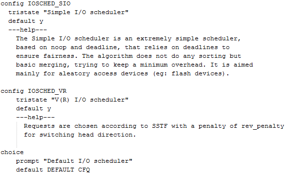
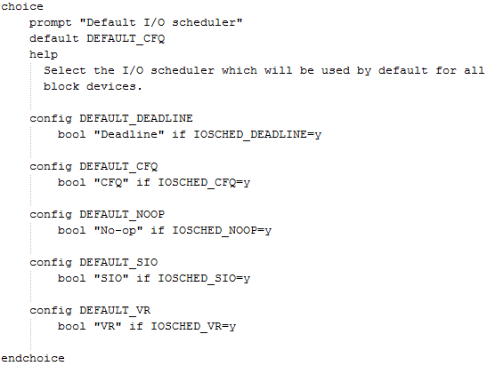
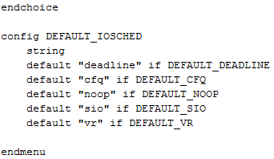
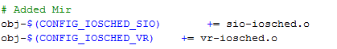
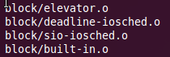

안녕하세요.

오늘은 커널에 스케쥴러를 추가해 보도록 하겠습니다.

좀 오래전(약 3달전)에 한 작업이라 사진이 극히 적으니 잘따라와 주세요.

구문은 다음 첨부파일을 확인해 주시면 감사드리겠습니다.

(제가 올려둔 Github의 commit를 확인해 보시려면

<https://github.com/itmir913/Mir-kernel/commit/d745d917209323bcac7ce117d7d6842a88e25678> 사이트를 방문해 주세요.)

**1. 스케쥴러의 소스를 구하자**

일단 추가할 스케쥴러의 소스를 구해야겠죠?

구하는 방법은 여러가지 입니다.

먼저 Github에서 구하는 방법이 있습니다 https://github.com 사이트에서 원하는 스케쥴러의 소스를 가져오시면 됩니다.

또한 구글링도 방법인대요 방대한 자료를 담고있는 구글에게 구해보는 겁니다.

마지막으로 누가 올려둔 소스를 보는 방법입니다.

제가 제 커널에 추가한 소스를 올려둘태니 참고하시면 될듯 합니다. ㅎㅎ

기본적으로 deadline이나 noop는 커널소스에 있을겁니다. sio나 vr만 받으셔도 될듯.

**2. 커널을 수정하자 - .c파일 추가편**

io 스케쥴러는 커널소스/block 폴더에 위치합니다.

이 폴더에 가져온 소스를 모두 넣어주시면 됩니다.

이름을 까먹을수 있으니 메모장이나 그런 프로그램에 이름만 저장해 두시면 편합니다.

**3. 커널을 수정하자 - 소스 수정편 -** **Kconfig.iosched**

우리가 수정해야 하는 파일은 Kconfig.iosched와 Makefile입니다.

일단 이 강좌에서는 sio와 vr만 추가하려 하기 때문에 이 두가지에 관한 내용만 서술하겠습니다.

다른 스케쥴러의 경우 Github에서 검색하보시면 다른 분께서 작성해 둔 소스를 살펴보시면 됩니다.

먼저 Kconfig.iosched부터 수정해 볼까요?

choice를 찾아주세요.

그 구문 위를 보시면 config DEFAULT\_CFQ 와 같은 구문이 있을겁니다.

그럼 그부분에 아래 구문을 넣어주시면 됩니다.

> config IOSCHED\_SIO
>
>     tristate "Simple I/O scheduler"
>
>     default y
>
>     ---help---
>
>     The Simple I/O scheduler is an extremely simple scheduler,
>
>     based on noop and deadline, that relies on deadlines to
>
>     ensure fairness. The algorithm does not do any sorting but
>
>     basic merging, trying to keep a minimum overhead. It is aimed
>
>     mainly for aleatory access devices (eg: flash devices).
>
> config IOSCHED\_VR
>
>     tristate "V(R) I/O scheduler"
>
>     default y
>
>     ---help---
>
>      Requests are chosen according to SSTF with a penalty of rev\_penalty
>
>      for switching head direction.

어려우시다면 아래 사진을 봐주시면 이해가 빠르실겁니다.

위 사진처럼 choice 위에 그냥 넣어주시기만 하시면 됩니다ㅋㅋ

그럼 다음으로 진행해 보겠습니다.

Kconfig에서 choice밑에 보시면 config DEFAULT가 있습니다.

이게 끝나는 부분에 아래 구절을 넣어주시면 됩니다.

> config DEFAULT\_SIO
>
>     bool "SIO" if IOSCHED\_SIO=y
>
> config DEFAULT\_VR
>
>     bool "VR" if IOSCHED\_VR=y

아래 사진처럼 choice밑부분에 config DEFAULT를 넣어주시면 완료됩니다.

이렇게 구문을 넣어주시면 완료됩니다. ㅎㅎ

Kconfig를 수정하는것은 대부분 완료되었습니다 이제 하나만 하면 됩니다.

커널에서 디폴트 스케쥴러를 설정할수 있게 해줘야 겠죠?

이번엔 endchoice를 찾아주세요.

endchoice밑에 default "cfq"의 문구가 있습니다.

이것도 마찬가지로 아래 구문을 넣어 주시면 됩니다.

> default "sio" if DEFAULT\_SIO
>
> default "vr" if DEFAULT\_VR

이렇게 말이죠.

endcohoice밑 config DEFAULT\_IOSCHED에 구절을 넣어주시면 완료되는 것이지요!

아무 수정도 하지 않은 Kconfig.iosched를 보시면 눈치가 빠르신 분들은 아 이런 구문을 넣으면 되는구나~ 라는 생각이 드실겁니다. ㅎㅎ

그냥 단순 복붙만 하면 되지요. ㅋ

**3. 커널을 수정하자 - 소스 수정편 - Makefile**

kconfig에서 이런 소스가 있구나~ 라는 것을 알아듣게 때렸으니 makefile에서 컴파일 되도록 구문을 추가해 줘야겠죠?

이건 수정이 완전 쉽습니다. ㅋㅋ

그냥 맨 아래에

> obj-$(CONFIG\_IOSCHED\_SIO) += sio-iosched.o
>
> obj-$(CONFIG\_IOSCHED\_VR) += vr-iosched.o

을 추가해주시면 됩니다.

위 사진처럼 말이죠. ㅋ

이제 모든 파일을 저장한다음 커널 컴파일 해주시면 됩니다.

혹시 모르니 menuconfig명령으로 스케쥴러가 정상적으로 추가 되어있는지 확인해 보시려면

menuconfig에서 Enable the block layer/IO Schedulers를 찾아가시면 확인하실수 있습니다~

그럼 위 사진처럼 정상적으로 컴파일 되는 모습을 지켜보실수 있습니다. ㅎㅎ