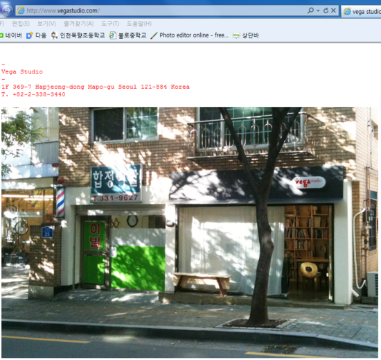
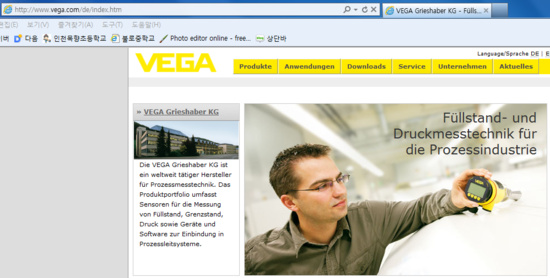

자 우리는 이제 사이트 주소에 관심을 가져봅시다

먼저 베가를 살피기 전 다른 회사는 어떤지 살펴보겠습니다

1. LG

lg의 사이트는 다음과 같습니다

[www.lg.co.kr](http://www.lg.co.kr/)

보시면 아시다 싶이 lg.co.kr이지요

lg의 사이트 주소는 lg입니다

2, Samsung

삼성의 사이트는 다음과 같습니다
[www.samsung.co.kr](http://www.samsung.co.kr/)

역시 삼성도 기업 이름과 사이트 이름이 같지요

물론 뒤 com이나 co.kr은 제외해야겠죠?ㅋ

3. Apple

오늘 애플주소도 들어가 봤는대요 (아이폰이 갑자기 끌려서..)

다음과 같습니다 애플의 주소는요
[www.apple.com/kr](http://www.apple.com/kr)

여기도 마찬가지로 apple의 주소는 apple입니다

기업들은 당연히 자신의 기업이름을 사이트의 도메인으로 쓰지요 ㅋ

4. Motorola

이제 좀 지겹기도 하니까 빨리 나갈께요
[www.motorola.com/kr/consumer](http://www.motorola.com/kr/consumer)

모토로라도 같습니다 기업이름=사이트 이름

철수한다니까 좀 아쉽네요..

5. HTC

htc도 철수한다는대..

아무튼 사이트 주소는
[www.htc.com/kr](http://www.htc.com/kr)

로 같습니다 역시 기업이름=사이트 도메인 주소 라는 공식이 성립되는 건가요?....

그런대...

6. Vega

우리의 베가에서 혁신이 일어납니다!!

베가의 사이트 주소는...

[www.ivega.co.kr](http://www.ivega.co.kr/)

입니다... 뭔가 끼어 있는게 보이시나요?

i가 끼어 ivega가 되었습니다...

만약 저라면 [www.vega](http://www.vega/)로 할탠대 말입니다...

왜 ivega일까요?

그래서 i를 뺀 vega를 검색해봤습니다

[www.vega.co.kr](http://www.vega.co.kr/)
[www.vega.com](http://www.vega.com/)

먼저 처음의 경우

사진이 좀 않좋습니다;
보시면 아시다 싶이 Vega Studio 입니다 사진관 이군요 ㅋ

[www.vega.co.kr](http://www.vega.co.kr/)를 치시면 [http://www.vegastudio.com/](http://www.vegastudio.com/)로 연결됩니다

그럼 후자의 경우는 어떨까요?

[www.vega.com](http://www.vega.com/)을 치시면 바로

음? 이게 뭐지요?

확대 해보겠습니다

이게 뭘까요?

VEGA라는 제품이 있군요...

그렇군요...

저같으면 어떻게든 [www.vega.co.kr](http://www.vega.co.kr/)이든지 [www.vega.com](http://www.vega.com/)이라는 도메인을 얻었을탠대요...

삼성같은 대기업은 돈주고 그 도메인을 샀겠죠?

이게 우리 베가의 한계인건가요?;;

이것으로 사이트 주소로본 Vega를 마치겠습니다
