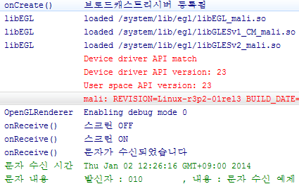

안녕하세요 ㅎ

원래는 2014년 처음에 올리려고 했는데 요즘 심한 감기에 걸려서 쿨럭

이번강좌부터는 조금씩 어려워 지고 있습니다

잘 따라와 주시고 이해가 안되는 부분은 아 그런가 보다~ 라고 생각하시는게 나을때가 많을겁니다 ㅎㅎ...

## 24. Broadcast Receiver로 문자(SMS) 수신해보자

### 24-1 Broadcast Receiver란?

브로드 캐스트(브로드캐스트리시버, BroadcastReceiver)란 과연 무엇일까요?

broadcast : 방송하다

receiver : 수신기(수신하다)

각각 이러한 뜻을 가지고 있는데요

합쳐보면 "방송을 수신한다" 라는 뜻이 됩니다

안드로이드에서는 어떠한 이벤트(활동)를 스피커에 대고 방송을 합니다

"핸드폰 화면이 꺼졌어요~"

그럼 브로드캐스트리시버가 이 방송을 듣습니다

"아 화면이 꺼졌다, 이러한 코드를 실행해야지"

이러한 원리로 작동이 되는겁니다

즉, 안드로이드에서 보내주는 이벤트를 수신해서 처리하는 곳이 바로 브로드캐스트리시버 입니다

그리고 브로드캐스트리시버는 우선순위에 따라 순차적으로 메세지가 전달됩니다

가장 우선순위가 높은 리시버에게 이벤트를 보내고, 그아래, 그아래.....으로 전달됩니다

이 BroadcastReceiver는 정적 리시버와 동적 리시버로 나눌수 있는데요

정적 리시버는 AndroidManifest.xml에 등록하며, 동적 리시버는 매니페스트에 등록하지 않습니다

### 24-2 Broadcast Receiver에서 받을수 있는 이벤트는 무엇이 있나요?

브로드캐스트에서 받을수 있는 액션이 무엇이 있는지 조금만 살펴보겠습니다

**ACTION\_BOOT\_COMPLETED**

**부팅이 끝났을 때 (RECEIVE\_BOOT\_COMPLETED 권한등록 필요)**

ACTION\_CAMERA\_BUTTON

카메라 버튼이 눌렸을 때

ACTION\_DATE\_CHANGED

ACTION\_TIME\_CHANGED

폰의 날짜, 시간이 수동으로 변했을때 (설정에서 수정했을때)

**ACTION\_SCREEN\_OFF**

**ACTION\_SCREEN\_ON**

**화면 on, off**

ACTION\_AIRPLANE\_MODE\_CHANGED

비행기 모드

ACTION\_BATTERY\_CHANGED

ACTION\_BATTERY\_LOW

ACTION\_BATTERY\_OKAY

배터리 상태변화

ACTION\_PACKAGE\_ADDED

ACTION\_PACKAGE\_CHANGED

ACTION\_PACKAGE\_DATA\_CLEARED

ACTION\_PACKAGE\_INSTALL

ACTION\_PACKAGE\_REMOVED

ACTION\_PACKAGE\_REPLACED

ACTION\_PACKAGE\_RESTARTED

어플 설치/제거

ACTION\_POWER\_CONNECTED

ACTION\_POWER\_DISCONNECTED

충전 관련

ACTION\_REBOOT

ACTION\_SHUTDOWN

재부팅/종료

ACTION\_TIME\_TICK

매분마다 수신

**android.provider.Telephony.SMS\_RECEIVED**

**sms 수신 (RECEIVE\_SMS 권한 필요)**

(전체중 극히 일부)

이중에서 굵은 표시가 되어 있는 부팅완료, 화면 on,off, 문자 수신을 가지고 예제를 만들어 보도록 하겠습니다

### 24-3 java파일 만들기

먼저 java파일을 만들어 줍시다

이 파일이 우리가 수신한 액션을 처리하는 브로드캐스트리시버 파일이 될것입니다

이름은 Broadcast.java입니다

import android.content.BroadcastReceiver;

import android.content.Context;

import android.content.Intent;

public class Broadcast extends **BroadcastReceiver** {

    @Override

    public void **onReceive**(Context context, Intent intent) {

    // 수신한 액션을 이 onReceive메소드에서 처리하게 됩니다

    }

}

달랑 메소드 하나만 있습니다

저 onReceive메소드에서 액션을 수신하여 처리할 코드를 입력해 주면 되는데요

액션이 하나라면 문제가 없지만 2개이상일때는 각각 구분해야 할 필요가 있습니다

intent.getAction()

으로 어떤 액션인지 알수 있습니다

예를들어 화면 on, off, 부팅 완료, sms수신의 경우

if (**Intent.ACTION\_BOOT\_COMPLETED**.equals(intent.getAction())){

    // 부팅완료

}

if (**Intent.ACTION\_SCREEN\_ON** == intent.getAction()) {

    // 화면 켜짐

}

if (**Intent.ACTION\_SCREEN\_OFF** == intent.getAction()) {

    // 화면 꺼짐

}

if (**"android.provider.Telephony.SMS\_RECEIVED"**.equals(intent.getAction())) {

    // sms 수신

}

이렇게 if문을 통해 구현해 주시면 됩니다 (이때 ==이나 equals나 상관이 없다고합니다만 잘 모르겠네요)

참고로 Intent.ACTION\_BOOT\_COMPLETED이나 "android.intent.action.BOOT\_COMPLETED"이나 같다고 합니다만 전자는 java에서, 후자는 xml에서 자주 보이는군요

이제 각각의 액션을 구분할수 있게 되었습니다

로그를 찍어서 한번 잘 작동하는지 보겠습니다

Log.d("onReceive()","부팅완료");

Log.d("onReceive()","스크린 ON");

Log.d("onReceive()","스크린 OFF");

Log.d("onReceive()","문자가 수신되었습니다");

각각 if문안에 넣어주세요

그다음 문자 수신의 경우는 누가 보냈는지와, 어떤 내용인지, 언제 수신했는지등의 정보를 알아야 합니다

이것은 일단 맨 아래에서 설명해 봅시다

참고로 우선순위가 낮은 브로드캐스트리시버가 수신을 못하게 하는 방법은

abortBroadcast();

를 사용하시면 됩니다

이제 매니페스트 파일에 등록해 봅시다

### 24-4 AndroidManifest.xml에 등록하자 (정적 등록)

정적 등록이라는건 한번 등록하면 수정이 안됩니다 (무조건 수신)

그러나 java에서 등록하면 xml보다 유동적으로 등록/해제가 가능합니다

사실 브로드캐스트는 등록할 필요가 그닥 없으며, xml에 등록을 해도 받지 못하는 액션도 있습니다

그런 액션은 동적으로 등록해야 합니다 (24-5 참조)

한번 등록해 봅시다

<receiver android:name ="whdghks913.tistory.examplebroadcastreceiver.Broadcast">

    <intent-filter **android:priority="9999"**>

        <action android:name="**android.intent.action.BOOT\_COMPLETED**"/>

        <action android:name="**android.provider.Telephony.SMS\_RECEIVED**" />

    </intent-filter>

</receiver>

receiver를 등록하였습니다

저기서 android:priority는 우선순위로, 숫자가 높을수록 우선순위가 높습니다

우선순위가 높은 리시버 부터 순차적으로 메세지가 전달됩니다

그런대 화면 on, off는 없네요?

그것은 위에서 말했드시 일부 액션은 xml에 등록해도 액션을 받을수 없습니다

그러므로 아래에서 살펴볼 registerReceiver()메소드를 이용해 등록해야만 합니다

마지막으로 부팅완료와 sms수신은 권한이 필요합니다

<uses-permission android:name="android.permission.RECEIVE\_BOOT\_COMPLETED" />

<uses-permission android:name="android.permission.RECEIVE\_SMS" />

### 24-5 registerReceiver()로 등록하자 (동적 등록)

24-4에서 등록하지 못한 Screen on과 off는 동적으로 java파일에서만 등록이 가능한 액션의 대표적인 예입니다

이번에는 동적으로 등록해 보겠습니다

MainActivity.java를 열어주세요

BroadcastReceiver myReceiver = new **Broadcast()**;

Button이나 TextView처럼 추가해 주시면 됩니다

굵게 표시한 Broadcast()는 java파일의 이름입니다

그다음 onCreate()에는

**IntentFilter intentFilter** = new IntentFilter(**Intent.ACTION\_SCREEN\_ON**);

intentFilter.**addAction**(**Intent.ACTION\_SCREEN\_OFF**);

intentFilter.addAction(Intent.ACTION\_BOOT\_COMPLETED);

intentFilter.addAction("android.provider.Telephony.SMS\_RECEIVED");

**registerReceiver**(myReceiver, intentFilter);

Log.d("onCreate()","브로드캐스트리시버 등록됨");

를 입력해 봅시다

IntentFilter를 통해 액션을 등록한다음, registerReceiver()로 리시버를 등록하고 있습니다

마지막으로 어플을 종료할때 호출되는 onDestroy()메소드를 만들어 액티비티가 종료되면 등록을 해제합시다

@Override

protected void onDestroy() {

    super.onDestroy();

**unregisterReceiver(myReceiver);**

    Log.d("onDestory()","브로드캐스트리시버 해제됨");

}

unregisterReceiver()로 등록을 해제할수 있습니다

이렇게 등록된 리시버는 **등록한 액티비티가 사라지거나 하면 등록이 해제되는 단점**이 있어 죽지 않는 서비스에서 등록합니다

### 24-6 문자 내용 수신 코드

아래는 문자 내용을 수신하는 코드입니다

// SMS 메시지를 파싱합니다.

Bundle bundle = intent.getExtras();

Object messages[] = (Object[])bundle.get("pdus");

SmsMessage smsMessage[] = new SmsMessage[messages.length];

for(int i = 0; i < messages.length; i++) {

    // PDU 포맷으로 되어 있는 메시지를 복원합니다.

    smsMessage[i] = SmsMessage.createFromPdu((byte[])messages[i]);

}

// SMS 수신 시간 확인

Date curDate = new Date(smsMessage[0].getTimestampMillis());

Log.d("문자 수신 시간", curDate.toString());

// SMS 발신 번호 확인

String origNumber = smsMessage[0].getOriginatingAddress();

// SMS 메시지 확인

String message = smsMessage[0].getMessageBody().toString();

Log.d("문자 내용", "발신자 : "+origNumber+", 내용 : " + message);

그러나 아직 어려우므로 이해하지 말고 그렇구나 하고 넘어갑시다 ㅎ

출처 : <http://android-town.org/>

### 24-7 완성!!

자, 이제 모든것이 완성되었습니다

그럼 작동을 확인해 보겠습니다

로그를 찍어보면 정상 작동하고 있다는 것이 나타납니다 ㅎㅎ

이번 강좌는 뭔가 횡설수설한 느낌이 강하네요;

오타가 많을거 같습니다

발견하시면 알려주세요 ㅎ

[ExampleBroadcastReceiver.zip](./file/ExampleBroadcastReceiver.zip)

---

## 첨부파일

- [ExampleBroadcastReceiver.zip](https://github.com/itmir913/archive/releases/download/itmir-attachments/ExampleBroadcastReceiver.zip) `636 KB`
