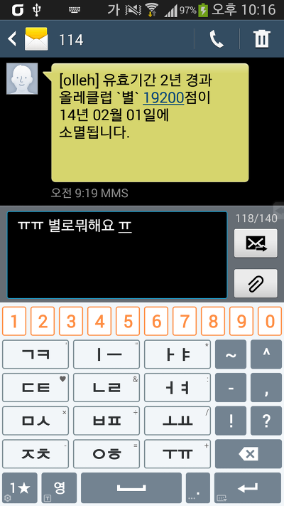
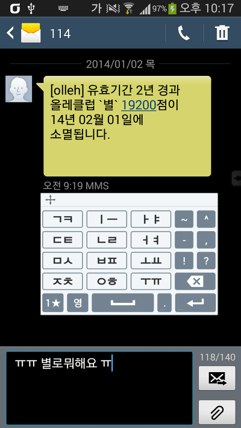
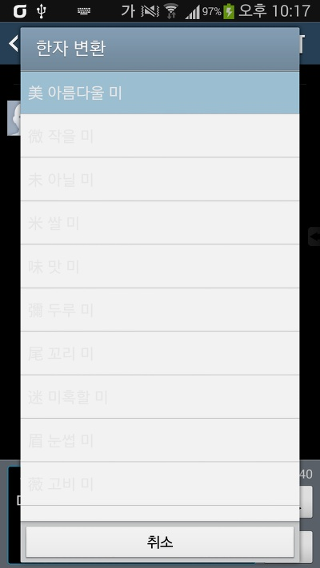
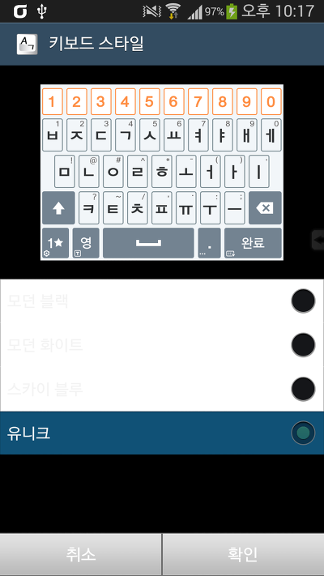
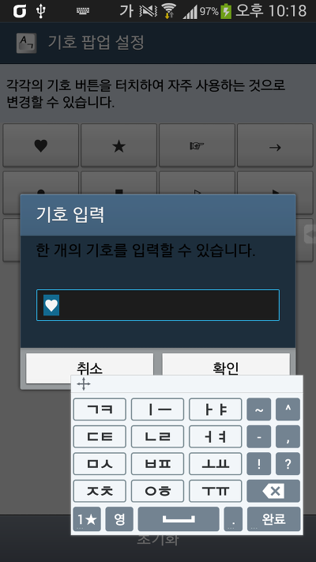
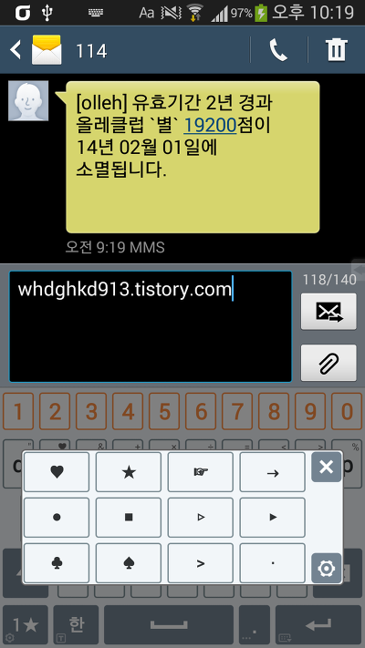

베가 시크릿 업(Vega Secret UP)의 순정 키보드 어플을 삼성 갤럭시 S3 LTE에서 작동시켜봤습니다

역시 베가 UI는 아몰레드에서 사용하는게 아니예요 ㄷㄷ

이 테마로 오래쓰다가는 엄청난 번인이;;;;(?)

아래는 스크린샷입니다

키보드 하면 가장 먼저 생각나는(?) 문자 어플로 해봤어요

그나저나 저 별 19200점 어떻게 쓸 방법 없을까요?...

    

    

    

(배경색이 안맞는다던지 이런 문제는 저게 원래 android.R.xx를 쓰는거라 안드로이드 기본으로 정해진거 마다 달라요 그래서 수정하려면 일일히 framework를 뜯어야 해서 귀찮 쩝)

아무튼 베가 시크릿 업의 키보드 어플을 사용해 봤습니다

결론은... 방학인대 할짓이 너무 없다..

대부분의 기능 작동하는걸로 보이고, 강종 버그는 수정한듯 합니다

그 뭐지...음... 아 맞다

SKY설정에서 On, Off를 하는 베가 키패드 진동설정은 아마도 설정이 안될듯 합니다

왜냐면 그거 하다가 너무 오류가 나기에 없애버렸어요 ^^

그래서 버그라면 진동이 안울리는정도??

그럼 이만...

[DOWNLOAD]

-2014-01-04 수정

강제종료 오류와 일부 기능을 수정하였습니다

참고 : <http://itmir.tistory.com/426>

[20140104-VEGAIME.apk](./file/20140104-VEGAIME.apk)

-2014-05-04 킷캣 최신 버전으로 업데이트 되었습니다

http://itmir.tistory.com/493

ps. VegaKeyguardSOS나 VEGAIMEProvider는 필요 없겠죠?? 힘들어서 그냥 뺐는대...

사실은 뭔지 몰라서 그냥 뺐습니다 무슨 기능이 있는거면 알려주세요

---

## 첨부파일

- [20140104-VEGAIME.apk](https://github.com/itmir913/archive/releases/download/itmir-attachments/425-20140104-VEGAIME.apk) `7.9 MB`
