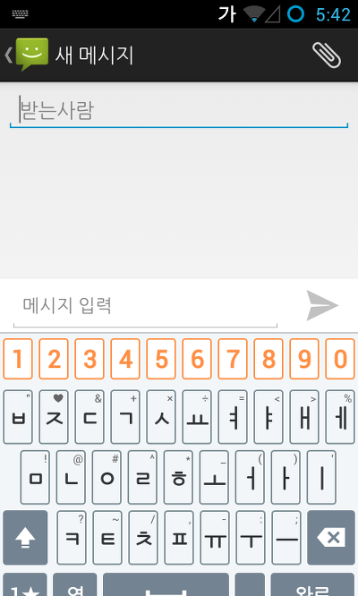
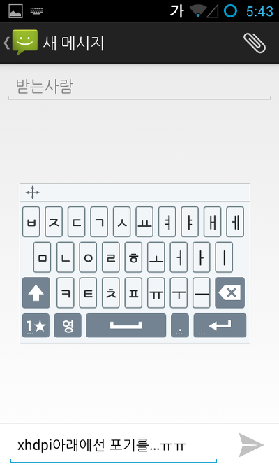
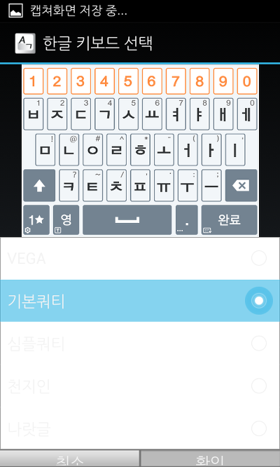
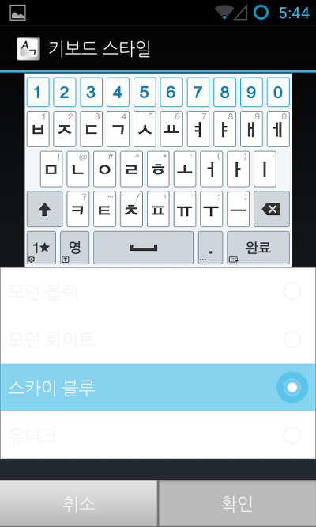

출처 없이 파일만 가져가는 일부 양심적이지 않은 분들께 알려드립니다

블로그의 모든 자료는 기본적으로 글에 출처가 없는 이상 직접 힘들게 만든 작업물 입니다

자료를 쓰시는건 정말 좋습니다

그러나 출처를 안써주시는건 정말 나쁜 행동입니다

[Appzzang](http://appzzang.co/bbs/board.php?bo_table=shareboard&wr_id=194307&sca=%EC%9E%90%EB%A3%8C&page=67)에 올라온 글을 보면 파일이 아무대나 출처없이 돌아다니고 있다는 정황을 포착했습니다

원래 이 키보드 저작권은 팬택에게 있어서 제가 뭐라 할수 있는 처지는 못됩니다만

상식적으로 자신이 만들지도 않은 자료 가지고 공유를 허락하네 마네 하는거 웃기네요 ㅋㅋ

ps. 블로그 자료가 출처없이 돌아다니고 있는 글을 발견하시면 제게 알려주시고 해당 글에 출처를 남겨주시면 감사드리겠습니다~ 라는 덧글 하나 써주시면 감사드리겠습니다~

ps2. 이 자료 어디까지 퍼진거죠?ㅋㅋ

어제 올린 베가 시크릿 업 키보드 ([[Application] - [APP] Vega Secret UP (베가 시크릿 업) 키보드](/archive/itmir/2014/425)) 어플이

일부 기종에서는 정상 실행이, 일부 기종에서는 강제종료가 발생한다고 하여 조사를 하였습니다

그결과 제 메인폰 갤럭시 S3에서는 작동이 원활하게 잘 되었으나 서브폰 넥서스S에서 시험한 결과 강제종료 오류가 발생하였습니다

따라서 오늘 약 2시간의 뻘짓결과 수정을 모두 마쳐 넥서스S에서도 정상 작동을 하기에 수정본 업로드 합니다

스크린샷 - 넥서스S

   

   

2014-01-04 수정내역

-홈화면 런처에 키보드 설정 아이콘 추가 (ㅈ..절때로 웃음투자님의 LG키보드 따라한거 아닙니다 ㅎㅎ;;)

-hdpi기종에서 확인/취소 버튼이 짤려 안보이던 문제 일부 수정

-강제종료 오류 수정

-기타 만든이 각인(?) 추가

-등.

스크린샷 보시면 아시겠지만.. xhdpi기종 이상이 아닌 hdpi기기 유저분들은 사용을 안하시는것이 정신건강에 좋으실듯 합니다

왜냐면... 짤려요 키보드가 ㅋㅋ;

그럼... 몸이 않좋아서 이만...

ps. 이번 수정은 조금 어려웠어요 ㅠㅠ

아래 개발자용 글을 보시면 아시겠지만 정말 삽질 많이 했습니다

사용하실때 덧글 한마디씩 해주시면 감사드리겠습니다 ㅠㅠ

[DOWNLOAD]

[20140104-VEGAIME.apk](https://github.com/itmir913/archive/releases/download/itmir-attachments/426-20140104-VEGAIME.apk)

-2014-05-04 킷캣 최신 버전으로 업데이트 되었습니다

/archive/itmir/2014/493

-개발자용 메모

처음에 넥서스S에서 나타났던 오류 입니다

D/dalvikvm( 3612): Trying to load lib /data/app-lib/com.pantech.inputmethod.skyime-1/libjni\_skyime.so 0x4222f900

D/dalvikvm( 3612): Shared lib '/data/app-lib/com.pantech.inputmethod.skyime-1/libjni\_skyime.so' already loaded in same CL 0x4222f900

E/dalvikvm( 3612): dlopen("/system/lib/libdhwr.so") failed: **Cannot load library**: load\_library(linker.cpp:771): library "**/system/lib/libdhwr.so**" **not found**

E/AndroidRuntime( 3612): FATAL EXCEPTION: main

E/AndroidRuntime( 3612): **java.lang.UnsatisfiedLinkError: Cannot load library: load\_library(linker.cpp:771): library "/system/lib/libdhwr.so" not found**

E/AndroidRuntime( 3612): at java.lang.Runtime.load(Runtime.java:340)

E/AndroidRuntime( 3612): at java.lang.System.load(System.java:507)

여기서 /system/lib/libdhwr.so 보이시나요?

강제종료가 났던 원인은 /system/lib/libdhwr.so파일이 없었기 때문입니다

그래서 덧글을 달아주신 분들중 저 so 파일을 lib폴더에 넣어주면 작동이 되는 분들이 계신거 였고요 (넥스에도 넣으면 작동됨)

하지만 제가 만들고 싶은건 "순정"에서 돌아가는 전기종 어플 이므로 찾아봤습니다

이상한건 어플내/lib/armeabi-v7a폴더에 libdhwr.so파일이 분명 있었습니다

원래 저기서 가져와야 하는게 맞는대 이상하게 /system/lib폴더를 찾고 있었습니다

아무리 뒤져봐도 해결이 안나오니 classes.dex를 java코드로 변환하서 뒤져봤습니다

libjni\_skyime.so를 호출하는 java는 com/pantech/inputmethod/skyime/Utils이더라고요

smali를 java로 변환한 코드입니다

public static void **loadNativeLibrary()**{

    try{

        if (SkyIMEData.USE\_SYSTEM\_LIBRARY){

**System.loadLibrary**("jni\_skyime");

            return;

        }

**System.load**("/data/data/com.pantech.inputmethod.skyime/lib/libjni\_skyime.so");

        return;

    }catch (UnsatisfiedLinkError localUnsatisfiedLinkError){

        Log.e(TAG, "Could not load native library jni\_skyime");

    }

}

여기서 System.loadLibrary()와 System.load()의 차이를 알았습니다

System.loadLibrary() : path를 기준으로 찾음, 경로를 설정할 필요가 없음

System.load() : 절대 경로로 찾음, 파일위치가 필요

저 굵은 부분 코드를 smali로 보면 아래와 같습니다

const-string v1, "jni\_skyime"

invoke-static {v1}, Ljava/lang/System;->**loadLibrary**(Ljava/lang/String;)V

const-string v1, "/data/data/com.pantech.inputmethod.skyime/lib/libjni\_skyime.so"

invoke-static {v1}, Ljava/lang/System;->**load**(Ljava/lang/String;)V

참고로 저 메소드를 호출하는 곳은

com/pantech/inputmethod/keyboard/ProximityInfo

com/pantech/inputmethod/skyime/BinaryDictionary

두곳입니다

그다음 libdhwr.so를 검색하면 com/diotek/dhwr/DHWR.smali에서 찾을수 있습니다

static{

    String str = **GetLibraryPath**("4.00");

**if (str != null)**

**System.load(str);**

while (true){

        DTYPE\_NONE = BIT\_FLAG(0);

        DTYPE\_MULTI\_CHARS = BIT\_FLAG(1);

생략

        mResult = new Result();

**return;**

**System.loadLibrary("dhwr");**

        // 리턴하면 그 아래에 있는 코드는 쓸모가 없죠...

}

}

....

public static String GetLibraryPath(String paramString){

    if (new File("/data/data/com.diotek.dhwr.addon/lib/libdhwr.so").exists());

label135:

while (true)

   try{

            FileInputStream localFileInputStream = new FileInputStream("/data/data/com.diotek.dhwr.addon/lib/libdhwrex.so");

            byte[] arrayOfByte = new byte[localFileInputStream.available()];

            localFileInputStream.read(arrayOfByte, 0, arrayOfByte.length);

            String[] arrayOfString = new String(arrayOfByte, "ascii").split("\\.");

            if (arrayOfString.length != 3)

   break label135;

            if (paramString.compareTo(arrayOfString[0] + "." + arrayOfString[1]) != 0){

   break label135;

                localFileInputStream.close();

**return "/system/lib/libdhwr.so";**

}

Integer.parseInt(arrayOfString[2]);

continue;

}catch (Exception localException){

   continue;

}

}

초반부분쯤 GetLibraryPath()메소드를 호출하고 그게 null값이 아니라면 System.load();를 하고 있어요

그런대 GetLibraryPath()이 조금 이상합니다 그래서 해석 포기

아무튼 /system/lib/libdhwr.so가 리턴되서 System.load()에 들어가게 되는대...

이 파일이 없는 기기들이 있었죠?

그래서 강종 오류가 떴던거 같습니다

const-string v1, "dhwr"

invoke-static {v1}, Ljava/lang/System;->load(Ljava/lang/String;)V

를

const-string v1, "dhwr"

invoke-static {v1}, Ljava/lang/System;->loadLibrary(Ljava/lang/String;)V

로 바꿔줍니다

이상...!!

출처 : <http://www.androidpub.com/2256339>

[http://blog.naver.com/todangs/80133439961](http://www.androidpub.com/2256339)

[http://blog.naver.com/lestat85/150167148465](http://www.androidpub.com/2256339)

---

## 첨부파일

- [20140104-VEGAIME.apk](https://github.com/itmir913/archive/releases/download/itmir-attachments/426-20140104-VEGAIME.apk) `7.9 MB`