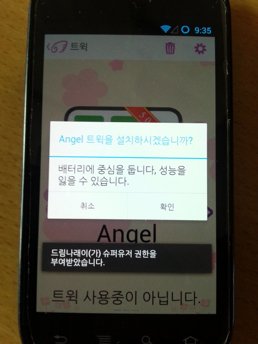

[안내]

본 게시글은 2014년 1월에 작성되었을 당시, 암호를 입력해야만 본문을 열람할 수 있었습니다. 암호는 dreamnarae-2014 였으며, 앱 개발자인 소피아네(WindSekirun)님만 본문을 볼 수 있었습니다.

하지만, 현재 2020년 10월 기준, 이 게시글을 공개로 전환합니다.

드림나래 앱이 플레이스토어에서 내려간지 오래되었고, 엔젤로이드 팀이 활동을 하지 않아 피해를 받지 않을 거라고 생각되며, 필자는 이 게시글의 내용이 안드로이드 보안에 기여하는 바가 크다고 판단하였기 때문입니다.

[알림]

이 글은 안드로이드 보안의 헛점과 난독화의 한계를 나타내는 글입니다.

[분석도구]

smali to java: [[SmartPhone] - Apk Dex Tools (Apk Manager)](/archive/itmir/2013/399)

apk manager: [[SmartPhone] - Apk Manager 5.0.2 다운/사용법 및 Java 설정](/archive/itmir/2013/121)

[분석대상]

이름: 드림나래

패키지: angeloid.dreamnarae.v3

버전: 3.0.5.Release

버전코드: 11

드림나래(dreamnarae)가 업데이트 되기 몇일전 Sleepy님께서 드림나래에 보안 헛점이 많다고 지적했습니다.

이를 보고 무슨 오류일까 궁금해 제가 직접 뜯어봤습니다.

그 결과 정말 놀라웠습니다.

안드로이드 어플의 라이센스를 크랙하는 대표적인 방법을 사용하여 크랙이 가능했습니다.

참고 : [[Development/App] - 안드로이드 어플 라이센스 크랙하기 (DRM Crack)](/archive/itmir/2013/408)

참고 글의 "무조건 TRUE반환" 방법을 사용하여 크랙이 가능했습니다.

먼저 핵심 키워드를 찾아냅니다.

찾는 방법은 다양하지만 제 경우는 아래와 같은 방법으로 찾아내고 있습니다.

런처에 나타나는 액티비티부터 분석합니다.

처음 실행되는 java파일을 찾아낸 후, 키워드를 분석해 내는겁니다.

smali 언어가 보기 싫어 java로 변환해 분석하면 더욱 편리합니다. (분석도구 첫번째)

이때 분석 키워드는,

pro, license, proversion, inapp등 유료를 나타내는 단어로 검색합니다.

드림나래같은 경우는 매인 액티비티가 smali/angeloid/dreamnarae/v3/main/MainActivity.java 입니다.

이 액티비티 부터 조사해 보면 나옵니다. Boolean반환 메소드라던지.. 코드라던지.

3.0.5 버전부터 난독화가 되어 있어 메소드 명은 알아보지 못하지만, inapp으로 검색하니 a()Z메소드가 MainActivity.java에 있더라고요.

smali언어를 보기 싫어 java로 보면 아래와 같더군요.

public static boolean a()

  {

    try

    {

      Bundle localBundle = n.a(3, "angeloid.dreamnarae.v3", "inapp", null);

      int i1 = localBundle.getInt("RESPONSE\_CODE");

      ArrayList localArrayList = null;

      if (i1 == 0)

        localArrayList = localBundle.getStringArrayList("INAPP\_PURCHASE\_ITEM\_LIST");

      if ((i1 == 0) && (localArrayList.size() > 0))

      {

        boolean bool = ((String)localArrayList.get(0)).equals("angel\_unlock");

        if (bool)

**return true;**

      }

    }

    catch (RemoteException localRemoteException)

    {

    }

**return false;**

  }

smali는 아래와 같습니다.

.method public static a()Z

    .locals 7

    .prologue

    const/4 v0, 0x0

    const/4 v1, 0x0

    .line 179

    :try\_start\_0

    sget-object v2, Langeloid/dreamnarae/v3/main/MainActivity;->n:Lcom/a/a/a/a;

    -- 모두 생략 --

.end method

그래서 그냥 아래처럼 코드를 바꿔버리면 무조건 true가 반환됩니다.

.method public static a()Z

    .locals 7

    .prologue

    const/4 v0, 0x**1**

**return v0**

    const/4 v1, 0x0

    .line 179

    :try\_start\_0

    sget-object v2, Langeloid/dreamnarae/v3/main/MainActivity;->n:Lcom/a/a/a/a;

    -- 모두 생략 --

.end method

그다음 검색해보면 smali/angeloid/dreamnarae/v3/tweak/Angel\_Biling.java에도 있는거 같아서 아래처럼 수정합니다.

public void a()

  {

    try

    {

      startIntentSenderForResult(((PendingIntent)a.a(3, getPackageName(), "angel\_unlock", "inapp", null).getParcelable("BUY\_INTENT")).getIntentSender(), 1001, new Intent(), Integer.valueOf(0).intValue(), Integer.valueOf(0).intValue(), Integer.valueOf(0).intValue());

      return;

    }

    catch (Exception localException)

    {

    }

  }

# virtual methods

.method public a()V

    .locals 7

    .prologue

    .line 132

return-void

    :try\_start\_0

    const-string v3, "angel"

    .line 133

    sget-object v0, Langeloid/dreamnarae/v3/tweak/Angel\_Biling;->a:Lcom/a/a/a/a;

    const/4 v1, 0x3

    invoke-virtual {p0}, Langeloid/dreamnarae/v3/tweak/Angel\_Biling;->getPackageName()Ljava/lang/String;

    -- 생략 --

.end method

아래부분을 실행하지 말고 그냥 리턴해버리면 끝;

이렇게 수정한 어플을 실행한다음 Angel 트윅을 설치하려고 하면,

인앱 결제 창도 안뜨고 바로 설치 화면이 나타납니다.

물론 프리덤같은걸로 결제한것도 아니라서 결제 흔적도 안남을거고, 남는다면 서버 로그기록정도...??

아무튼 이렇게 시도해 보면서 안드로이드와 java가 정말 쉽게 뚤리구나 라는것을 알게 되었습니다.

소피아네님 이제 더욱더 강력한 무기로 막는겁니다(?)

그럼 제가 그걸 뚫어서(?)

결론 : 안드로이드 보안은 정말 힘드네요.. 요즘 인앱 결제를 많이 넣고 있는데,

그냥 true값을 반환하게 해버리면 다 뚤리니 말이죠;

근본적인 대책이 필요합니다.

아래는 diff로 소스를 분석한 patch파일 입니다.

[DN.patch](./file/DN.patch)

---

## 첨부파일

- [DN.patch](./files/DN.patch)