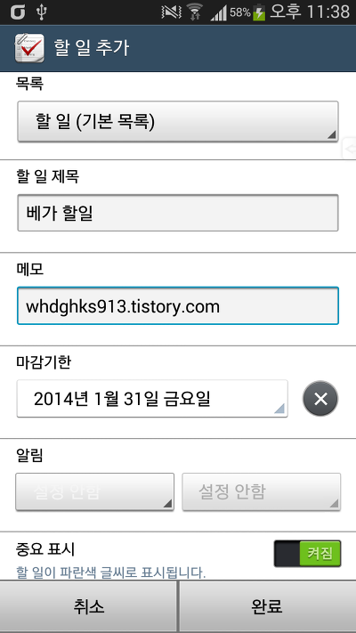
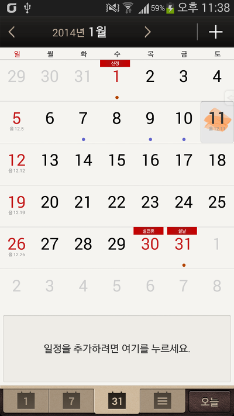
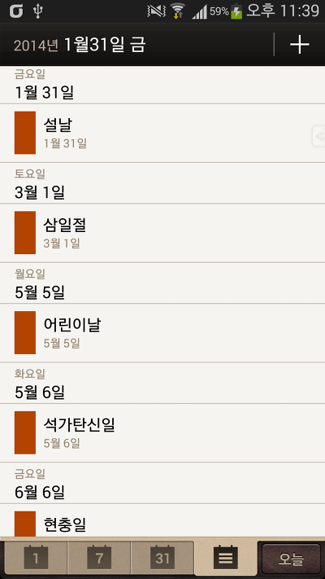
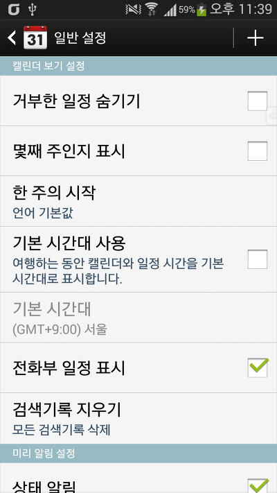

마켓에 존재하는 베가 할일 어플과 캘린더 어플입니다

일단 베가 어플이므로(?) 디자인이 나쁘지는 않네요

마켓에 존재하는 어플은 팬택 기종만 다운로드가 가능합니다

타 제조사 기기는 다운로드도, 검색도 불가능 하므로 그 기기를 위해 수정된 어플입니다

일부 글자색등이 수정되었습니다

버그가 있다면 알려주세요 수정하도록 하겠습니다

[할일 어플 스크린샷]

    

[캘린더 어플 스크린샷]

    

[DownLoad]

캘린더 : v1.1.0

할일 : v1.1.2

[캘린더 Beta.apk](https://github.com/itmir913/archive/releases/download/itmir-attachments/429-calendar-beta.apk)

[할일 Beta.apk](https://github.com/itmir913/archive/releases/download/itmir-attachments/429-todo-beta.apk)

---

## 첨부파일

- [캘린더 Beta.apk](https://github.com/itmir913/archive/releases/download/itmir-attachments/429-calendar-beta.apk) `2.0 MB`
- [할일 Beta.apk](https://github.com/itmir913/archive/releases/download/itmir-attachments/429-todo-beta.apk) `2.5 MB`
