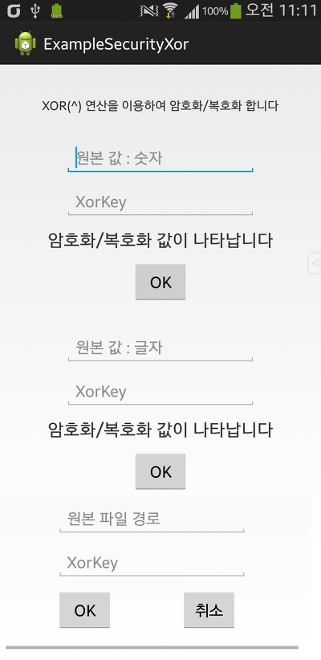
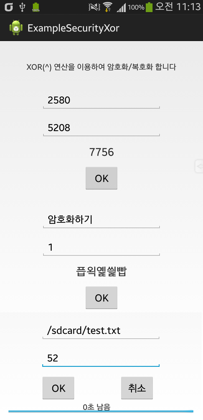

Xor연산을 이용하여 int, String, long, short, byte, char, File를 암호화 할수 있는 library입니다

안드로이드 어플리케이션에 jar 파일을 추가한다음 사용하시면 됩니다

---

[DownLoad]

jar library와 javadoc

Version : v1.0, 2014-01-14

[SecurityXOR.jar

다운로드](./file/SecurityXOR.jar)

[javadoc.zip

다운로드](./file/javadoc.zip)

2014-09-11 원본 java소스 첨부

[SecurityXORLibrary.java

다운로드](./file/SecurityXORLibrary.java)

---

**API 가이드 (KO - EN)**

필요한 import

Necessary import

import com.whdghks913.xor.SecurityXOR;

Xor.jar library를 사용하기 위한 선언

Declaration to use the Xor.jar library

SecurityXOR securityXOR = new SecurityXOR();

사용할수 있는 메소드

Available methods

getSecurityXOR(), securityFileXOR(), remainingTime(), getIsFileSize(), getTotalFileSize(), getJarVersion()

getSecurityXOR()메소드 가이드

**getSecurityXOR(int Code, int XorCode)**

-반환형(Return value type) : int

: Code-원본값(original value), XorCode-xor비밀번호(xor Password)

XorCode가 0일경우 0을 반환합니다

**getSecurityXOR(String Code, int XorCode)**

-반환형(Return value type) : String

: Code-원본값(original value), XorCode-xor비밀번호(xor Password)

XorCode가 0일경우 0을 반환합니다

**getSecurityXOR(String Code, byte XorKey[])**

-반환형(Return value type) : String

: Code-원본값(original value), XorCode[]-xor비밀번호 배열(xor password arrangement)

**getSecurityXOR(long Code, int XorCode)**

-반환형(Return value type) : long

: Code-원본값(original value), XorCode-xor비밀번호(xor Password)

Xorcode가 0일경우 null을 반환합니다

**getSecurityXOR(long Code, long XorCode)**

-반환형(Return value type) : long

: Code-원본값(original value), XorCode-xor비밀번호(xor Password)

XorCode가 0일경우 0을 반환합니다

**getSecurityXOR(short Code, int XorCode)**

-반환형(Return value type) : int

: Code-원본값(original value), XorCode-xor비밀번호(xor Password)

XorCode가 0일경우 0을 반환합니다

**getSecurityXOR(byte Code, int XorCode)**

-반환형(Return value type) : int

: Code-원본값(original value), XorCode-xor비밀번호(xor Password)

XorCode가 0일경우 0을 반환합니다

**getSecurityXOR(char Code, int XorCode)**

-반환형(Return value type) : char

: Code-원본값(original value), XorCode-xor비밀번호(xor Password)

XorCode가 0일경우 0을 반환합니다

securityFileXOR()메소드 가이드

**securityFileXOR(File originFile, File securityFile, int XorCode)**

-반환형(Return value type) : boolean

: originFile-암호화할 File, securityFile-xor암호화후 File, XorCode-비밀번호

securityFile이 존재하면 true, 없으면 false를 반환합니다

**securityFileXOR(File originFile, File securityFile, int XorCode, ProgressBar progressBar)**

-반환형(Return value type) : boolean

: originFile-암호화할 File, securityFile-xor암호화후 File, XorCode-비밀번호, progressBar-진행상황 표시

진행상황을 표시하려면 이 메소드를 사용하세요

securityFile이 존재하면 true, 없으면 false를 반환합니다

**stopFileSecurity()**

-반환형(Return value type) : void

: 파일 암호화를 중단합니다

**remainingTime()**

-반환형(Return value type) : int

: 남은시간을 초 단위로 반환합니다

쓰래드를 이용하여 1초마다 사용해 주세요

**getIsFileSize()**

-반환형(Return value type) : int

: 현재 xor연산이 완료된 파일 크기를 byte단위로 반환합니다

**getTotalFileSize()**

-반환형(Return value type) : int

: 전체 파일 크기를 byte단위로 반환합니다

**getJarVersion()**

-반환형(Return value type) : String

jar버전을 String으로 반환합니다

---

**자바 API 예제**

[DownLoad]

[SecurityXor.java

다운로드](./file/SecurityXor.java)

이클립스(eclipse)에서 jar library를 추가하세요 (Add SecurityXOR.jar)

[CMD]

--ExampleSecurityXor--

--byte

securityXOR.getSecurityXOR(5, 12) : 9

--char

securityXOR.getSecurityXOR('A', 5) : D

--int

securityXOR.getSecurityXOR(25, 854) : 847

--long(int)

securityXOR.getSecurityXOR(85L, 852) : 769

--long(long)

securityXOR.getSecurityXOR(85258L, 85L) : 85343

--short

securityXOR.getSecurityXOR(56, 582) : 638

--String(byte[])

securityXOR.getSecurityXOR("Hi XOR", { 5, 8, 9 }) : Ma)]G[

--String(int)

securityXOR.getSecurityXOR("JAR FILE", 251) : 군⒪쉿렙

--File

securityXOR.securityFileXOR(new File("C:/java/test.txt"), new File("C:/java/test\_xor.txt"), 8547)

Success : true, Fail : false

--TotalSize

securityXOR.getTotalFileSize() : 0byte(바이트)

--JarVersion

securityXOR.getJarVersion() : SecurityXOR by Mir(whdghks913), v1.0

--remaining Time

securityXOR.remainingTime() : 4Sec(초)

--isFileSize

securityXOR.getIsFileSize() : 322859byte(바이트)

--remaining Time

securityXOR.remainingTime() : 3Sec(초)

--isFileSize

securityXOR.getIsFileSize() : 480423byte(바이트)

--remaining Time

securityXOR.remainingTime() : 2Sec(초)

--isFileSize

securityXOR.getIsFileSize() : 638265byte(바이트)

--remaining Time

securityXOR.remainingTime() : 1Sec(초)

--isFileSize

securityXOR.getIsFileSize() : 802051byte(바이트)

--remaining Time

securityXOR.remainingTime() : 0Sec(초)

--isFileSize

securityXOR.getIsFileSize() : 967356byte(바이트)

--File

securityXOR.securityFileXOR(new File("C:/java/test.txt"), new File("C:/java/test\_xor.txt"), 8547)

Success : true, Fail : false

Result : true

정상적으로 실행이 되면 나타나는 구문들 입니다

jar으로 사용할수 있는 모든 API들을 담았습니다

---

**어플 API 예제 (KO)**

[DownLoad]

api사용을 담은 예제 어플 소스 / number, String, File을 암호화 할수 있는 예제 소스

Version : v1.0, 2014-01-14

[ExampleSecurityXor.zip

다운로드](./file/ExampleSecurityXor.zip)

    

---

---

## 첨부파일

- [ExampleSecurityXor.zip](https://github.com/itmir913/archive/releases/download/itmir-attachments/ExampleSecurityXor.zip) `645 KB`
- [javadoc.zip](https://github.com/itmir913/archive/releases/download/itmir-attachments/javadoc.zip) `39 KB`
- [SecurityXOR.jar](https://github.com/itmir913/archive/releases/download/itmir-attachments/SecurityXOR.jar) `3 KB`
- [SecurityXor.java](./files/SecurityXor.java)
- [SecurityXORLibrary.java](./files/SecurityXORLibrary.java)
