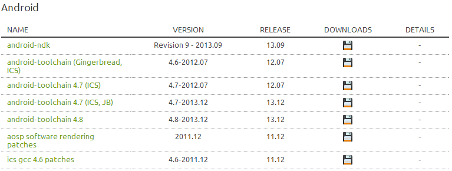

일반적으로 커널 컴파일(빌드)시 사용되는 arm-eabi-4.6 툴체인외 arm기기에 최적화 되어 있다고 알려진

linaro툴체인을 이용하여 빌드하는 방법입니다.

이때 arm-eabi툴체인을 사용할때는 Warning으로 처리하여 그냥 넘어가던 경고가 linaro툴체인에서는 Error로 처리되어 진행이 되지 않을 때도 있습니다.

먼저 linaro를 사용하는 방법부터 살펴보겠습니다.

**1. Linaro툴체인 다운받기**

툴체인을 다운로드 하는 경로는 다양합니다.

(1) 미르의 IT 정복기

[[Kernel] - Android Toolchain (툴체인) 모음](/archive/itmir/2013/349)

(2) 공식 홈페이지

<http://www.linaro.org/downloads/>

공식 홈페이지에서 안드로이드 버전에 맞게 다운로드 하면 됩니다.

4.6버전은 GB와 ICS에서, 4.7은 ICS와 JB에서, 4.8은 시험버전인듯 합니다.

(3) XDA 포럼 링크

<http://forum.xda-developers.com/showthread.php?t=2098133>

**2. Linaro툴체인 설치하기**

이전글 : [[Kernel] - 커널 컴파일을 위한 기본 설정 구축하기](/archive/itmir/2013/51)

에서 arm-eabi툴체인을 설치하지 말고 linaro툴체인을 설치하면 됩니다.

툴체인을 다운받아 아래 경로에 넣어주세요.

/home/계정명/

폴더의 이름은 다르게 해도 좋지만 저는 linaro-toolchain으로 했습니다.

터미널에서

chmod -R 777 linaro-toolchain

그다음 .bashrc를 다시 수정해야 합니다.

gedit ~/.bashrc

export CROSS_COMPILE=$HOME/linaro-toolchain/bin/arm-eabi-

export PATH=$PATH:$HOME/linaro-toolchain/bin/

이런씩으로 경로를 바꿔주세요.

**3. Compile Error Fix**

error: variable 'c' set but not used [-Werror=unused-but-set-variable]

cc1: all warnings being treated as errors

이런 오류가 발생할겁니다. (아니면 와우~~~하면 되고요 ㅋㅋ)

이제 kernel폴더 최상위에 있는 MakeFile을 열어주세요.

그다음 KBUILD_CFLAGS를 검색해 주세요

KBUILD_CFLAGS   := -Wall -Wundef -Wstrict-prototypes -Wno-trigraphs \

  -Werror \

  -fno-strict-aliasing -fno-common \

  -Werror-implicit-function-declaration \

  -Wno-format-security \

  -fno-delete-null-pointer-checks

위 문구를 아래로 바꿔주세요

KBUILD_CFLAGS   := -Wundef -Wstrict-prototypes -Wno-trigraphs \

  -Werror \

  -fno-strict-aliasing -fno-common \

  -Werror-implicit-function-declaration \

  -Wno-format-security \

  -Wno-unused-but-set-variable \

  -fno-delete-null-pointer-checks

수정된 부분 강조

KBUILD_CFLAGS   := -Wall -Wundef -Wstrict-prototypes -Wno-trigraphs \

  -Werror \

  -fno-strict-aliasing -fno-common \

  -Werror-implicit-function-declaration \

  -Wno-format-security \

**-Wno-unused-but-set-variable \**

  -fno-delete-null-pointer-checks

만약 MakeFile에서 "CROSS_COMPILE"이라고 검색했을때 있다면,

경로를 linaro툴체인으로 알맞게 변경해 주세요.

warning: 'offset.un' may be used uninitialized in this function [-W**uninitialized**]

이런 종류의 경고는 아래형식으로 처리가 가능합니다.

$(call cc-disable-warning,(Warning이름),)

위 에러에서 밑줄 굵게 표시된 부분이 에러 이름입니다.

$(call cc-disable-warning,uninitialized,)

이것을 MakeFile의 KBUILD_CFLAGS에 넣어주세요.

예를 들면 아래와 같습니다.

KBUILD_CFLAGS   := -Wundef -Wstrict-prototypes -Wno-trigraphs \

  -Werror \

  -fno-strict-aliasing -fno-common \

  -Werror-implicit-function-declaration \

  -Wno-format-security \

  -Wno-unused-but-set-variable \

  -fno-delete-null-pointer-checks **\**

**$(call cc-disable-warning,uninitialized,)**

In function 's5ptvfb_set_par':

error: lvalue required as left operand of assignment

문제된 파일 s5p_stda_grp.c을 열어주세요.

((struct fb_var_screeninfo) (s5ptv_status.fb->var)).bits_per_pixel = ((struct fb_var_screeninfo) (fb->var)).bits_per_pixel;

위 줄을 아래로 바꿔주세요.

(s5ptv_status.fb->var).bits_per_pixel = (fb->var).bits_per_pixel;

error: arch/arm/boot/compressed/piggy.lzo.o: Unknown CPU architecture

linaro툴체인 문제입니다.

아래 주소에 있는 툴체인을 받아 사용해 주세요.

<https://github.com/itmir913/linaro-4.7-modifed>

출처: http://cafe.naver.com/skydevelopers/302917

http://forum.xda-developers.com/showthread.php?t=2376286

https://gitorious.org/replicant/kernel_samsung_aries/commit/f385c89f3b03e9ee69dd45b185bc790dc23e191c?diffmode=sidebyside