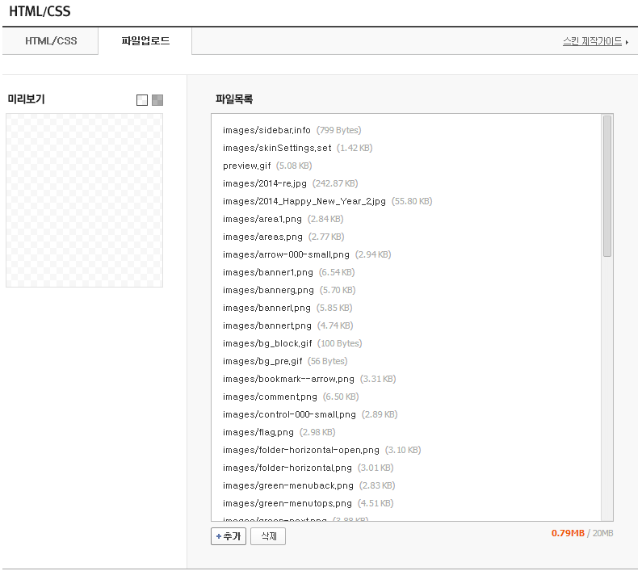
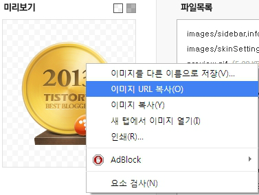
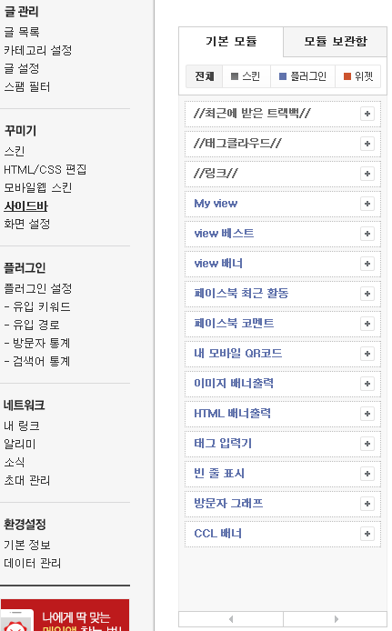
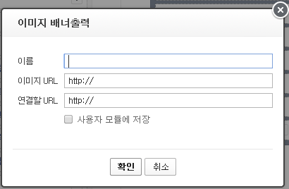
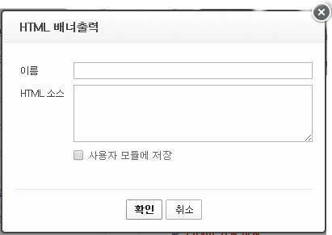

먼저 2013 우수 블로그의 블로거 분들 모두 축하드립니다~~!!

저도 이번 2013 우수 블로그를 노렸지만 아쉽게도 안됬습니다 ㅠㅠ..

그래서 이왕 이렇게 된거 아이콘이라도 달아보자~ 하는 마음에 사이드바에 로고 달아봤습니다 ㅋㅋㅋ

먼저 이미지 파일을 업로드 시켜야 합니다

이때 티스토리 파일 업로드 말고도 바로 이미지 로딩이 가능한 다른곳에 올린후 url을 가져오셔도 됩니다

+추가 버튼을 눌러 파일을 업로드 해주세요

그다음 업로드한 파일의 미리보기에 마우스 오른쪽 클릭후 이미지 URL 복사를 눌러주세요 (크롬기준)

그다음 사이드바 설정에 들어가서 이미지 배너 출력을 선택해주세요

그다음 창이 하나 뜨는대 파란 박스대로 입력해 주세요

이름: 마음대로

이미지 URL : 방금전 업로드한 이미지 주소

연결할 URL : http://tistory.com/thankyou/2013/?nil=supporters\_banner

저장해 주시면 됩니다

아래 스크린샷 처럼 적용이 완료될경우 이쁘게 적용됩니다

그러나 가운대 정렬이 되어 있지 않습니다

가운데 정렬이 안되어 있는것이 거슬리시는 분은 아래를 또 따라해 주세요

설정 - 사이드바 - HTML 배너출력을 선택하세요 그다음 파란 박스대로 HTML 소스를 입력해 주세요

그다음 복사하시면 됩니다 ㅎㅎ

내년 2014 우수 블로그 노려봐야 겠어요~

[Best2013.zip](https://github.com/itmir913/archive/releases/download/itmir-attachments/Best2013.zip)

---

## 첨부파일

- [Best2013.zip](https://github.com/itmir913/archive/releases/download/itmir-attachments/Best2013.zip) `41 KB`
