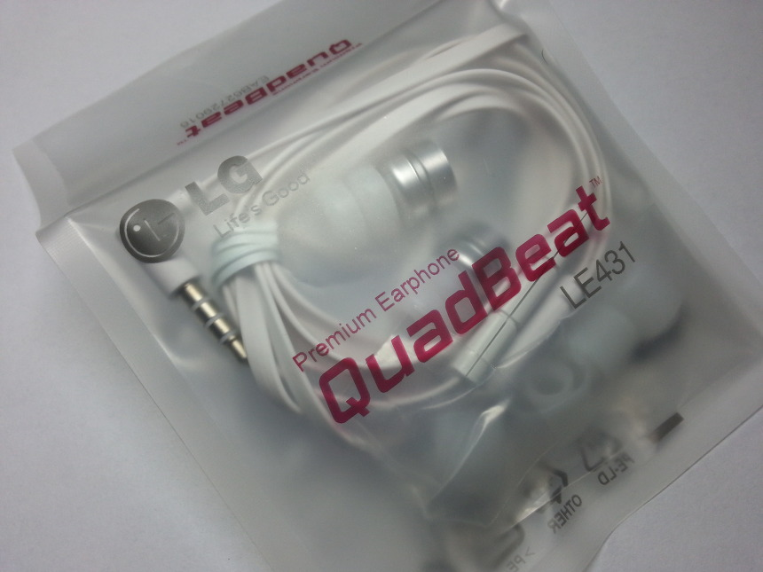
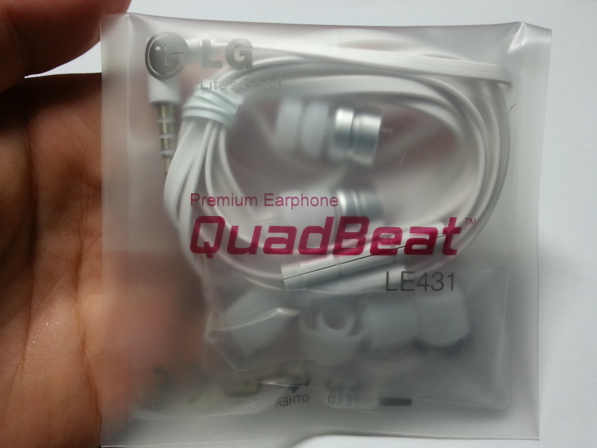
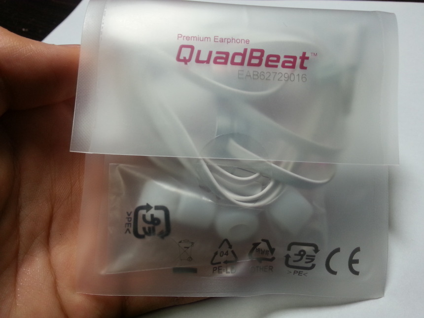
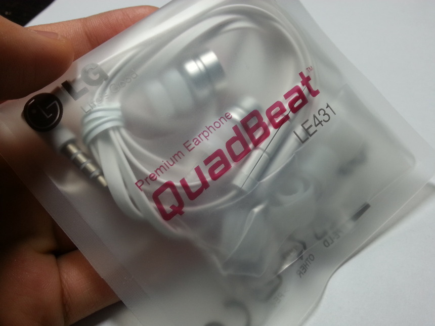
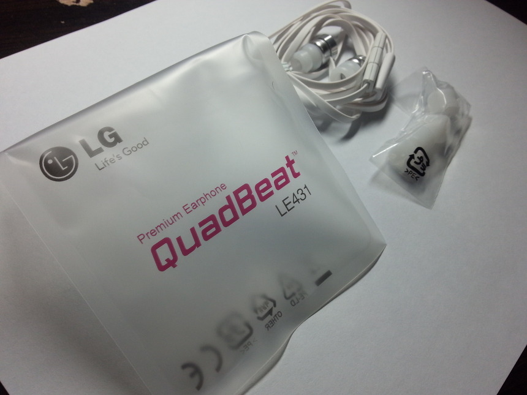
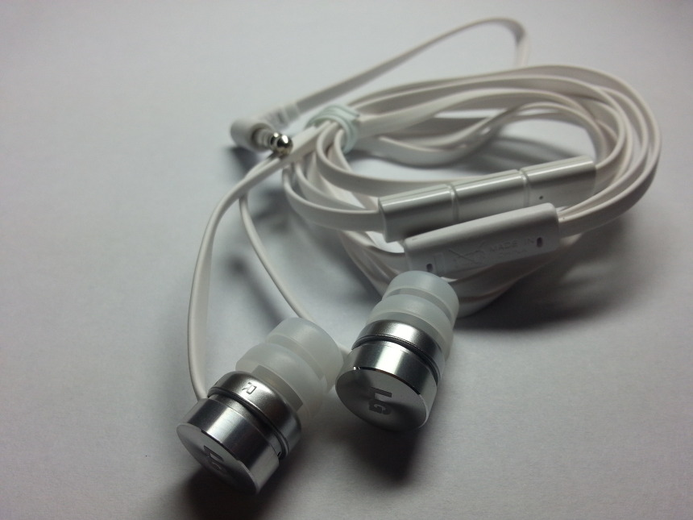
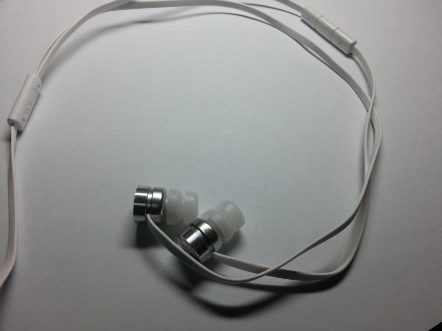
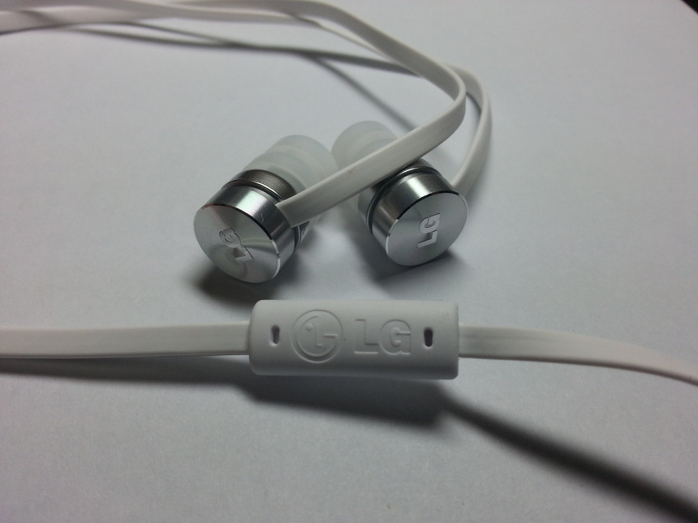

옵티머스 G Pro가 출시된 달을 살펴보니 2013년 2월이더라고요

출시 1년이 다되는거 같은대 이 쿼드비트를 이제서야 체험해 봅니다 ㅎㅎ...

오늘 아빠께서 가지고 오셨어요 ㅎㅎ

검색해보니 G Pro 번들 이어폰이 쿼드비트2라는 소리도 있고 G에 들어간거랑 같은거라는 소리도 있고...

뭐가 맞는지 모르겠네요 ;; 일단 포장지에 쿼드비트2라는 소리가 없으니 이건 아니고

쿼드비트1 Pro인가봐요

아래는 전문 프로 블로그 답게(?) 잘 찍은(?) 사진들 입니다.

봉투 안 내용물을 안꺼내고 찍은 사진들~

구성품을 빼고 한번 찰칵

아래는 이어폰 사진이예요

대부분의 삼성, 팬택 이어폰은 그냥 말려있는대

쿼드비트는 둥글게 말았네요

쿼드비트는 칼국수 형(?) 이어폰입니다

이 이어폰의 단점이라면...

LG로고가 몇개 있어요

이어폰에 있는 LG로고는 정말 멋지고 마음에 드는대 저 갈라지는 부분에 있는 LG로고는 마음에 안드네요ㅡ

착용감은 나쁘진 않습니다

전까지 쓰던 갤럭시 S3 번들 이어폰이랑 비슷한 느낌이랄까요?

음질부분은 음을 죽인다고 하시는 분도 계셨는대

저는 삼성 이어폰이랑 별 차이가 없다고 느끼네요;;

기분상인가 별로 와!!!!! 이런 느낌은 아니예요

좋은점이라는건 음이 깔끔해진 느낌? 이것도 플라시보 효과같은대

와!!! 이런 느낌은 안드는거 같아요

오히려 저음 부분이 더 약해진거 같은 느낌이 확 듭니다

파워앰프 EQ로 저음을 보강하던지 해야겠어요

이 이어폰은 분실하지 말길... 제발
