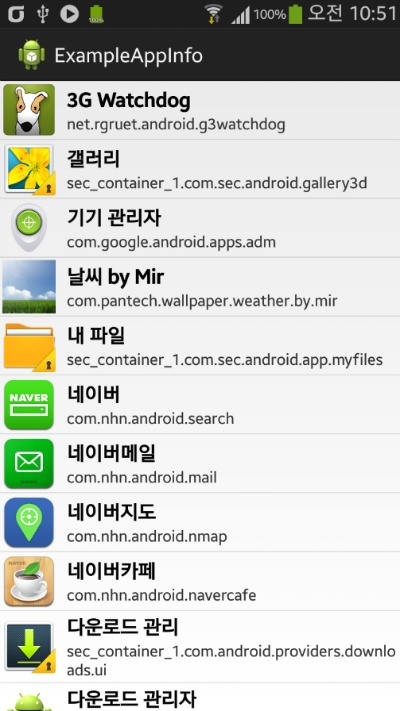
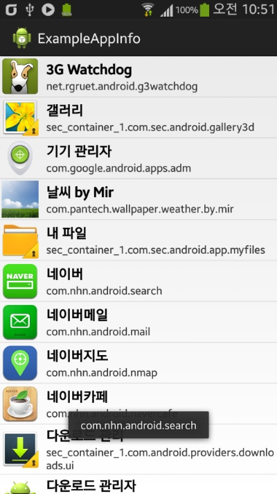

설치되어 있는 어플의 리스트를 가져오는 예제입니다

저처럼 정말 죽을짓 하시는 분이 없기를 바라면서 원본 예제를 수정해서 올립니다

이 예제는 어플 목록을 표시하며, 앱 아이콘과 어플 이름, 패키지 목록까지 표시합니다

또한 리스트 아이템을 터치하면 패키지 네임을 토스트 알림으로 띄울수 있도록 했습니다

    

관련글

[[Development/App] - 설치된 어플 리스트 예제 (ListView, PackageManager)](/archive/itmir/2013/382)

이 글의 두번째 AppInfo예제를 수정하였습니다

기본 뼈대가 되는 어플 예제 출처

http://blog.naver.com/pluulove84/100153350054

이로써 더이상 설치된 어플 리스트를 얻기 위해 저처럼 쌩고생 하시는 분이 더이상 안계시기를 바랍니다..

[ExampleAppInfo.zip](https://github.com/itmir913/archive/releases/download/itmir-attachments/ExampleAppInfo.zip)

---

## 첨부파일

- [ExampleAppInfo.zip](https://github.com/itmir913/archive/releases/download/itmir-attachments/ExampleAppInfo.zip) `648 KB`