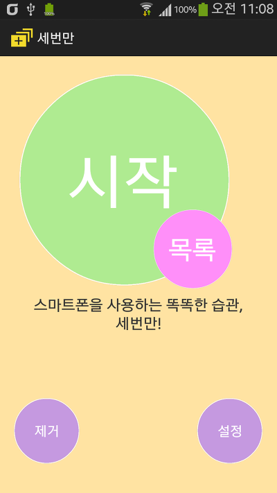
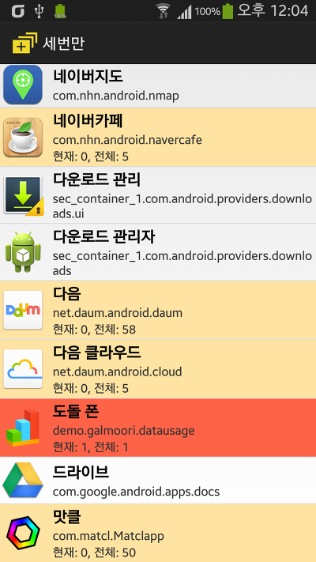
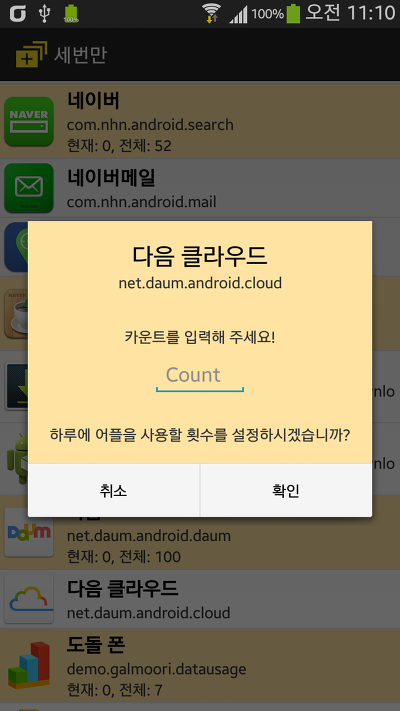
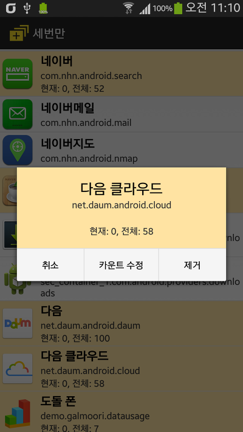
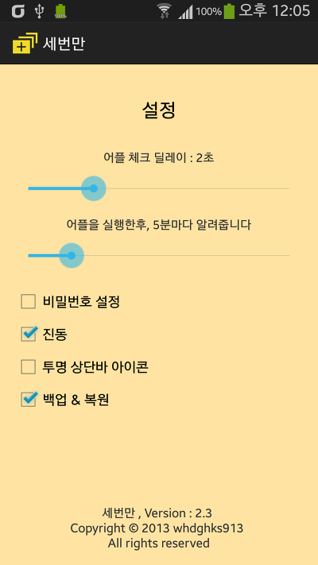
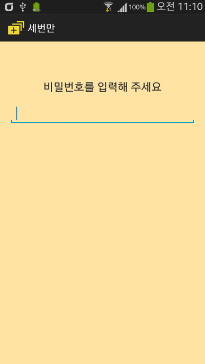
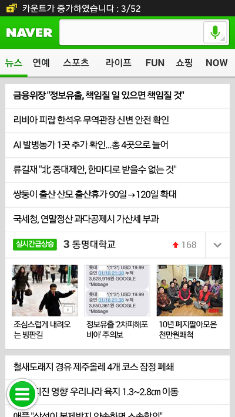

**Only3 (세번만) - 스마트폰 어플 중독방지**

스마트폰의 중독과 과도한 어플 실행을 막아주는 똑똑한 잠금 어플, 세번만이 업데이트 되었습니다

이번 업데이트에서는 어플을 선택할수 있는 화면이 새롭게 달라졌으며, 더욱 편리한 카운트 지정이 가능해졌습니다

어플 목록의 바탕색으로 쉽게 상태를 알수 있습니다

(흰색-지정안함, 귤색-카운트설정됨, 자홍색-카운트초과됨)

진동 설정 버그가 수정되었습니다

새해 1월이 이제 모두 지나가는 시점에 있습니다

다들 계획한일 작심삼일로 끝내지 마시고 꼭 성취하시길...!

그 계획에 이 스마트폰 중독이 가로막고 있다면 이번기회에 세번만 어플로 꼭 이루시길 바랍니다

   

(좌) 메인화면 (우) 어플 선택 화면

오른쪽 스크린샷을 보시면 카운트가 초과된 어플은 저렇게 빨간 바탕이되며, 카운트 수정이 이루어 지지 않습니다

   

(좌) 카운트 설정 전 화면 (우) 카운트 설정후 화면

   

(좌) 설정 화면 (우) 비밀번호 입력 화면

   

(좌) 예시)네이버 어플 카운트 상승 화면 (우) 카운트 초과 화면

이번 업데이트로 정말 어플이 어플다워졌고 쓸만한 앱, 편리한 앱이 다 되어가는것 같은 느낌이 듭니다

사용하신후 버그, 또는 기능 제안은

whdghks913@naver.com

으로 알려주시길 바랍니다

(수시로 체크하여 빠른 답변 가능)

2014-01-21 업데이트 버전 : **v2.4**

업데이트 가능 추정 시간 : **2014-01-21 오후 3시 이후**

**[다운로드](http://play.google.com/store/apps/details?id=lee.whdghks913.only3)**
