먼저 이글을 쓰기전 상태가 분노&어이없음 상태이기 때문에 과격한 표현이 나타날수 있습니다

만 최대한 순화했습니다

와...

전에 "내폰내놔"라는 어플을 만든적이 있습니다

이 어플은 흔들면 화면이 꺼지는 어플으로써 같은 기능을 하는 비슷한 어플보다

메모리/언어등에서 차이를 보이며, 광고가 전혀 없는 앱을 만들어 무료 배포중에 있습니다

그런대 화면이 꺼지는 어플 특성상(화면꺼짐 기능이 있는 모든 어플) 기기 관리자 권한을 얻어야 하며

이 권한을 얻은 어플은 권한 해제를 하지 않는 이상 제거가 불가능 합니다

그래서 이를 알고 저는 세번만 어플에는 출시부터, 내폰내놔는 첫 버전에는 메뉴키에, 2.0업데이트 이후에는 메인화면에

어플 제거 버튼을 만들어 두고 있습니다

이를 누르면 권한해제와 동시에 바로 삭제가 가능합니다

그리고 이 사실을 마켓/앱 설명/업데이트내역등에 공지하고 있습니다

와..... 그런대 어플 리뷰에 가보니 가관이더라고요

모두 삭제가 안된다고 하면서 별점 1점을 주더라고요

아래는 그 스샷입니다

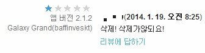

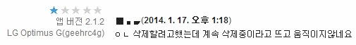

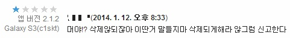

: 자기는 만들지도 못하면서ㅋㅋㅋㅋㅋ 신고해보세요

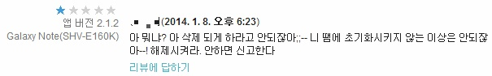

: 신고해봐 2.1.2이상이면 어플내에 어플제거 버튼이 있는 상태인대 왜 그걸 못보는지 와..

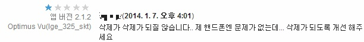

: 네 핸드폰엔 문제가 없죠... 다만 님의 머리와 눈에 문제가 있는듯...

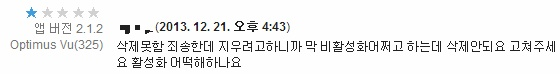

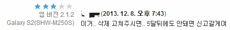

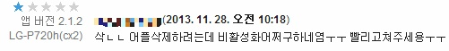

참고로 2.0 아래버전의 리뷰는 제외햇습니다

그 아래 버전은 몰랐을수도 있어요 왜냐면 UI가 조금 복잡했기때문에...

그런대 2.0부터는 변명할수 없습니다 왜냐면 못봤다는게 말이 안되거든요

와... 정말 놀랍습니다

어떻게 하면 모든 삭제 관련 문구를 한번에 씹을수가 있을까요?

그래서 제가 한번 삭제 문구가 얼마나 있나 세봤어요

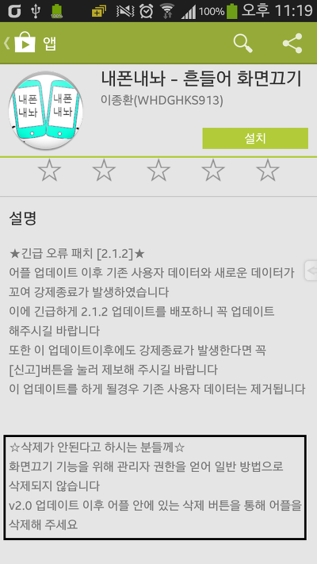

먼저 마켓 첫번째에 하나 있고요

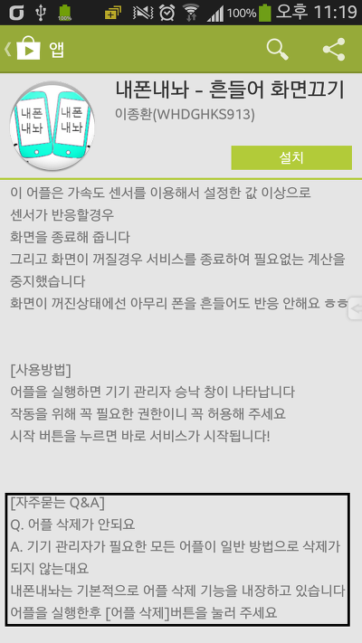

그아래에도 하나 또 있어요 총 2개

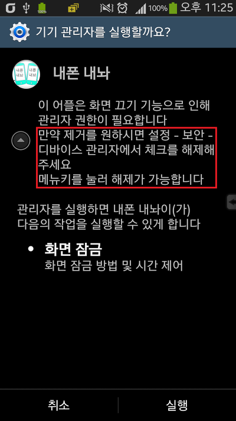

기기 관리자 실행할때 하나 있어요

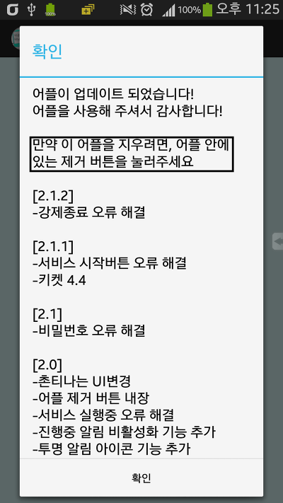

업데이트마다 뜨는 알림에도 하나 있어요 총 4개

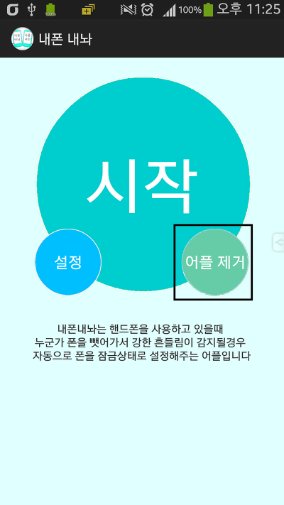

그다음에 가장 중요한 어플 제거 버튼이 메인화면에 있습니다

총 5개

가장 웃긴건 어플 제거 버튼이 시작 버튼 옆에 있어 한번은 봐야 정상입니다

그런대 그걸 못보고 저 리뷰에서 욕을 하는사람이 전 도대체 이해가 안됩니다

이거 어떻게 할 방법이 없을까요?

무시하고 싶긴한대 별점 1점이 쌓이면 평균 별점수가 떨어져서 불이익이 있다고 합니다...

와,....... 진짜 어이없네요
