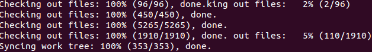

**AOSP (Android Open Source Project) 소스를 받고 빌드해보자**

이번에는 순수 안드로이드인 AOSP를 다운받고, 빌드해보는 시간을 가져보겠습니다

AOSP와 CM는 빌드소스와 방식부분에서 조금 차이를 보일수 있으므로 cm소스 그대로 AOSP가 빌드되는것은 아닙니다

**0. 사전 필독 글들 && 관련 글들**

필독글

[[Android Build] - 1) 안드로이드를 빌드하기 전에 빌드 환경을 구축하자](http://itmir.tistory.com/220)

권장글

[[Android Build] - 2) CyanogenMod 소스를 받고 빌드해 보자](http://itmir.tistory.com/221)

[[Ubuntu] - Ubuntu의 저장소를 daum.net으로 바꿔보자 (apt-get 속도향상)](http://itmir.tistory.com/265)

**1. repo 설정**

aosp는 cm과 다르므로 다시 폴더를 만들고 repo를 설정해 주어야 합니다

mkdir ~/aosp

cd ~/aosp

그다음 repo를 설정해 주세요

repo init -u https://android.googlesource.com/platform/manifest

명령어 뒤에 -b를 붙힌후 원하는 버전을 다운받을수도 있습니다

android-2.3.7\_r1

android-4.0.4\_r2

android-4.1.1\_r6

android-4.1.2\_r2

android-4.2.1\_r1

android-4.2.2\_r1

android-4.3\_r3

android-4.4\_r1

android-4.4.1\_r1

android-4.4.2\_r1

참고 : <https://android.googlesource.com/platform/manifest/+refs>

최신버전인 4.4.2 버전을 받는다고 한다면

repo init -u https://android.googlesource.com/platform/manifest -b android-4.4.2\_r1

이렇게 입력해 주세요

repo has been initialized in /home/whdghks913/aosp

이런 문장이 나타난다면 완료된것입니다

**2. repo sync**

이제 소스를 받아봅시다

repo sync

명령어 뒤에 -j옵션을 붙혀 더 빠르게 받을수 있습니다

repo sync -j4

2, 4, 8, 16정도에서 골라주시길 바라며 숫자가 크다고 더 빠른건 아닙니다

완료후 한번더 repo sync를 해서 수정된 내역을 한번 확인해 주세요

**3. 디바이스 소스 생성**

AOSP도 device폴더에 들어가보면 원하는 기기 소스가 없을겁니다

CyanogenMod와 비슷하지요

이것도 몇가지 방법이 있습니다

(1) 정식 지원기기

구글에서 정식 지원하는 기기는 소스 다운받을때 device/(제조사)에 소스가 들어있습니다

예를들어 넥서스s의 경우 4.1.2의 manifest를 보면

<project path="device/samsung/crespo" name="device/samsung/crespo" />

<https://android.googlesource.com/platform/manifest/+/refs/heads/android-4.1.2_r2.1/default.xml>

그러므로 따로 소스 준비는 필요 없습니다

(2) 지원이 끊긴 레퍼 / CyanogenMod 정식 기기

예를들어 넥서스s는 4.1.2가 끝입니다

4.1.2를 빌드할때는 아래에서 소스코드를 다운로드할수 있습니다

https://android.googlesource.com/device/samsung/crespo

그러나 그 위 버전은 구글 aosp소스로는 힘들수 있습니다

가장 대표적으로 CyanogenMod에서 가져온다음 파일을 수정하면 됩니다

https://github.com/cyanogenmod/android\_device\_samsung\_crespo

수정해야 하는 파일은 따로 정리하겠습니다

(빌드를 진행하다 보면 ~파일을 찾을수 없습니다 라던지 ~가 정의되지 않았습니다 같은게 나옵니다

그걸 수정해야 합니다.. 제가 aosp소스가 지금 없어서..)

구글 레퍼런스는 아니지만 CyanogenMod 지원기기도

cm 디바이스 소스를 aosp로 바꿔주면 되는대요

따로 포스팅 할 예정입니다

(3) CM소스를 AOSP소스로 바꾸기

다음편에 이어집니다

(3) 소스 직접 만들기

이건.... AOSP는 찾아보니 CyanogenMod처럼 소스를 만드는 스크립트도 존재하지 않는것 같습니다

따라서 먼저 cm소스를 만든다음 aosp로 바꾸던지, 아니면 일일히 노가다 하면서 만들어야 합니다

cm소스를 만드는 것은 [[Android Build] - 2) CyanogenMod 소스를 받고 빌드해 보자](http://itmir.tistory.com/221) 를 참고해 주세요

**4. 빌드하기**

cm은 brunch라는것으로 빌드가 가능하지만 aosp는 이게 없는걸로 알고있습니다

그래서 make명령어로 빌드해 주어야 합니다

. build/envsetup.sh

lunch 또는 lunch (기기명)

make -j4 otapackage

lunch를 하면 번호가 쭉 나올탠데 이때 원하는 기기의 번호를 눌러주시면 됩니다

제 기억으론 lunch (기기명) (예를들면 lunch crespo)해도 된거 같습니다

그다음 cm과 다르게 make otapackage를 입력해 주세요

꼭 otapackage를 입력해 주세요 그냥 make만 칠경우 구글 호환성 검사부터 모두 빌드하는것 같습니다

끝입니다~ AOSP를 즐기시면 됩니다

다음편은 CM소스를 AOSP로 바꿔서 빌드하는 것을 해보겠습니다

조금 시간이 걸릴수도 있겠네요..
