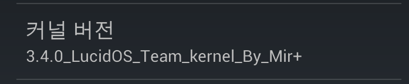

아래 스크린샷은 LucidOS의 베가레이서2 커널 버전입니다.

보시면 저기 Mir옆에 + 표시가 있죠?

이 + 표시를 지우는 방법입니다.

커널소스의 scripts/setlocalversion 파일을 열어주세요.

그다음 res="$res${scm:++}"를 찾아주세요.

# LOCALVERSION= is not specified

    if test "${LOCALVERSION+set}" != "set"; then

        scm=$(scm_version --short)

**res="$res${scm:++}"**

    fi

저 부분을 삭제해 주시면 됩니다.

관련 commit : <https://github.com/itmir913/android_kernel_pantech_ef47s/commit/581747b2023ca16021beff799df7ef585c39923c>

참고 : thanks for bestmjh47
