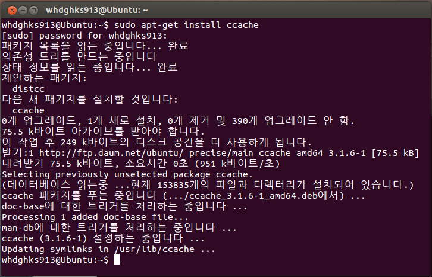
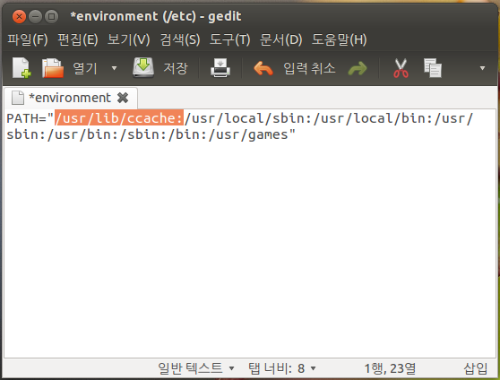
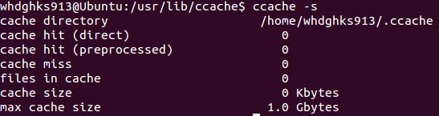
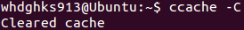
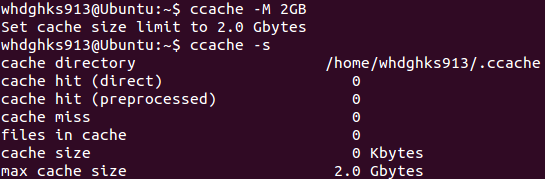

리눅스(Linux)에서 빌드시간을 단축하는대 사용되는 가장 대표적인 방법은 ccache와 distcc입니다.

ccache는 빌드결과를 모와뒀다가 재빌드시 빌드 시간을 줄여주는 것이고,

distcc는 컴퓨터 두 대 이상을 사용하여 "분산"빌드 하는 형식입니다.

일단 설명하는것과 사용하기 편한 ccache를 먼저 다뤄보겠습니다.

공식 사이트는 <http://ccache.samba.org/> 입니다.

## 1. ccache설치하기

리눅스중 fedora는 이미 기본 설치되어 있다고 하고요 Ubuntu는 따로 설치해야 합니다.

Ubuntu도 apt-get로 손쉽게 설치할수 있습니다.

sudo apt-get install ccache

이 명령어 하나로 ccache설치가 완료되었습니다.

## 2. PATH설정하기

ccache를 활용하기 위해서는 PATH설정이 필요합니다.

(1) 한 사용자 계정만 적용할경우

sudo gedit ~/.bashrc

한다음 아래 문구 추가.

export PATH="/usr/lib/ccache:$PATH"

(2) 모든 계정에 적용할경우

sudo gedit /etc/environment

한다음 아래 스크린샷처럼 파란박스 추가.

/usr/lib/ccache:

## 3. 툴체인 환경

툴체인을 사용할경우 심링크를 걸어주면 됩니다.

cd /usr/lib/ccache

sudo ln -s ../../bin/ccache powerpc-tuxbox-linux-gnu-cc

sudo ln -s ../../bin/ccache powerpc-tuxbox-linux-gnu-c++

sudo ln -s ../../bin/ccache powerpc-tuxbox-linux-gnu-gcc

sudo ln -s ../../bin/ccache powerpc-tuxbox-linux-gnu-g++

## 4. ccache 확인 / Clean / Max cache Size 수정

ccache설치가 완료되었으면 상태를 확인해 봅시다.

ccache -s

캐쉬 폴더와 현재 캐쉬 파일 크기, 최대 캐쉬파일 크기를 확인할수 있습니다.

빌드 결과가 이상하여 캐쉬를 지우고 싶을경우에는,

ccache -C

이렇게 하면 현재 저장된 캐쉬가 지워집니다.

최대 캐쉬 크기를 변경하고 싶다면 아래를 입력하세요.

ccache -M (크기)

예를들어 최대 캐쉬 크기를 2GB로 변경하고 싶다면,

ccache -M 2GB

이제 ccache -s로 상태를 확인해 보면 최대 캐쉬 크기가 변경된것을 확인할수 있습니다.

참조: [http://whatwant.tistory.com](http://whatwant.tistory.com/421)[/421](http://whatwant.tistory.com/421)

<http://ccache.samba.org/>

<http://blog.naver.com/accdar/150173403764>
