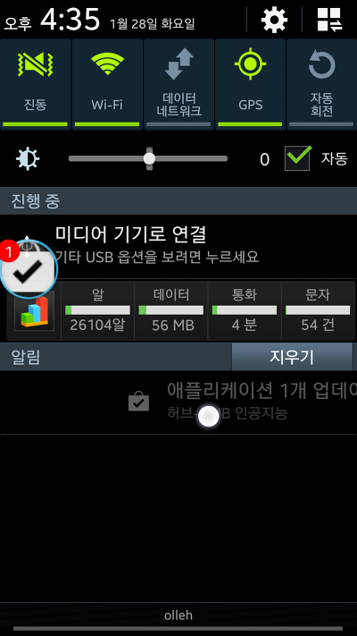
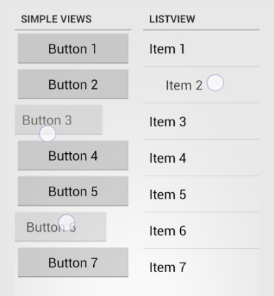
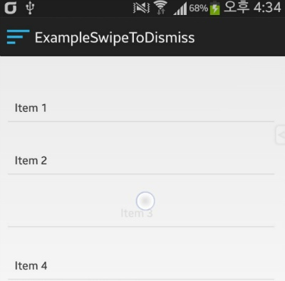
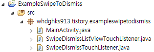

ICS부터 추가된 밀어서 삭제하기 (Swipe To Dismiss)기능에 대해 혹시 아시나요?

이 기능이 요즘 나오는 어플의 리스트뷰에도 적용되어 있습니다

밀어서 제거하기에 대해 한번 이번시간에 해보도록 할께요

**1. 오픈소스**

이 기능은 "Roman Nurik" 라는 구글의 UI개발자 분께서 만드신 기능이라고 합니다

구글+에서도 같은 소식을 확인할수 있습니다

<https://plus.google.com/+RomanNurik/posts/Fgo1p5uWZLu>

github에서 이 소스가 오픈되어 있습니다

github에서 가져오시거나 아래 박스에서 소스를 다운로드 해주세요

<https://github.com/romannurik/Android-SwipeToDismiss>

[SwipeDismissListViewTouchListener.java](./file/SwipeDismissListViewTouchListener.java)

[SwipeDismissTouchListener.java](./file/SwipeDismissTouchListener.java)

필요한 소스코드는 두개 입니다

**2. 예제 스크린샷**

흥미를 돋구기 위해 예제 스크린샷을 제시합니다


   


(좌) github, (우) 예제

보시면 리스트뷰에서 스와이프로 제거가 가능합니다

**3. 적용하기**

다운받은 두개의 java파일(SwipeDismissListViewTouchListener.java, SwipeDismissTouchListener.java)을 넣어주세요



처음에 복사를 하면 package오류가 납니다

자신의 패키지명에 맞게 수정해 주세요

중요한 코드는 아래와 같습니다

```java
SwipeDismissListViewTouchListener touchListener =
    new SwipeDismissListViewTouchListener(mListView,
    new SwipeDismissListViewTouchListener.DismissCallbacks() {
        @Override
        public boolean canDismiss(int position) {
            return true;
        }

        @Override
        public void onDismiss(ListView listView, int[] reverseSortedPositions) {
            for (int position : reverseSortedPositions) {
                mAdapter.remove(mAdapter.getItem(position));
            }
            mAdapter.notifyDataSetChanged();
        }
    });
mListView.setOnTouchListener(touchListener);
mListView.setOnScrollListener(touchListener.makeScrollListener());
```

어뎁터 설정후, 위 코드만 있으면 됩니다

좌우로 움직이는 좌표를 받아와 Dismiss한다고 합니다

그런대 리스트뷰는 상하 스크롤도 있으므로 상하일때 값을 저장해

마지막에 지우는것인지 확인한다고 합니다

MainActivity.java입니다

```java
public class MainActivity extends Activity {
    ListView mListView;
    ArrayAdapter<String> mAdapter;
    
    @Override
    protected void onCreate(Bundle savedInstanceState) {
        super.onCreate(savedInstanceState);
        setContentView(R.layout.activity_main);
        
        mListView = (ListView)findViewById(R.id.listView1);
        
        String[] items = new String[20];
        for (int i = 0; i < items.length; i++) {
            items[i] = "Item " + (i + 1);
        }
        
        mAdapter = new ArrayAdapter<String>(this, android.R.layout.simple_list_item_2, android.R.id.text2,
                new ArrayList<String>(Arrays.asList(items)));
        mListView.setAdapter(mAdapter);
        
        SwipeDismissListViewTouchListener touchListener =
                new SwipeDismissListViewTouchListener(mListView,
                new SwipeDismissListViewTouchListener.DismissCallbacks() {
                    @Override
                    public boolean canDismiss(int position) {
                        return true;
                    }

                    @Override
                    public void onDismiss(ListView listView, int[] reverseSortedPositions) {
                        for (int position : reverseSortedPositions) {
                            mAdapter.remove(mAdapter.getItem(position));
                        }
                        mAdapter.notifyDataSetChanged();
                    }
                });
        mListView.setOnTouchListener(touchListener);
        mListView.setOnScrollListener(touchListener.makeScrollListener());
    }
}
```

어려울줄 알았는대 오픈소스가 있어 손쉽게 적용이 가능했습니다 ㅎㅎ

더 자세한 이론은 http://thdev.net/369 을 참고해 주세요

[ExampleSwipeToDismiss.zip](./file/ExampleSwipeToDismiss.zip)

---

## 첨부파일

- [ExampleSwipeToDismiss.zip](https://github.com/itmir913/archive/releases/download/itmir-attachments/ExampleSwipeToDismiss.zip) `566 KB`
- [SwipeDismissListViewTouchListener.java](./files/SwipeDismissListViewTouchListener.java)
- [SwipeDismissTouchListener.java](./files/SwipeDismissTouchListener.java)
