안녕하세요

이번 강좌는 매우 깁니다만 매우 재밌는 내용이므로 꼭 정독해 주세요

그리고 PC버전과 또는 원본 티스토리 글에서 봐주시길 부탁드립니다

절대 모바일로 보지 말아주세요 왜냐면 가독성이 매우 떨어집니다

## 26. Notification 띄우기

### 26-1 구글 2012 IO를 아시나요?

2012 구글 IO 기억히시나요?

젤리빈에 대해 발표되면서 향상된 Nofification에 대한 언급이 있었습니다

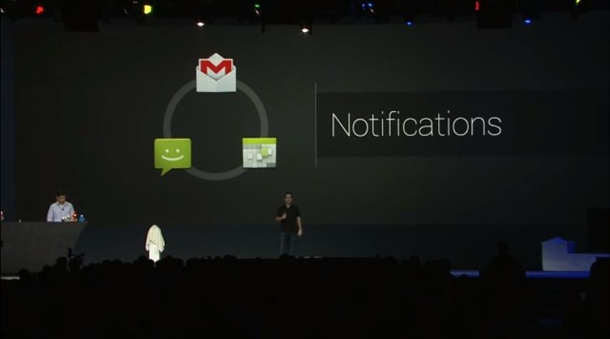

오늘 배울 내용은 이 구글 IO와 관련이 매우 깊습니다

추가된 API도 사용할것이기 때문입니다

그럼 지금부터 배워보도록 하겠습니다

### 26-2 Notification에 관한 설명

이 강좌를 어떻게 시작해야 할지 몇일동안 고민하다가 먼저 설명부터 시작하자고 생각했습니다

Notification의 아이콘은 잘 아시다 싶이 상단바 부분, Notification Area라는 영역에 표시됩니다

그리고 상세한 내용은 상단바를 쓱 쓸어내리면 나타나는거 다들 아시죠?

젤리빈 전에 쓰이던 알림 띄우기 방법과, 새로 추가된 API들을 다뤄보겠습니다

(이하 Notification을 알림으로 순화함)

기본적인 알림의 형식은 아래와 같아요

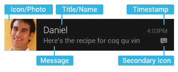

젤리빈(4.1)이상부터는 이 알림을 늘리고 줄일수가 있어요

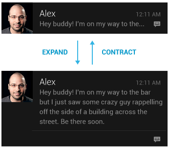

이렇게 더 많은 정보를채울수 있습니다~

스크린샷같은것은 그걸 알림에서 미리보기도 가능하고 바로 삭제 또는 공유가 가능하죠

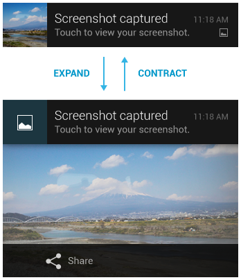

또한 Action을 지정하면 알림에서 바로 작업을 할수 있습니다

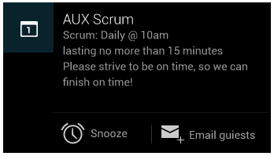

더 많은 유형이 있지만 생략하고 빨리 코드를 배워봅시다

### 26-3 "구"버전 알림 띄우기

먼저 젤리빈에서 추가된 다양한 알림을 띄우면 머리가 터질수 있기에(?) 처음에는 기본적인 구 버전의 알림 띄우는 모습을 확인해 보겠습니다

```java
NotificationManager nm = (NotificationManager)getSystemService(Context.NOTIFICATION_SERVICE);
Notification notification = new Notification(R.drawable.ic_launcher, "Nomal Notification", System.currentTimeMillis());
notification.flags = Notification.FLAG_AUTO_CANCEL;
notification.defaults = Notification.DEFAULT_SOUND | Notification.DEFAULT_VIBRATE ;
notification.number = 13;
PendingIntent pendingIntent = PendingIntent.getActivity(this, 0, new Intent(this, MainActivity.class), PendingIntent.FLAG_UPDATE_CURRENT);
notification.setLatestEventInfo(this, "Nomal Title", "Nomal Summary", pendingIntent);
nm.notify(1234, notification);
```

1번줄에 NotificationManager를 호출하고 있습니다

알림도 진동과 마찬가지로 시스템 서비스이기 때문에 첫번째줄처럼 호출해 주면 됩니다

라인 2번을 자세히 보시면

Notification notification = new Notification(icon, tickerText, when);

이런 형식으로 되어 있습니다

- Icon : 알림의 아이콘 입니다
- tickerText : 잠시 표시될 글자입니다 예를 들자면 "새로운 메시지가 도착했습니다"
- when : 알림이 표시될 시간입니다 밀리 세컨드초 단위로, System.currentTimeMillis()를 입력하면 지금 당장이 됩니다

그다음 flags를 봅시다

플래그는 아래가 있는데요 보통 일반 알림인지, 진행중 알림인지 선택할때 사용합니다

- FLAG_AUTO_CANCEL : 알림을 터치하면 사라짐
- FLAG_ONGOING_EVENT : 진행중 알림

4번째줄의 notification.defaults는 있어도 되고 없어도 됩니다

전 소리와 진동을 사용할것이기 때문에 저런 속성을 주었고요 진동만, 또는 소리만 하는 방법은 아래와 같아요

- notification.defaults = Notification.DEFAULT_SOUND ;
- notification.defaults = Notification.DEFAULT_VIBRATE ;

그 아래의 number는 미확인 알림의 개수라고 생각하시면 됩니다

999이상은 999+라고 표시되는것 같습니다 참고하세요

6번째 줄의 PendingIntent는 자세하게 설명은 힘드나 알림을 터치하면 실행할 액티비티(또는 서비스)를 지정해 주고 있어요

마지막의 PendingIntent.FLAG_UPDATE_CURRENT에 대해 조금 보충해 드리자면

- FLAG_CANCEL_CURRENT : 이전에 생성한 PendingIntent 는 취소하고 새롭게 만듭니다
- FLAG_NO_CREATE : 생성된 PendingIntent를 반환하여 재사용 합니다
- FLAG_ONE_SHOT : 이 flag 로 생성한 PendingIntent는 일회용 입니다
- FLAG_UPDATE_CURRENT : 이미 생성된 PendingIntent가 존재하면 내용을 변경합니다

그 아래 7번째는 아래와 같습니다

notification.setLatestEventInfo(context, contentTitle, contentText, contentIntent);

- context : context객체, this (Context에 대해 이해하려면 골치아파요)
- contentTitle : 상단바 알림 제목
- contentText : 상단바 알림 내용
- contentIntent : 실행할 작업이 담긴 PendingIntent

마지막으로 notify에 대해 설명드리겠습니다

nm.notify(id, notification)

- id : 알림을 구분할 상수, 알림을 지울때 이 id가 필요합니다
- notification : 위에서 만든 notification 객체

자, API설명이 모두 끝났습니다

스크린샷은 아래와 같아요

처음에 알림이 잠깐 표시될때 Text와 상단바에서 알림을 확인할때 Text가 다른것을 확인할수 있습니다


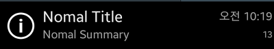

[미르의 팁]

Q. 이클립스에서 코드에 노란 줄이 그어 있고 Notification is deprecated라고 뜹니다

A. 이클립스는 더이상 지원하지 않는(사용하지 않는) API를 저렇게 표시합니다

만 안드로이드 API에서 완전히 사라지지 않는 이상은 사용이 가능합니다

### 26-4 Builder를 이용한 알림방식

이번에는 Builder라는것을 이용해 알림을 띄워볼께요

```java
NotificationManager nm = (NotificationManager) getSystemService(Context.NOTIFICATION_SERVICE);
PendingIntent pendingIntent = PendingIntent.getActivity(this, 0, new Intent(this, MainActivity.class), PendingIntent.FLAG_UPDATE_CURRENT);

Notification.Builder mBuilder = new Notification.Builder(this);
mBuilder.setSmallIcon(R.drawable.ic_launcher);
mBuilder.setTicker("Notification.Builder");
mBuilder.setWhen(System.currentTimeMillis());
mBuilder.setNumber(10);
mBuilder.setContentTitle("Notification.Builder Title");
mBuilder.setContentText("Notification.Builder Massage");
mBuilder.setDefaults(Notification.DEFAULT_SOUND | Notification.DEFAULT_VIBRATE);
mBuilder.setContentIntent(pendingIntent);
mBuilder.setAutoCancel(true);

mBuilder.setPriority(NotificationCompat.PRIORITY_MAX);

nm.notify(111, mBuilder.build());
```

첫번째 줄이랑 두번째 줄은 구버전이랑 다른건 없습니다

4번째 줄부터 새로운 API가 시작인데요

Notification.Builder를 이용해 보겠습니다

mBuilder의 옵션을 하나씩 살펴볼께요

- setSmallIcon : 아이콘입니다 구 소스의 icon이랑 같습니다
- setTicker : 알림이 뜰때 잠깐 표시되는 Text이며, 구 소스의 tickerText이랑 같습니다
- setWhen : 알림이 표시되는 시간이며, 구 소스의 when이랑 같습니다
- setNumber : 미확인 알림의 개수이며, 구 소스의 notification.number랑 같습니다
- setContentTitle : 상단바 알림 제목이며, 구 소스의 contentTitle랑 같습니다
- setContentText : 상단바 알림 내용이며, 구 소스의 contentText랑 같습니다
- setDefaults : 기본 설정이며, 구 소스의 notification.defaults랑 같습니다
- setContentIntent : 실행할 작업이 담긴 PendingIntent이며, 구 소스의 contentIntent랑 같습닏
- setAutoCancel : 터치하면 자동으로 지워지도록 설정하는 것이며, 구 소스의 FLAG_AUTO_CANCEL랑 같습니다
- setPriority : 우선순위입니다, 구 소스의 notification.priority랑 같습니다만 구글 개발자 API를 보면 API 16이상부터 사용이 가능하다고 합니다
- setOngoing : 진행중알림 이며, 구 소스의 FLAG_ONGOING_EVENT랑 같습니다
- addAction : 알림에서 바로 어떤 활동을 할지 선택하는 것이며, 스샷찍은다음 삭제/공유 같은것이 이에 해당합니다

Builder에서 사용되는 대표적인, 또는 대부분의 옵션을 살펴봤어요

위에서 살펴본거랑 약간 다를뿐 나머지는 모두 같다는것을 살펴볼수 있습니다

스크린샷은 아래와 같습니다


스크린샷이랑 코드설명이랑 함께 보시면 더 확실히 알수 있을것입니다

### 26-5 CompatBuilder를 이용한 알림방식

Builder가 4.1부터만 되기 때문에 그 아래 버전은 사용이 불가능합니다

그래서 호환성을 위해 NotificationCompat.Builder라는것이 존재한다고 합니다

만... Builder랑 차이가 없습니다

그래서 코드만 드리고 지나가도록 하겠습니다

```java
NotificationManager nm = (NotificationManager) getSystemService(Context.NOTIFICATION_SERVICE);
PendingIntent pendingIntent = PendingIntent.getActivity(this, 0, new Intent(this, MainActivity.class), PendingIntent.FLAG_UPDATE_CURRENT);

NotificationCompat.Builder mCompatBuilder = new NotificationCompat.Builder(this);
mCompatBuilder.setSmallIcon(R.drawable.ic_launcher);
mCompatBuilder.setTicker("NotificationCompat.Builder");
mCompatBuilder.setWhen(System.currentTimeMillis());
mCompatBuilder.setNumber(10);
mCompatBuilder.setContentTitle("NotificationCompat.Builder Title");
mCompatBuilder.setContentText("NotificationCompat.Builder Massage");
mCompatBuilder.setDefaults(Notification.DEFAULT_SOUND | Notification.DEFAULT_VIBRATE);
mCompatBuilder.setContentIntent(pendingIntent);
mCompatBuilder.setAutoCancel(true);

nm.notify(222, mCompatBuilder.build());
```

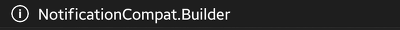


### 26-6 bigPicture 알림방식

와 무한스크롤 100%네요...

중요한 부분만 요약 정리하겠습니다

```java
Bitmap bigPicture = BitmapFactory.decodeResource(getResources(), R.drawable.jellybean);

Notification.BigPictureStyle bigStyle = new BigPictureStyle(mBuilder);
bigStyle.setBigContentTitle("bigpicture Expanded Title");
bigStyle.setSummaryText("bigpicture Expanded Massage");
bigStyle.bigPicture(bigPicture);

mBuilder.setStyle(bigStyle);
```

큰 사진을 표시할때 사용할수 있습니다

기본적인 뼈대는 Builder와 완벽하게 같으며 그 아래에 위 코드만 추가해 주시면 됩니다

일단 Builder와 속성이 모두 같기 때문에 Notification.BigPictureStyle(3번줄)의 속성만 언급하겠습니다

- setBigContentTitle : 알림을 늘린후, 제목입니다
- setSummaryText : 알림을 늘린후, 내용입니다
- bigPicture : 표시할 사진을 입력해 주면 됩니다

그다음 8번줄을 보시면 setStyle이라고 나와 있습니다

... 아시겠죠 말안해도?ㅋㅋ

bigPicture은 스크린샷 찍은후 사용되는 방법입니다

아래는 스크린샷 입니다

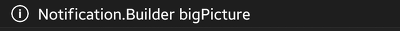


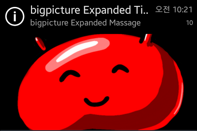

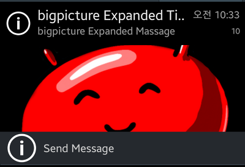

맨 마지막 사진은 스샷 다 찍고나니 addAction을 찍은게 없어서 찍어봤어요

### 26-7 bigTextStyle 알림방식

이건 문자왔을때 자주 사용되더라고요

빨리 코드 보겠습니다

```java
Notification.BigTextStyle style = new Notification.BigTextStyle(mBuilder);
style.setSummaryText("and More +");
style.setBigContentTitle("BigText Expanded Title");
style.bigText("Mir's IT Blog adress is \"itmir.tistory.com\"," +
        "Welcome to the Mir's Blog!! Nice to Meet you, this is Example JellyBean Notification");

mBuilder.setStyle(style);
```

bigPicture과 비슷하며, 이 코드는 아래 스크린샷과 비교하며 보는것이 더 이해가 잘되더라고요

그래서 스크린샷을 보시면서 확인해 주시면 감사드리겠습니다 ㅎ

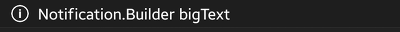


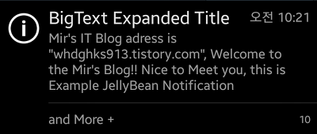

### 26-8 InboxStyle 알림 방식

이건 GMail에서 사용된것 같습니다

Text를 한줄씩 표시하는 알림 방식입니다

```java
Notification.InboxStyle style = new InboxStyle(mBuilder);
style.addLine("Google Nexus 5 is $0!!");
style.addLine("Example Nofitication Inbox");
style.addLine("Today is 2014-01-29");
style.addLine("See you Next Time!");
style.setSummaryText("+ 3 More");

mBuilder.setStyle(style);
```

이건 addLine말고는 설명할게 딱히 없습니다

그리고 addLine이라는거 딱 보면 뭔뜻인지 아실거 같아서 이것도 지나가겠습니다~

스크린샷과 비교하며 보시는게 정말 효과적입니다


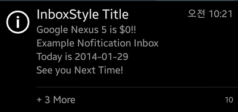

### 26-9 ProgressBar in ICS up

아..ㅡ 이 강좌 괜히 쓴거 같네요 지금 3시간이 넘어가는거 같은데..

다운로드 같은건 알림바에 프로그래스바가 있죠?

그걸 구현해 봅시다

참고로 이 ProgressBar API가 ICS에 추가되었기 때문에 GB는 안됩니다

GB에서 구현하는건 아래 26-10에서 봅시다

이건 쓰레드를 이용해야 ProgressBar가 움직입니다

```java
mBuilder.setProgress(0, 0, true);
mBuilder.setOngoing(true);

nm.notify(666, mBuilder.build());
new Thread(new Runnable() {
    @Override
    public void run() {
        for(int i=1 ;i<=100 ;i++){
            try {
                Thread.sleep(100);
            } catch (InterruptedException e) {
                e.printStackTrace();
            }
            
            mBuilder.setProgress(100, i, false);
            mBuilder.setContentText("ProgressBar : " + i);
            nm.notify(666, mBuilder.build());
            
            if(i>=100){
                nm.cancel(666);
            }
        }
    }
}).start();
```

첫번째줄의 setProgress는 ProgressBar에서 많이 본것 맞죠?ㅋㅋ

mBuilder.setProgress(max, progress, indeterminate)

- max : ProgressBar의 최대 값입니다, android:max와 같습니다
- progress : 현재 프로그래스 값입니다
- indeterminate : 이건 그 마켓에서 다운받기 전에 - -- - -- 이거 움직이죠? 그거를 설정해주는겁니다 true는 대기중, false는 progress값 적용

쓰래드를 돌리기 전에 먼저 알림을 띄워야 합니다

8번째 line을 보시면 for문으로 int i값을 증가시키면서 setProgress를 해주고 있습니다

17번 보시면 바뀐 값을 다시 띄워주는 역할을 합니다

그 아래 if문은 i값이 100일경우 알림을 지우는 역할을 하고 있습니다

스크린샷은 아래와 같습니다


### 26-10 ProgressBar in GB

와 주제가 10번까지 오다니....대박이네요

GB는 알림을 띄울때 ProgressBar에 대한 API가 없습니다

그래서 우리가 직접 xml을 만들어야 합니다

먼저 res/layout/progressbar.xml입니다

```xml
<RelativeLayout xmlns:android="http://schemas.android.com/apk/res/android"
    android:layout_width="wrap_content"
    android:layout_height="wrap_content"
    android:id="@+id/noti_layout">

    <TextView
        android:id="@+id/noti_title"
        android:layout_width="wrap_content"
        android:layout_height="wrap_content"
        android:layout_alignParentTop="true"
        android:layout_centerHorizontal="true"
        android:text="title" />
    
    <ProgressBar
        android:id="@+id/noti_progress"
        style="?android:attr/progressBarStyleHorizontal"
        android:layout_width="match_parent"
        android:layout_height="wrap_content"
        android:layout_alignParentLeft="true"
        android:layout_below="@+id/noti_title" />

    <TextView
        android:id="@+id/noti_text"
        android:layout_width="wrap_content"
        android:layout_height="wrap_content"
        android:layout_below="@+id/noti_progress"
        android:layout_centerHorizontal="true"
        android:text="message" />

</RelativeLayout>
```

위에 있는 TextView는 title, 아래에 있는 TextView는 ProgressBar 진행표시를 하려고 합니다

그다음 java로 넘어와주세요

java코드는 아래와 같습니다

```java
final NotificationManager nm = (NotificationManager)getSystemService(Context.NOTIFICATION_SERVICE);
final PendingIntent pendingIntent = PendingIntent.getActivity(this, 0, new Intent(this, MainActivity.class), 0);

new Thread(new Runnable() {
    @Override
    public void run() {
        RemoteViews mRemoteView = new RemoteViews(getPackageName(), R.layout.progressbar);
        mRemoteView.setTextViewText(R.id.noti_title, "GB ProgressBar");
        mRemoteView.setProgressBar(R.id.noti_progress, 100, 0, false);

        Notification notification = new Notification(R.drawable.ic_launcher, "ProgressBar GB", System.currentTimeMillis());
        notification.flags |= Notification.FLAG_ONGOING_EVENT;
        notification.contentIntent = pendingIntent;
        notification.contentView = mRemoteView;
                
        notification.contentView.setProgressBar(R.id.noti_progress, 0, 0, true);
        nm.notify(777, notification);
        
        for(int i=0 ;i<=100 ;i++){
            try {
                Thread.sleep(100);
            } catch (InterruptedException e) {
                e.printStackTrace();
            }
            notification.contentView.setProgressBar(R.id.noti_progress, 100, i, false);
            notification.contentView.setTextViewText(R.id.noti_text, "Progress : "+i);
            nm.notify(777, notification);

            if(i>=100){
                nm.cancel(777);
            }
        }
    }
}).start();
```

7번의 RemoteViews에 대한 자세한 지식은 <http://huewu.blog.me/110089286698>를 참조해 주세요

14번에서 contentView = mRemoteView이렇게 되어 있는데요

이제부터 setProgress는 contentView를 이용해 진행됩니다

contentView에 대해서는 커스텀 알림 만들기 강좌에 나올것 같습니다

커스텀 알림이란 지금 배우는 모든 형식을 안쓰고 도돌폰같이 직접 디자인 하는겁니다 ㅎㅎ

아무튼 리모트뷰와 contentView를 이용해서 프로그래스바를 조절합니다

25~26을 봐주세요

GB에서는 이런 방식으로 프로그래스바를 돌려야 합니다

그래서 모양도 ICS보다 안이뻐요


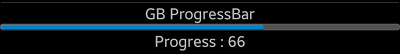

자~!! 이렇게 해서 Notification을 띄우는 방법을 모두 알아봤습니다

26번 강좌의 길이가 이정돈데 와 30번대는 한달에 한번? 이렇게 해야될까봐요

지금 4시간째 쓰고 있네요 ㅠㅠ

이렇게 해서 알림을 띄우는 대표적인 코드와 방법에 대해 알아봤는데요

스크롤 압박에서 이겨내신분들 모두 축하드립니다 ㅠㅠ

그리고... 오늘은 제발 꼭 덧글 달아주세요

강좌 하나 쓰는거 너무 힘듭니다 ㅠㅠ

그럼 설 잘보내세요~~

[ExampleNofitication.zip](https://github.com/itmir913/archive/releases/download/itmir-attachments/ExampleNofitication.zip)

참조 : http://androidhuman.com/507

http://stunstun.tistory.com/101

http://darksilber.tistory.com/114

http://aroundck.tistory.com/2134

http://developer.android.com/design/patterns/notifications.html

---

## 첨부파일

- [ExampleNofitication.zip](https://github.com/itmir913/archive/releases/download/itmir-attachments/ExampleNofitication.zip) `614 KB`
