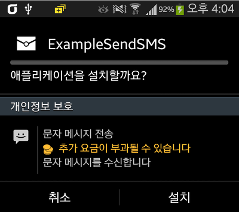
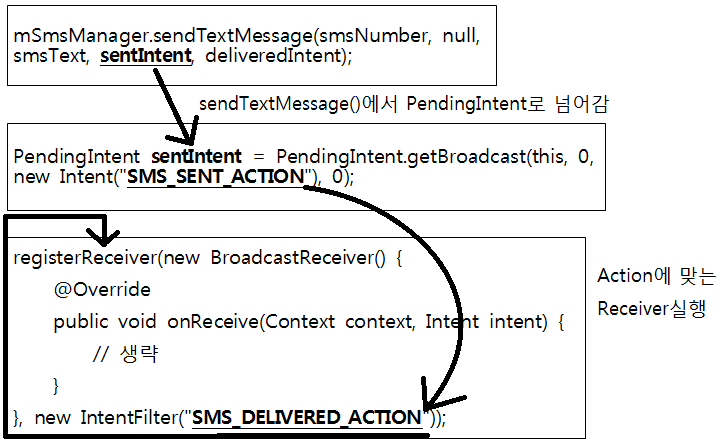
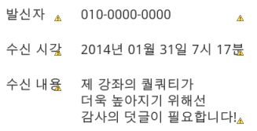
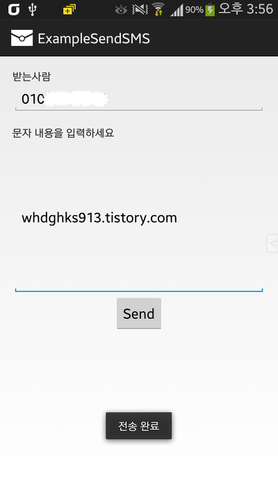
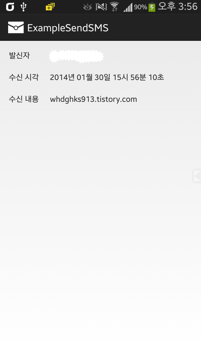

설이네요 ㅎㅎ..

이번강좌는 어플에서 SMS문자를 전송하는 방법을 알아볼까 합니다

또한 브로드캐스트리시버에서 잠깐 소개한 문자 수신도 담겨 있습니다

0번~10번대 강좌를 보고 있으신 분들은 빨리 이 강좌까지 따라 오세요!

참고로 제 강좌는 전에 배운것이 다음 강좌에 섞여 나오는 일이 아주 많기에 전에배운건 꼭 아시고 계셔야만 합니다

## 27. 어플에서 SMS(문자) 전송 하기

### 27-1 안드로이드 앱에서 문자를 전송하기 전에 주의하세요

문자를 수신하고 전송하기 위해서는 어플에 권한을 추가해야 합니다

이것은 사용자가 앱을 깔때 이 어플이 문자를 전송할 수 있구나 라고 확인이 가능한데요

(사실 앱 설치때 권한 보는 사람은 적다지만 아무튼)

문자 전송이 꼭 필요한 기능이면 몰라도 필요없는 앱에 sms전송이 있다면 악성앱일 가능성이 큽니다

그리고 사용자의 돈을 사용하는 것이기 때문에 더욱 더 잘 다뤄야 합니다



이 강좌를 모두 마스터 한다면 위 사진처럼 진짜 문자 전송이 되는 앱을 만들수 있습니다

AndroidManifest.xml에 아래 권한을 추가해주세요

<uses-permission android:name="android.permission.SEND\_SMS" />

<uses-permission android:name="android.permission.RECEIVE\_SMS" />

<uses-permission android:name="android.permission.READ\_PHONE\_STATE" />

### 27-2 Main Layout

오랜만에 메인 레이아웃부터 시작해보겠습니다

필수로 있어야 하는건 "받는사람 번호"와 "보낼 메세지", "전송 버튼"정도 인데요

저는 TextView, EditText, TextView, EditText, Button순으로 배치했습니다

각자 알아서 마음대로 배치하되, 두개의 EditText의 id값은 각각 smsNumber, smsText으로 하고

Button은 android:onClick="sendSMS"속성을 넣어줍시다

### 27-3 문자를 전송하자

findViewById는 모두 생략하겠습니다

onClick에 맞게 메소드를 하나 만들어 보겠습니다

```java
public void sendSMS(View v){
    String smsNum = smsNumber.getText().toString();
    String smsText = smsTextContext.getText().toString();

    if (smsNum.length()>0 && smsText.length()>0){
        sendSMS(smsNum, smsText);
    }else{
        Toast.makeText(this, "모두 입력해 주세요", Toast.LENGTH_SHORT).show();
    }
}
```

2~3줄의 getText().toString()은 모두 아시는 구문이죠?

모르신다면 [[Development/App] - #7 EditText는 완전 쉬워요~](/archive/itmir/2013/306) 부터 보시길 추천드립니다

5번째의 length는 String의 길이를 반환합니다

그래서 길이가 0인경우는 "", 즉 입력하지 않은것이 됩니다

if문으로 입력되지 않았을경우, Toast를 띄우도록 하고 있습니다

두개 모두 빈칸이 아닐경우 sendSMS라는 메소드를 호출하며, 입력한 Number와 Text를 그 메소드로 넘겨주고 있습니다

sendSMS메소드를 살펴보기 전에 먼저 문자를 보내는 API부터 알아볼께요

SmsManager mSmsManager = SmsManager.getDefault();

mSmsManager.sendTextMessage(destinationAddress, scAddress, text, sentIntent, deliveryIntent);

이 두개의 코드만 이해한다면 오늘 강의의 목표를 모두 마스터한것입니다

sendTextMessage에대해 조금 알아보겠습니다

- destinationAddress : 받는사람의 Phone Number입니다 신기하게도 String형식입니다
- scAddress : 이건 잘 모르겠습니다 일단 null을 입력해 주세요 (구글API : is the service center address or null to use the current default SMSC)
- text : 문자의 내용입니다
- sentIntent : 문자 전송에 관련한 PendingIntent입니다 null을 넣어도 되지만 저는 전송 확인결과를 알아보기 위해 이것도 사용할 예정입니다
- deliveryIntent : 문자 도착에 관련한 PendingIntent라고 합니다 null을 넣어도 되지만 한번 이것도 사용해 보겠습니다

그럼 sendSMS()를 살펴보겠습니다

```java
public void sendSMS(String smsNumber, String smsText){
    PendingIntent sentIntent = PendingIntent.getBroadcast(this, 0, new Intent("SMS_SENT_ACTION"), 0);
    PendingIntent deliveredIntent = PendingIntent.getBroadcast(this, 0, new Intent("SMS_DELIVERED_ACTION"), 0);

    registerReceiver(new BroadcastReceiver() {
        @Override
        public void onReceive(Context context, Intent intent) {
            switch(getResultCode()){
                case Activity.RESULT_OK:
                    // 전송 성공
                	Toast.makeText(mContext, "전송 완료", Toast.LENGTH_SHORT).show();
                    break;
                case SmsManager.RESULT_ERROR_GENERIC_FAILURE:
                    // 전송 실패
                	Toast.makeText(mContext, "전송 실패", Toast.LENGTH_SHORT).show();
                    break;
                case SmsManager.RESULT_ERROR_NO_SERVICE:
                    // 서비스 지역 아님
                	Toast.makeText(mContext, "서비스 지역이 아닙니다", Toast.LENGTH_SHORT).show();
                    break;
                case SmsManager.RESULT_ERROR_RADIO_OFF:
                    // 무선 꺼짐
                	Toast.makeText(mContext, "무선(Radio)가 꺼져있습니다", Toast.LENGTH_SHORT).show();
                    break;
                case SmsManager.RESULT_ERROR_NULL_PDU:
                    // PDU 실패
                	Toast.makeText(mContext, "PDU Null", Toast.LENGTH_SHORT).show();
                    break;
            }
         }
    }, new IntentFilter("SMS_SENT_ACTION"));

    registerReceiver(new BroadcastReceiver() {
        @Override
        public void onReceive(Context context, Intent intent) {
            switch (getResultCode()){
                case Activity.RESULT_OK:
                    // 도착 완료
                	Toast.makeText(mContext, "SMS 도착 완료", Toast.LENGTH_SHORT).show();
                    break;
                case Activity.RESULT_CANCELED:
                    // 도착 안됨
                	Toast.makeText(mContext, "SMS 도착 실패", Toast.LENGTH_SHORT).show();
                    break;
            }
        }
    }, new IntentFilter("SMS_DELIVERED_ACTION"));

    SmsManager mSmsManager = SmsManager.getDefault();
    mSmsManager.sendTextMessage(smsNumber, null, smsText, sentIntent, deliveredIntent);
}
```

두번째~세번째 줄의 PendingIntent에 대해 따로 때어내어 설명하도록 하겠습니다

PendingIntent sentIntent = PendingIntent.getBroadcast(this, 0, new Intent("SMS\_SENT\_ACTION"), 0);

PendingIntent deliveredIntent = PendingIntent.getBroadcast(this, 0, new Intent("SMS\_DELIVERED\_ACTION"), 0);

각각 위에서부터 문자 전송, 문자 수신에 관련하여 sendTextMessage()에 넘겨줄 값들입니다

PendingIntent에서 세번째로 넘겨주는것이 new Intent()인데요

그 아래에 있는 코드들을 보면 registerReceiver가 있고, new IntentFilter()가 있습니다

registerReceiver는 우리 브로드캐스트리시버할때 한번 사용한 적이 있습니다

BroadCast를 등록해 주는 역할을 했었는데요

그 아래의 IntentFilter도 그 강좌에서 한 적이 잇습니다

[[Development/App] - #24 Broadcast Receiver로 문자(SMS) 수신해보자](/archive/itmir/2014/424)



뭐.. 이런씩으로 말이죠

브로드 캐스트 리시버에서 어떤 작업이 이루어 지는지는 주석으로 설명이 되어 있으니 더 이상의 설명은 필요 없을듯 합니다

마지막줄의 sendTextMessage()가 실행되어 SMS가 전송되는 겁니다 ㅎㅎ

그럼 문자를 수신하는 방법도 알아봐야 겠지요?

### 27-4 문자를 수신하자 - 브로드캐스트리시버 편

문자를 수신하기 위해 필요한것은 브로드캐스트리시버 입니다

#24번에서 언급한 내용이지만 다시 한 번 짚고 넘어가 봅시다

먼저 문자가 오면 나타날 화면의 레이아웃부터 설정해 봅시다



저는 이렇게 TableLayout을 이용해서 구현했습니다

이 레이아웃은 한번도 써본적이 없으신 분들을 위해 코드를 제공하겠습니다

res/layout/activity\_showsms.xml

```xml
<TableLayout xmlns:android="http://schemas.android.com/apk/res/android"
    xmlns:tools="http://schemas.android.com/tools"
    android:layout_width="fill_parent"
    android:layout_height="fill_parent"
    android:paddingBottom="@dimen/activity_vertical_margin"
    android:paddingLeft="@dimen/activity_horizontal_margin"
    android:paddingRight="@dimen/activity_horizontal_margin"
    android:paddingTop="@dimen/activity_vertical_margin"
    tools:context=".ShowSMSActivity"  >
    
    <TableRow
        android:layout_width="wrap_content"
        android:layout_height="wrap_content" >
        
        <TextView
            android:layout_width="wrap_content"
            android:layout_height="wrap_content"
            android:text="발신자" />
        
        <TextView
            android:id="@+id/originNum"
            android:layout_width="wrap_content"
            android:layout_height="wrap_content"
            android:layout_marginLeft="20dp" />
    
    </TableRow>
    
    <TableRow
        android:layout_width="wrap_content"
        android:layout_height="wrap_content"
        android:layout_marginTop="20dp" >
        
        <TextView
            android:layout_width="wrap_content"
            android:layout_height="wrap_content"
            android:text="수신 시각" />
        
        <TextView
            android:id="@+id/smsDate"
            android:layout_width="wrap_content"
            android:layout_height="wrap_content"
            android:layout_marginLeft="20dp" />
    
    </TableRow>
    
    <TableRow
        android:layout_width="wrap_content"
        android:layout_height="wrap_content"
        android:layout_marginTop="20dp" >
        
        <TextView
            android:layout_width="wrap_content"
            android:layout_height="wrap_content"
            android:text="수신 내용" />
        
        <TextView
            android:id="@+id/originText"
            android:layout_width="wrap_content"
            android:layout_height="wrap_content"
            android:layout_marginLeft="20dp" />
    
    </TableRow>
</TableLayout>
```

그다음에 브로드캐스트리시버를 작성합시다

이름은 SMSBroadCast.java입니다

```java
import android.content.BroadcastReceiver;
import android.content.Context;
import android.content.Intent;

public class Broadcast extends BroadcastReceiver {

    @Override
    public void onReceive(Context context, Intent intent) {
        if("android.provider.Telephony.SMS_RECEIVED".equals(action)){
            
        }
    }
}
```

자, 저 if문에 문자 수신을 위한 코드를 작성해 봅시다

저번에도 말씀드렸지만 한번에 이해하려고는 하지 마세요. 천천히 이해하시면 됩니다.

```java
Bundle bundle = intent.getExtras();
Object messages[] = (Object[])bundle.get("pdus");
SmsMessage smsMessage[] = new SmsMessage[messages.length];

for(int i = 0; i < messages.length; i++) {
    smsMessage[i] = SmsMessage.createFromPdu((byte[])messages[i]);
}
```

그다음에는 저 SmsMessage에서 발신자와, 수신시각, 수신 메세지를 얻어와야 합니다

```java
Date curDate = new Date(smsMessage[0].getTimestampMillis());
SimpleDateFormat mDateFormat = new SimpleDateFormat("yyyy년 MM월 dd일 HH시 mm분 ss초", Locale.KOREA);

String originDate = mDateFormat.format(curDate);
String origNumber = smsMessage[0].getOriginatingAddress();
String Message = smsMessage[0].getMessageBody().toString();
```

SimpleDateFormat은 얻어온 날짜를 년, 월, 일 형식에 맞게 변환해 줍니다

이에 대한 지식은 어플지식이 아니라 java지식이므로 검색해 주세요

4번 라인에서 mDateFormat.format으로 날짜 형식을 변환합니다

6~7번은 발신자와 문자 내용을 가져오는 코드입니다

마지막으로 받아온 값을 액티비티에 전달해 주어야 하는데요

Intent를 이용해서 값을 전달해보겠습니다

```java
Intent showSMSIntent = new Intent(mContext, ShowSMSActivity.class);
showSMSIntent.putExtra("originNum", origNumber);
showSMSIntent.putExtra("smsDate", originDate);
showSMSIntent.putExtra("originText", Message);

showSMSIntent.setFlags(Intent.FLAG_ACTIVITY_NEW_TASK);

mContext.startActivity(showSMSIntent);
```

putExtra(name, value)은 name과 값을 입력하여 Intent로 실행한 액티비티(또는 서비스등)에서 값을 가져올수 있습니다

번호, 시각, 내용을 putExtra로 집어넣고 있으며

브로드캐스트에서 액티비티를 실행하므로 setFlags를 이용합니다

마지막으로 액티비티를 실행하면 브로드캐스트로 할일은 끝입니다

AndroidManifest.xml에 방금 만든 브로드캐스트를 등록합시다

<receiver android:name ="whdghks913.tistory.examplesendsms.SMSBroadCast">

    <intent-filter android:priority="9999">

        <action android:name="android.provider.Telephony.SMS\_RECEIVED" />

    </intent-filter>

</receiver>

### 27-5 문자를 수신하자 - Activity편

java파일을 하나 만들어 주세요 이름은 ShowSMSActivity.java입니다

이 java파일에는 아래 코드만 추가해 주면 끝입니다

```java
TextView smsDate = (TextView) findViewById(R.id.smsDate);
TextView originNum = (TextView) findViewById(R.id.originNum);
TextView originText = (TextView) findViewById(R.id.originText);

Intent smsIntent = getIntent();

String originNumber = smsIntent.getStringExtra("originNum");
String originDate = smsIntent.getStringExtra("smsDate");
String originSmsText = smsIntent.getStringExtra("originText");

originNum.setText(originNumber);
smsDate.setText(originDate);
originText.setText(originSmsText);
```

5번라인에서 Intent를 가져온후 7~9번을 보시면 putExtra로 넣은 값을 가져오고 있습니다

11~13번에서 Text를 적용하는 모습입니다

액티비티를 만들었으므로 AndroidManifest.xml에 추가해 줍시다

<activity android:name="whdghks913.tistory.examplesendsms.ShowSMSActivity" />

이제 완성입니다~~

작동 결과를 확인해 봅시다


    


문자전송과 수신이 모두 정상적으로 이루어 지는것을 확인해 볼수 있습니다~

요즘 강좌 길이가 상상을 초월할 정도로 길어져서 제가 무슨말 하는지도 못알아 먹을때가 있어요 ㅠㅠ

정성 가득 썼는데 글이 무시(?)당할때도 있는 것 같아요...

보시고 이 글이 마음에 드신다면 꼭 덧글 한마디 부탁드리겠습니다~

이번 강좌 예제는 심플 문자앱(?)으로도 쓸수 있을거 같아서 apk파일은 미리 올려드립니다 ㅎ

[ExampleSendSMS.apk](https://github.com/itmir913/archive/releases/download/itmir-attachments/ExampleSendSMS.apk)

이 강좌의 예제소스는 28번 강좌가 나오는 즉시 업로드 됩니다

카페에서는 원본글에서만 다운로드가 가능합니다

[ExampleSendSMS.zip](https://github.com/itmir913/archive/releases/download/itmir-attachments/ExampleSendSMS.zip)

참조 : http://developer.android.com/reference/android/telephony/gsm/SmsManager.html

/archive/itmir/2014/424

---

## 첨부파일

- [ExampleSendSMS.apk](https://github.com/itmir913/archive/releases/download/itmir-attachments/ExampleSendSMS.apk) `243 KB`
- [ExampleSendSMS.zip](https://github.com/itmir913/archive/releases/download/itmir-attachments/ExampleSendSMS.zip) `562 KB`