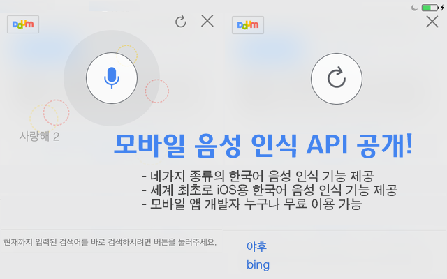
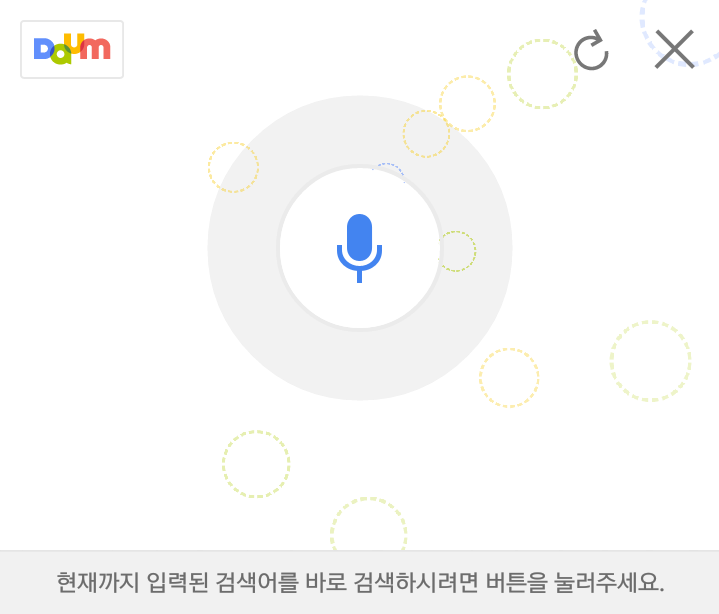

어제 (2014-02-03) 다음(Daum)에서 모바일 음성인식 API가 공개되었습니다

비슷한 기능으로 네이버의 음성인식과 구글의 음성인식이 있습니다

국내최초로 다음이 이 음성인식 API를 공개했는대요

이는 Android와 IOS모두 해당합니다

Android의 경우 구글 음성인식이 이미 있지만 IOS의 경우는 한국어 음성인식 API가 시리를 제외하고는 최초라고 알고있습니다

시리는 애플에서 다른 앱이 사용 불가능하도록 막아뒀기때문에 한국어 음성인식 API가 IOS에서는 세계 최초라고 합니다

**API관련 Daum 가이드**

- [API 시작하기](http://dna.daum.net/affiliate/speech/intro)

- [안드로이드 API 가이드](http://dna.daum.net/affiliate/speech/android)  /  [예제 소스 다운로드](http://dna.daum.net/examples/speech/android/DaumSpeechRecognizerAndroid-1.0.0.zip)

- [IOS API 가이드](http://dna.daum.net/affiliate/speech/ios)  /  [예제 소스 다운로드](http://dna.daum.net/examples/speech/ios/DaumSpeechRecognizerIphone-1.0.0.zip)

또한 다음에서 음성인식 API를 시험할수 있도록 예제 앱을 올려두었습니다

[SpeechRecognizerOpenApiSample.apk](https://github.com/itmir913/archive/releases/download/itmir-attachments/SpeechRecognizerOpenApiSample.apk)

<http://dna.daum.net/examples/speech/android/SpeechRecognizerOpenApiSample.apk>

아래는 제가 직접 음성인식 API를 사용한 스크린샷 입니다

생각보다 음성인식률이 나쁘지 않습니다

Android API 가이드를 보면 서버에서 데이터 최적화를 통해 좀더 정확한 값을 찾아낸다고 하는대

서버 최적화 전과 후가 확실히 다릅니다

한영 → 안녕

이런씩으로 최적화가 되요 ㅋㅋ

빨리 이 API를 사용해 봐야 겠습니다

---

## 첨부파일

- [SpeechRecognizerOpenApiSample.apk](https://github.com/itmir913/archive/releases/download/itmir-attachments/SpeechRecognizerOpenApiSample.apk) `301 KB`
