이번에는 이클립스와 git을 연동하여 사용해 보도록 하겠습니다

요즘은 안드로이드 앱 프로젝트를 github에 올려두고 작업하는 경우가 많습니다

이클립스에서 git을 사용하지 않으면 일일히 git add, git commit를 눌러야 하므로 비 효율적입니다

먼저 이글을 시작하기 전에 자신만의 git이 있어야 합니다

이에 관해서는 전에 2개의 git사이트를 소개한적이 있으므로 링크로 대신하겠습니다

[[Computer/PC] - Github 사용방법](/archive/itmir/2013/38)

[[Computer/PC] - Git 사용 방법](/archive/itmir/2013/192)

[[Computer/PC] - [Site] Bitbucket, 무료 git 사이트](/archive/itmir/2013/397)

1. 이클립스 설치

요즘은 안드로이드 개발 프로그램으로 이클립스를 보통 사용하므로 개발환경을 구축하셨다면 이클립스가 설치되어 있을겁니다

만약 설치되지 않았다면 이클립스 공식 사이트에서 다운로드 하시길 바랍니다

이클립스는 32비트와 64비트를 구분해서 다운로드 해야 합니다

<http://eclipse.org/>

또는 필자가 포스팅중인 어플 개발 강좌를 보아도 손색이 없다

[[Development/App] - #1 컴퓨터의 개발환경을 구축하자](/archive/itmir/2013/286)

[[Development/App] - #2 이클립스 때려서 어플 만들자](/archive/itmir/2013/287)

2. EGit 플러그인 설치

이클립스에서 git사용을 도와주는 플러그인의 이름은 egit입니다 (edit아닙니다 ㅋ)

공식 사이트는 <http://www.eclipse.org/egit/> 이며 설명을 볼수 있습니다

공식 사이트에서는 설명만 볼수 있고 다운로드는 이클립스로 직접 가능합니다

Help - Install New Software에 접속해 주세요

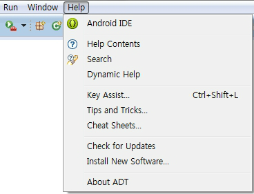

그다음 아래 스크린샷이 나타날탠대

Work with: 란에 아래 박스 주소를 입력해 주세요

http://download.eclipse.org/egit/updates

그럼 두개가 나타날탠대 Eclipse Git Team Provider를 체크한뒤 Next!

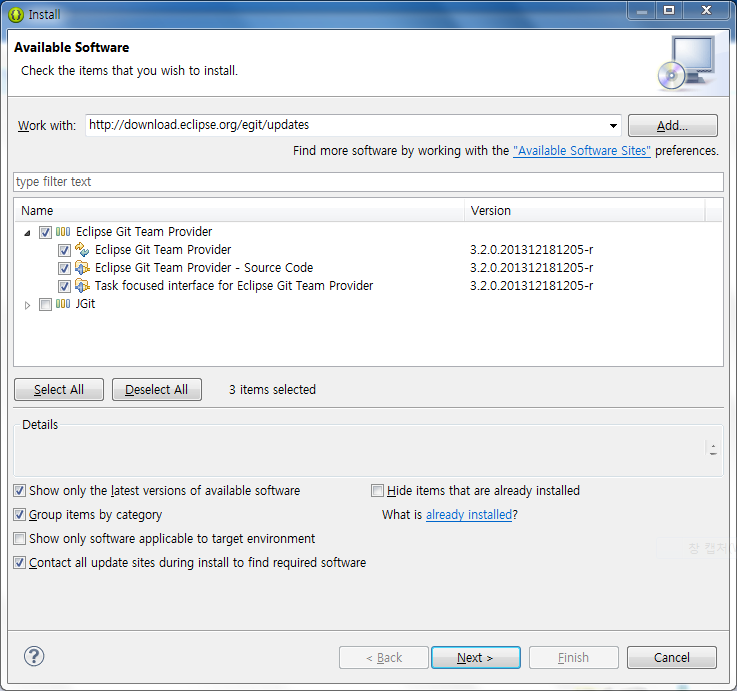

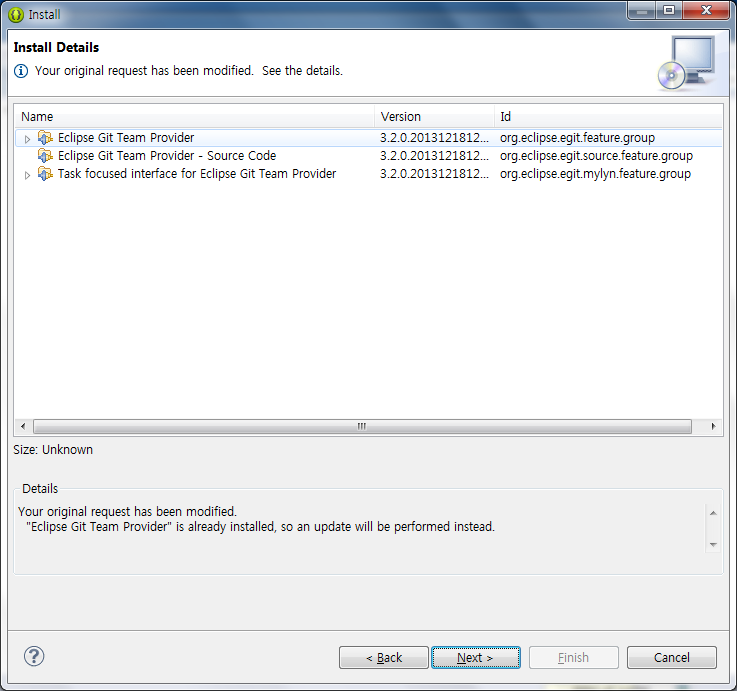

확인후 Next > !

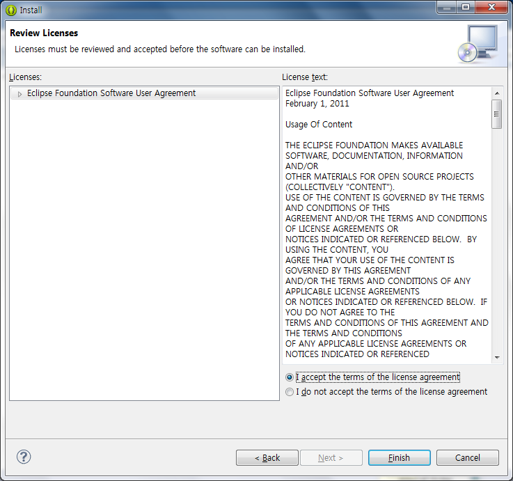

라이센스에 동의한후 Finish를 누르면 설치가 됩니다

설치중인 모습입니다

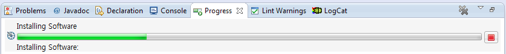

설치가 완료되면 ADT(혹은 이클립스)를 재시작 하라는 알림이 나타나며,

재시작을 하게 되면 Windows - Show View - Other에 들어가게 되면 Git이라는것이 새로 나타나게 됩니다

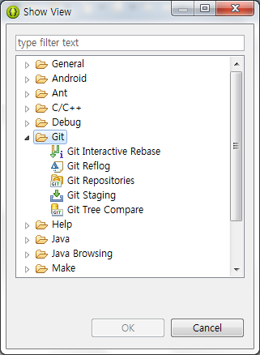

Git Repositories를 선택하시면 아래와 같은 화면이 새로 나타납니다

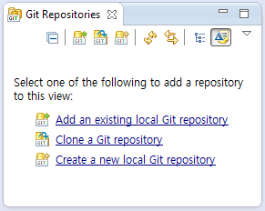

3가지를 선택할수 있습니다

1. 이미 다운받은 .git을 추가하는 방법

2. github등에서 clone하는 방법

3. 새로 만드는 방법

먼저 1번부터 시도해 보겠습니다

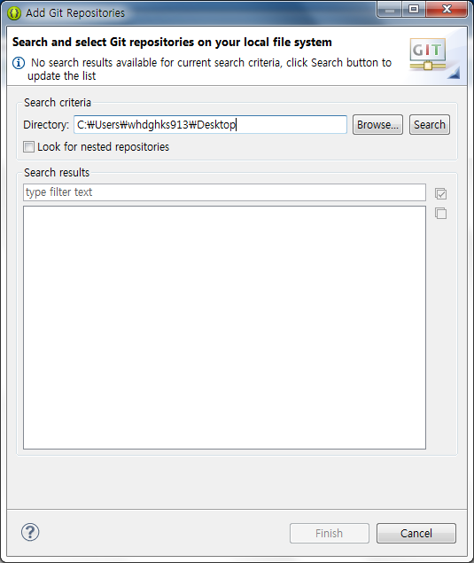

git이 담긴 폴더를 선택해 주세요

그럼 끝입니다 ㅋㅅㅋ

Git부분에 추가한 repo가 표시됩니다

두번째로 Clone하는 방법을 알아볼까 합니다

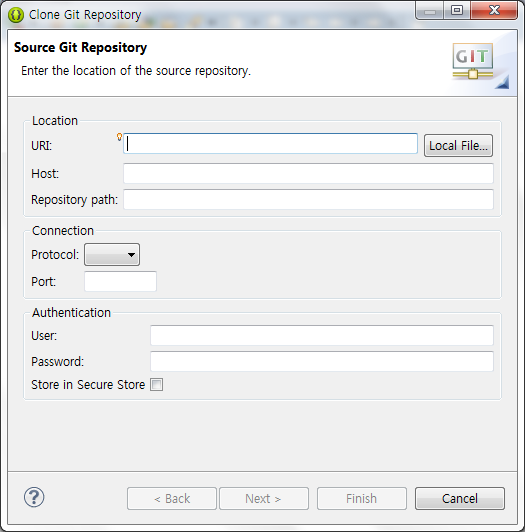

저기서 URL만 입력하면 Host나 Repository path는 알아서 입력되는거 같은대요

URL은 clone 주소 입니다

github는 이렇게 할수 있네요

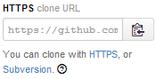

사용자 ID랑 PW는 private repo일경우 필요합니다

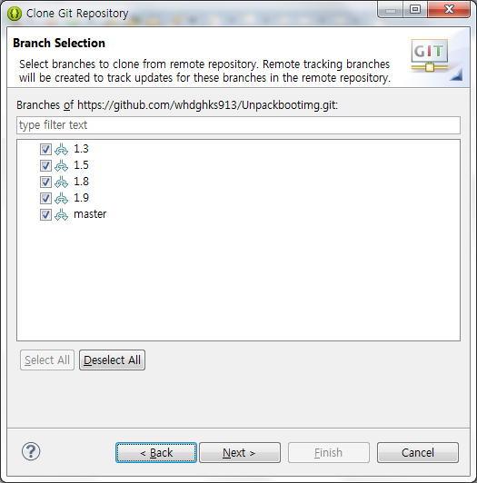

Clone할 branch를 선택하고 Next

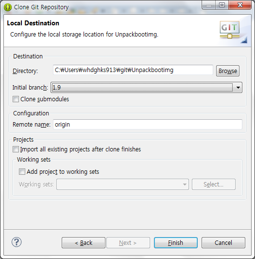

그다음 Finish하면 끝입니다

이제 Commit을 해볼까요?

Only3(세번만) 소스를 improt한다음 commit해보겠습니다

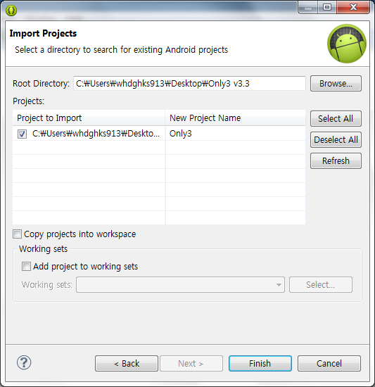

git 설치이후 .git이 있는 프로젝트를 import하면 자동으로 git에 추가되는듯 합니다

저는 시험삼아 AndroidManifest를 수정했습니다

">"라고 보이시죠?

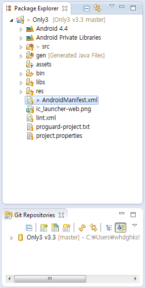

마우스 오른쪽 - Team - Commit을 누르면 됩니다

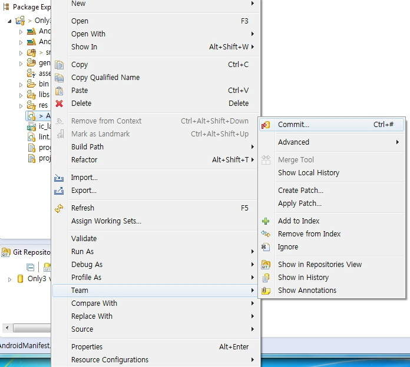

Commit Message를 입력후 완료할수 있습니다

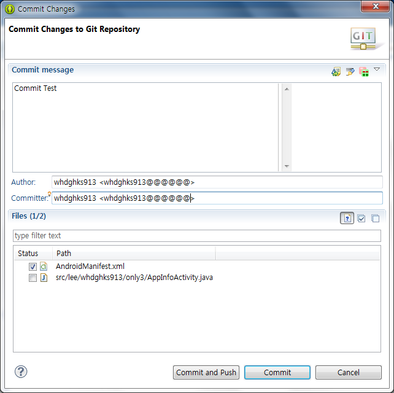

Commit은 commit만 하는거고 Commit and Push는 서버에 전송까지 한번에 해주는 겁니다

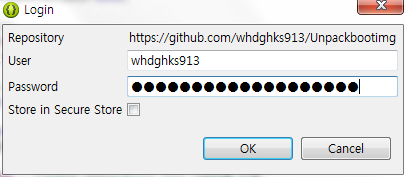

로그인까지 해주면 완료~~

이렇게 해서 이클립스랑 git이랑 연동해서 사용하는 방법을 알아보았습니다

git을 사용하는 유저에게 매우 편리한 방법이라 생각됩니다 ^^