안녕하세요

이번글에서는 이클립스와 Cygwin을 이용하여 NDK 빌드환경을 구축해 보도록 하겠습니다

처음에 NDK를 압축푸는 시간과 Cygwin설치 시간이 길어요

그러므로 1번과 2번을 동시에 진행하시는걸 추천드립니다

또한 이 강좌는 윈도우를 기준으로 작성되었습니다

다른 리눅스나 맥에서는 [다른강좌](http://blog.naver.com/zzbung/10100873079)를 참고해 주세요

뭐.. Cygwin를 사용하는것만 빼면 비슷합니다

0. 필수

-Java가 필수로 설치되어 있어야 하며, 환경변수 설정이 완료되어 있어야 합니다

-sdk는 일단 깔아두세요 이클립스로 ndk할때 어처피 sdk있어야 합니다.. 필수!

1. NDK 다운로드

먼저 NDK를 다운로드 하셔야 합니다

SDK다운로드 받을때 처럼 구글에서 다운로드 하셔야 합니다

<http://developer.android.com/tools/sdk/ndk/index.html>

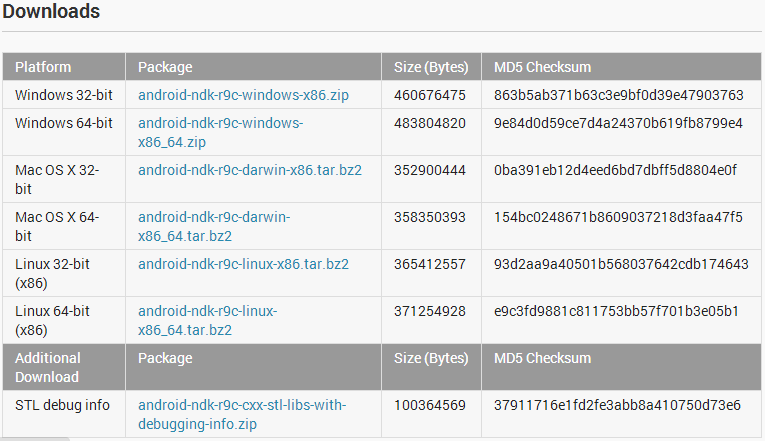

자신의 컴퓨터 사양과 OS등에 맞게 파일을 다운로드 하세요

그다음 아무데나 (또는 SDK를 저장한 폴더에) 압축을 풀어주세요

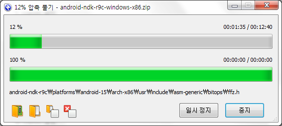

압축풀기가 완료된 모습입니다^^

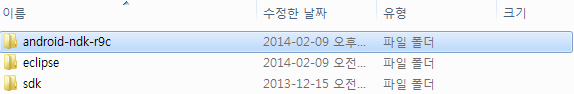

2. Cygwin설치

Cygwin는 윈도우 환경을 사용중일때 설치해야 합니다

위에서 언급했지만 다른 OS일경우 이 강좌를 보시면 안됩니다 (뭐.. Cygwin설치만 빼면 비슷하지만요)

-공식 사이트

<http://cygwin.com>

-직링크

<http://cygwin.com/setup-x86.exe>

<http://cygwin.com/setup-x86_64.exe>

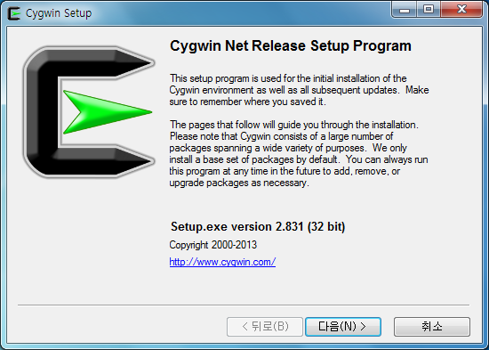

다음 >

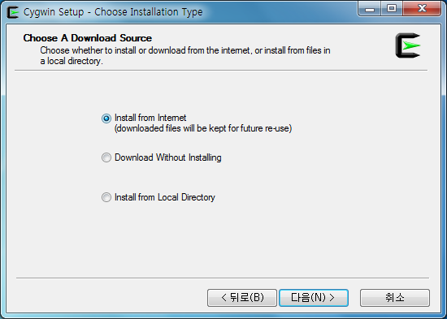

처음 설치하는것이니 Install from Internet을 선택해주세요

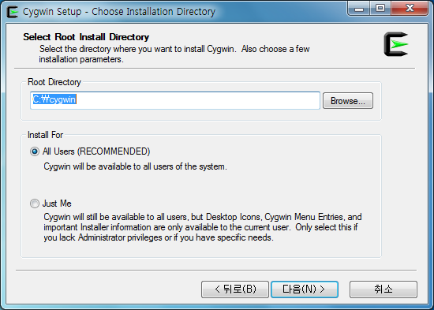

폴더 경로는 기본설정(C:\아래)이 편합니다

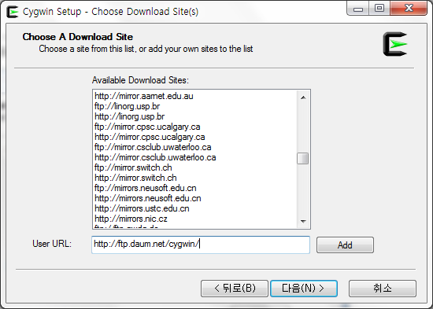

여기서..

다른 미러 사이트들은 속도가 장난 아닙니다

속도가 남는 잉여분들은(?) 외국 미러사이트에서,

아니면 다음 서버를 사용합시다

http://ftp.daum.net/cygwin/

URL입력후 Add한뒤 선택하고 다음 >

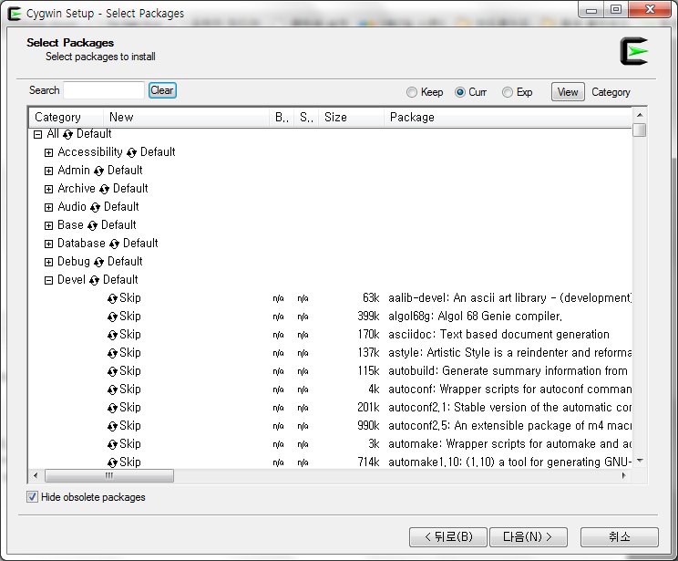

위 스샷은 다운로드할 패키지를 선택하는 화면입니다

아래 박스에 있는 패키지를 검색해서 Skip을눌러 버전명이 나오도록 한뒤 다음 버튼을 눌러주세요

- devel/gcc-core: GNU Compiler Collection (C, OpenMP)

- devel/gcc-g++: GNU Compiler Collection (C++)

- devel/make: The GNU version of the 'make' utility

cygwin\_gcc-core 이런게 아니라 gcc-core입니다

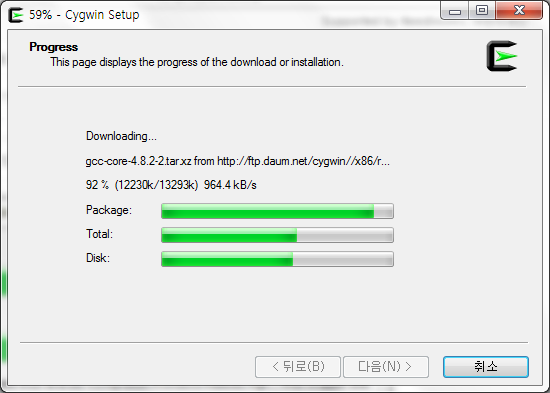

다운로드중..

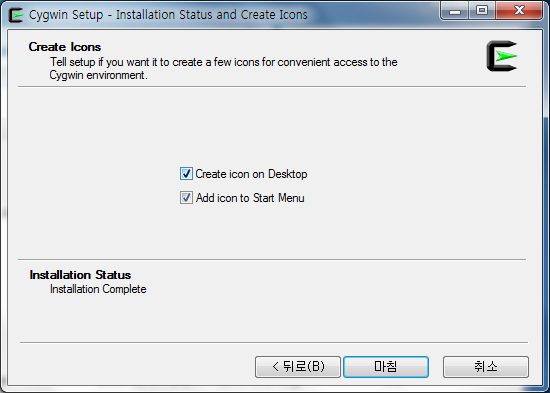

완료!

3. Cygwin의 bashrc수정

이제 ".bashrc"라는 파일을 수정해야 합니다

경로는 아래와 같아요

C:\cygwin\home\(계정명)\.bashrc

만약 파일이 없다면 cygwin을 한번 실행한다음 다시 들어가 보세요

추가해야 할건 아래와 같습니다

PATH=$PATH:.:${HOME}/bin:/cygdrive/**c/SDK/android-ndk-r9c**:**/cygdrive/c/SDK/sdk/tools**

export PATH

NDK\_PROJECT\_PATH=.

export NDK\_PROJECT\_PATH

/cygdrive/c/은 C:\입니다

cygwin에서는 이렇게 표현합니다 (이유는 몰라요)

1번에서 설치한 ndk경로와 sdk/tool의경로를 적어주세요

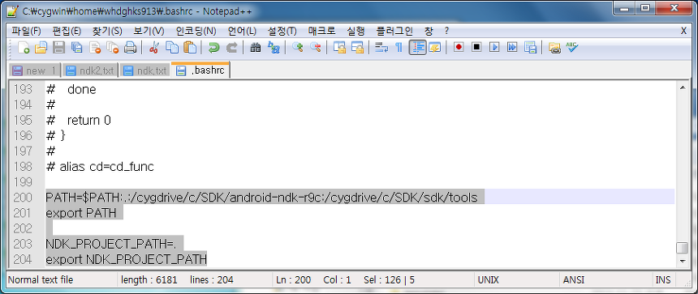

이제 Cygwin을 연다음 adb를 입력했을때 정상적으로 나타날겁니다

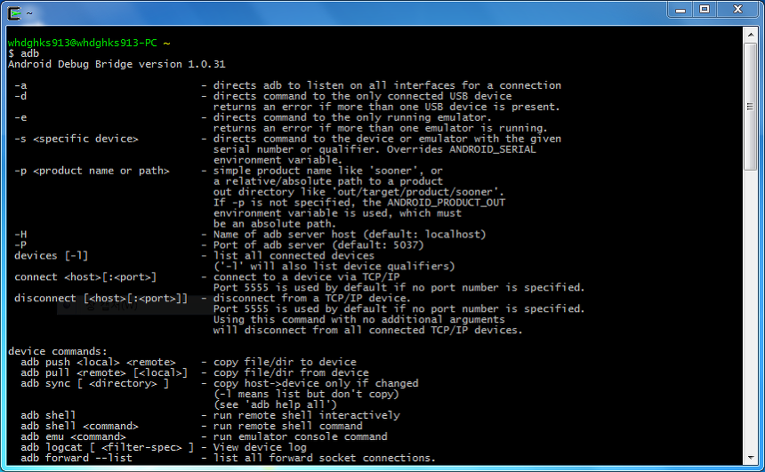

NDK 개발환경 구축이 모두 완료되었습니다~

샘플 NDK는 다음포스팅에서 알아보도록 하겠습니다

저도 연구좀...
