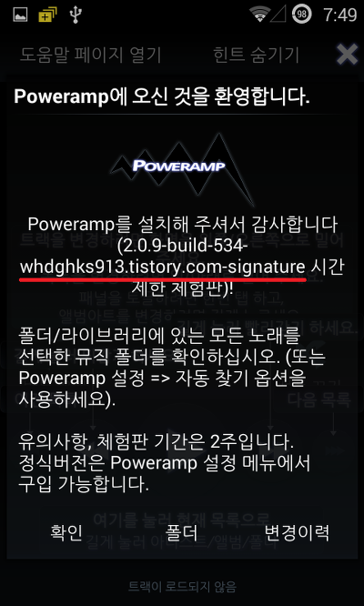
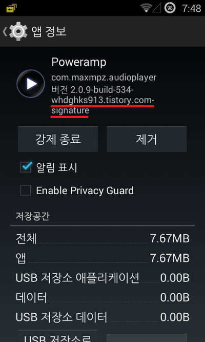

PowerAmp(파워앰프)는 난공불락의 철벽처럼 그 보안을 뚫는것이 매우 어렵습니다

난독화/파일 이름 부터 디컴파일부터 불가능하게 막아둔 보안과, 개발사가 예상한건지는 모르겠는대

컴파일까지도 안됩니다 ㅇㅅㅇ..;;

그리고 파일을 수정하지 않고 사인키만 변경해도 앱 실행을 중지시켜 버립니다

엄청난 난공불락의 앱이죠

그래서 대부분의 유명어플은 크래커에 의해 크랙어플이 등장합니다만

파워앰프는 특이하게도 럭키패쳐를 이용한 방법 외에는 unlocker설치후 라이센스 오류뜰때마다 다시 까는 방법외에는 없습니다

그런대 오늘 제가 그 엄청난 보안중의 하나인 사인키 검사(Signature)를 뚫었습니다 ㅋㅋㅋ

사실 악의적인 목적으로 뚫은것이 아니라 저도 NDK를 이용한 사인키 검사를 통해 유료어플의 크랙을 막아보려는 생각을 가지고 있고, 일부 성공하였기 때문입니다

사인키 검사하면 대표적으로 파워앰프가 있어 몇시간동안 뚫어 봤는대 뚫리네요....;;

아래 두개의 스샷은 인증 사진입니다

어플의 버전명을 변경하고 설치하면 사인키가 변경되어 여러분께서 직접 해보시면

"Sorry, can't run the modified APK. Please try to reinstall Poweramp from the Google Play or official website."

이라는 오류가 나타날겁니다

아래 스샷에는 제 블로그 주소가 표시되어 있어 장난이 아님을 보이고 있습니다

    

사인키 변조 확인후, 종료되는 현상만 건너뛴것이기때문인지는 몰라도 모든게 아에 안되네요;

실행만 됩니다

그냥 사인키 변조 우회에 의의를 가지며...

--개발자용 메모

invoke-virtual {v0, v3, v4}, Landroid/content/pm/PackageManager;->getPackageInfo(Ljava/lang/String;I)Landroid/content/pm/PackageInfo;

move-result-object v0

iget-object v0, v0, Landroid/content/pm/PackageInfo;->**signatures**:[Landroid/content/pm/Signature;

// 이부분이 signature을 가져오는 부분이예요

array-length v3, v0

if-lez v3, :cond_c

const/4 v3, 0x0

aget-object v0, v0, v3

invoke-virtual {v0}, Landroid/content/pm/Signature;->toByteArray()[B

move-result-object v5

const/4 v0, 0x5

sget-object v3, Lcom/maxmpz/audioplayer/Application;->ah:[B

array-length v6, v3

move v3, v0

move v0, v2

:goto_0

if-ge v0, v6, :cond_c

add-int/lit8 v4, v3, 0x1

aget-byte v3, v5, v3

sget-object v7, Lcom/maxmpz/audioplayer/Application;->ah:[B

aget-byte v7, v7, v0

:try_end_0

.catch Landroid/content/pm/PackageManager$NameNotFoundException; {:try_start_0 .. :try_end_0} :catch_0

if-eq v3, v7, :cond_b

move v0, v2

:goto_1

if-nez v0, :cond_1

// smali의 if문법에 따르면 not equals zero (0이 아니면) cond_1(아래부분)으로 넘어갑니다

// 이부분에서 true(0이 아니다)가 나와서 아래 "?컙"을 패스해야 되요!!

**if-eqz v0, :cond_1**

// equals zero(0이면) 을 추가해 0이든 0이 아니든 cond_1으로 넘어가게 만듭니다

sput-boolean v1, Lcom/maxmpz/audioplayer/Application;->0xF1:Z

**invoke-static {p0}, Lcom/maxmpz/audioplayer/Application;->?컙(Landroid/content/Context;)V**

// 이부분이 실행되면 Sorry~ 가 뜨며 앱이 종료되요

.line 723

:cond_1

invoke-virtual {p0}, Lcom/maxmpz/audioplayer/Application;->?컙()V

완벽한 보안은 없네요...;

그럼 전 다시 체험판 파워앰프를 설치하러 갑니다..
