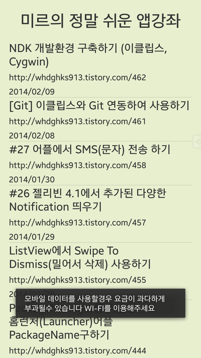
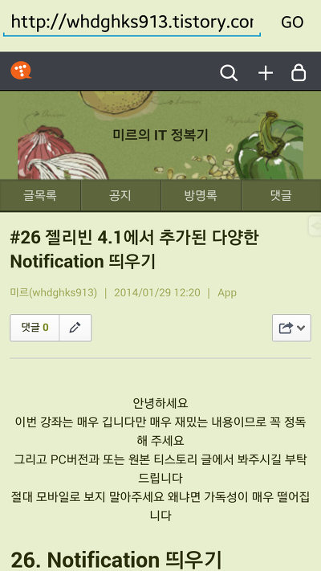

작년 7월말 부터 작성하게 된 강좌가 벌써 반년이 지났습니다 ...

제가 작성한 어플 강좌 시리즈는 벌써 27개가 되고 다른 번외편까지 포함하면 약 50개의 강좌가 등록되어 있군요...!

<http://itmir.tistory.com/category/Development/App>

그래서 시기가 좀 애매하지만

오늘 아침부터 처음하는 html 파싱에 대해 공부했습니다 처음하는거라 이해가 안되더라고요..

그렇지만 결국엔 성공했습니다 ㅎㅎ

제 앱 강좌를 더욱더 편하게 보시고, 새로운 강좌를 더 빨리 보시기 위한 마음에

앱 강좌 링크를 어플로 탄생시켰습니다 !!

    

마켓 링크는 [http](http://play.google.com/store/apps/details?id=lee.whdghks913.mirithtml)[://play.google.com/store/apps/details?id=lee.whdghks913.mirithtml](http://play.google.com/store/apps/details?id=lee.whdghks913.mirithtml) 이며 방금 업로드 했으므로 나타나지 않을수 있습니다

[DownLoad]

<http://play.google.com/store/apps/details?id=lee.whdghks913.mirithtml>

어플을 실행하는 즉시 강좌 리스트가 로딩이 되며, 이때 약 45KB(약 0.043MB) 정도의 데이더를 소모하며

리스트를 터치하면 어플 강좌 사이트로 진입합니다

편하게 풀스크린으로 했습니다 ㅎㅎ

이제 제가 고등학생 1학년에 입학하게 되어 앱에 투자할 시간이 부족할수도 있겠지만

틈틈히 시간날때마다 고 퀄리티, 시중 5만원의 책보다 완성도가 높은 강좌를 쓰도록 노력하겠습니다~

감사합니다 ㅎㅎ
