안녕하세요

강좌가 등록되는 시간 주기가 초반에는 하루였는대 요즘은 보름~한달 되는거 같아요

천천히 강좌를 써서 여러분이 빨리 따라올수있도록 배려하는거랍니다~(?)

그리고 이번강좌 부터는 모바일에서의 가독성 향상을 위해 소스코드를 사진으로 캡쳐해서 올리겠습니다

복사할수있는 소스코드는 "코드보기"버튼을 누르면 볼수 있으며, 티스토리에서만 볼수있습니다 (네이버는 지원을 안하므로..)

## 28. WebView로 인터넷을 해보자

### 28-1 인터넷을 하기 위해서는 권한이 필요해요

웹뷰 예제를 따라하다 마지막에 "잘못한게 없는거 같은데 강제종료 되요"라는 덧글이 올라올까봐 처음부터 언급하겠습니다

인터넷을 하기 위해서는 AndroidManifest.xml에 인터넷 권한을 추가해 주어야만 합니다

그래야 이 어플을 설치하기 전에 아 인터넷에 접속할수 있구나 라는걸 사용자에게 알릴수가 있답니다

<uses-permission android:name="android.permission.INTERNET" />

### 28-2 레이아웃을 만들어 보자

오랜만에 레이아웃을 만드는거 같습니다(?)

이번시간에 만들 레이아웃은 아래와 같습니다

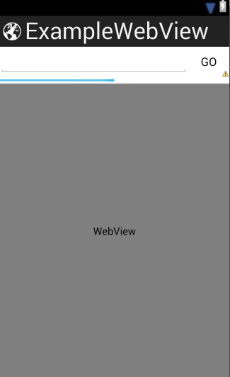

평소 사용하던 RelativeLayout을 사용하면 힘들수 있으므로 이번에는 리니어 레이아웃을 사용해 보겠습니다

잠깐 LinearLayout에 대해 설명하자면..

이 레이아웃은 추가된 하위뷰들(EditText)을 순서대로 위에서 아래로, 또는 왼쪽에서 오른쪽으로 배열합니다

저 사진에서 ProgressBar는 0으로 설정해야 하고요

레이아웃 xml은 아래와 같습니다

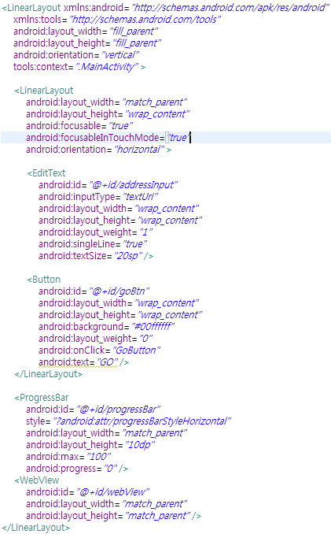

코드 보기

```xml
<LinearLayout xmlns:android="http://schemas.android.com/apk/res/android"
    xmlns:tools="http://schemas.android.com/tools"
    android:layout_width="fill_parent"
    android:layout_height="fill_parent"
    android:orientation="vertical"
    tools:context=".MainActivity" >
    
    <LinearLayout
        android:layout_width="match_parent"
        android:layout_height="wrap_content"
        android:focusable="true"
        android:focusableInTouchMode="true"
        android:orientation="horizontal" >
        
        <EditText
            android:id="@+id/addressInput"
            android:inputType="textUri"
            android:layout_width="wrap_content"
            android:layout_height="wrap_content"
            android:layout_weight="1"
            android:singleLine="true"
            android:textSize="20sp" />

        <Button
            android:id="@+id/goBtn"
            android:layout_width="wrap_content"
            android:layout_height="wrap_content"
            android:background="#00ffffff"
            android:layout_weight="0"
            android:onClick="GoButton"
            android:text="GO" />
    
    </LinearLayout>

    <ProgressBar
        android:id="@+id/progressBar"
        style="?android:attr/progressBarStyleHorizontal"
        android:layout_width="match_parent"
        android:layout_height="10dp"
        android:max="100"
        android:progress="0" />

    <WebView
        android:id="@+id/webView"
        android:layout_width="match_parent"
        android:layout_height="match_parent" />

</LinearLayout>
```

두번째 리니어 레이아웃을 보면

focusable과 focusableInTouchMode이 있는데요

처음에 액티비티에 EditText가 있을경우 포커스가 EditText로 먼저 가므로 이를 방지하기 위해 넣어줬습니다

이 두개가 없을경우 앱을 실행하면 키보드가 나타나요

더 자세한 설명보다 직접 보는게 이해가 빠르므로 설명은 생략하겠습니다

(앱 예제안 주석에 달아두겠습니다)

### 28-3 MainActivity.java

이번 강좌에서는 선언해야 할것이 조금 많습니다

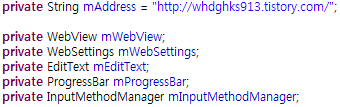

코드 보기

```java
private String mAddress = "http://itmir.tistory.com/";

private WebView mWebView;
private WebSettings mWebSettings;
private EditText mEditText;
private ProgressBar mProgressBar;
private InputMethodManager mInputMethodManager;
```

가독성 향상을 위해 사진을 사용했습니다

코드를 보기 위해서는 "코드보기"버튼을 눌러주세요~~

이제 onCreate()로 와주세요

id값과 InputMethodManager의 경우는 시스탬 서비스를 호출해야 합니다

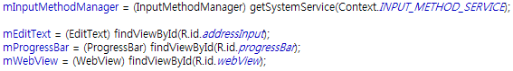

코드보기

```java
mInputMethodManager = (InputMethodManager) getSystemService(Context.INPUT_METHOD_SERVICE);

mEditText = (EditText) findViewById(R.id.addressInput);
mProgressBar = (ProgressBar) findViewById(R.id.progressBar);
mWebView = (WebView) findViewById(R.id.webView);
```

첫번째 줄을 보시면 InputMethodManager가 처음 나왔는데요 이것을 사용하는 이유는 이동할 주소를 입력한뒤 이동 버튼을 누르면

키보드가 숨겨져야 하죠? 그래서 InputMethodManager를 사용합니다

이제 WebSettings에 대해 설명할 차례가 왔습니다

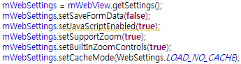

코드보기

```java
mWebSettings = mWebView.getSettings();

mWebSettings.setSaveFormData(false);
mWebSettings.setJavaScriptEnabled(true);
mWebSettings.setSupportZoom(true);
mWebSettings.setBuiltInZoomControls(true);
mWebSettings.setCacheMode(WebSettings.LOAD_NO_CACHE);
```

첫번째 줄이 WebView의 설정을 불러오는 부분입니다

3번째 라인은 Form데이터를 저장할지 여부이며,

4번째는 java스크립트 사용여부

5~6번째는 멀티터치로 화면을 늘릴지 여부를 설정하고,

7번줄은 캐쉬 사용 모드를 나타내고 있습니다

CacheMode에는 아래중 하나가 들어갈수 있습니다

- WebSettings.LOAD\_DEFAULT
- WebSettings.LOAD\_NORMAL
- WebSettings.LOAD\_CACHE\_ELSE\_NETWORK
- WebSettings.LOAD\_NO\_CACHE
- WebSettings.LOAD\_CACHE\_ONLY

여기서 LOAD\_CACHE\_ELSE\_NETWORK에 대해 부가 설명을 하면

캐쉬를 사용할수 있는경우 기간이 만료되도 사용합니다, 사용할수 없으면 네트워크를 사용합니다

(API 원문 : Use cached resources when they are available, even if they have expired. Otherwise load resources from the network.)

이제 아래 문구를 또 넣어주세요

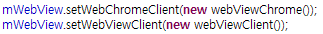

코드 보기

```java
mWebView.setWebChromeClient(new webViewChrome());
mWebView.setWebViewClient(new webViewClient());
```

그러면 new ~()부분에 빨간 밑줄이 나타날겁니다

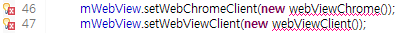

당황하지 마시고 아래의 클래스를 추가해 주면 되는데요

onCreate()아래에 추가해 주시면 됩니다

설명까지 한번에 이어서 하겠습니다

먼저 webChromeClient입니다

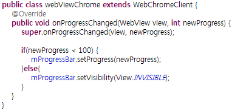

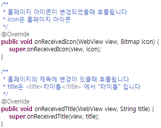

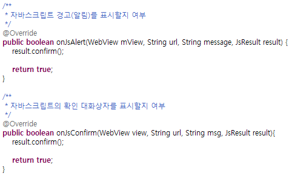

코드 보기

```java
public class webViewChrome extends WebChromeClient {
    @Override
    public void onProgressChanged(WebView view, int newProgress) {
        super.onProgressChanged(view, newProgress);

        if(newProgress < 100) {
            mProgressBar.setProgress(newProgress);
        }else{
            mProgressBar.setVisibility(View.INVISIBLE);
        }
    }
}
```

이 onProgressChanged()메소드는 페이지를 로딩할때, 프로그래스가 달라질때마다 호출됩니다

그러므로 ProgressBar를 설정하는 부분을 이곳에 넣어주면 됩니다~

onReceivedIcon()는 웹페이지의 아이콘이 변경될때마다 호출되는데요


이게 아이콘 입니다

onReceivedTitle()는 웹페이지의 제목이 변경될때마다,

onJsAlert()와 onJsConfirm()는 자바스크립트 알림/경고를 표시할지 여부를 설정해줍니

아래는 webViewClient입니다

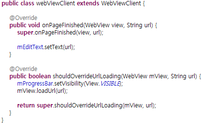

코드 보기

```java
public class webViewClient extends WebViewClient {

    @Override
    public void onPageFinished(WebView view, String url) {
        super.onPageFinished(view, url);

        mEditText.setText(url);
     }

    @Override
    public boolean shouldOverrideUrlLoading(WebView mView, String url) {
        mProgressBar.setVisibility(View.VISIBLE);
        mView.loadUrl(url);

        return super.shouldOverrideUrlLoading(mView, url);
    }
}
```

위에 있는 4번째 줄의 onPageFinished()는 페이지 로딩이 끝났을때 호출됩니다

아래 shouldOverriedUrlLoading()메소드는 한 페이지에서 다른 페이지로 넘어갈때 호출되므로

13줄의 loadUrl()을 통해 페이지를 이동합니다

여기까지 하셨다면 아까 빨간줄은 없어졌을겁니다

이제 마지막으로 onCreate()의 맨 마지막에 아래 문구만 추가해 주면 끝입니다

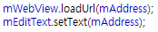

코드 보기

```java
mWebView.loadUrl(mAddress);
mEditText.setText(mAddress);
```

이제 Layout에서 버튼을 누르면 할 작업을 만들어 줘야 되요~

onClick에서 GoButton으로 했기 때문에 GoButton이라는 메소드를 만들어 줍시다

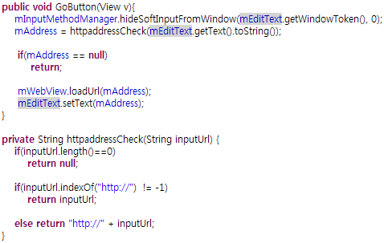

코드 보기

```java
public void GoButton(View v){
    mInputMethodManager.hideSoftInputFromWindow(mEditText.getWindowToken(), 0);
    mAddress = httpaddressCheck(mEditText.getText().toString());

    if(mAddress == null)
        return;

    mWebView.loadUrl(mAddress);
    mEditText.setText(mAddress);
}

private String httpaddressCheck(String inputUrl) {
    if(inputUrl.length()==0)
        return null;

    if(inputUrl.indexOf("http://")  != -1)
        return inputUrl;

    else return "http://" + inputUrl;
}
```

2번째 줄에서버튼을 누르면 일단 키보드를 숨겨줍니다

그다음에 httpaddressCheck()라는 메소드를 호출하는데요

이 메소드는 "http://"라는 글자가 주소에 없을경우 추가해주는 메소드입니다

8번 라인에서 입력한 주소로 이동하는 모습을 볼수 있어요

마지막으로 뒤로가기 키를 누르면 이전 페이지로 가는 코드를 넣어줍시다

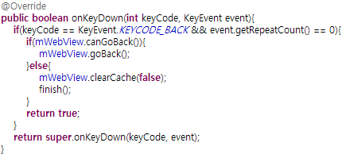

코드 보기

```java
@Override
public boolean onKeyDown(int keyCode, KeyEvent event){
    if(keyCode == KeyEvent.KEYCODE_BACK && event.getRepeatCount() == 0){
        if(mWebView.canGoBack()){
            mWebView.goBack();
        }else{
            mWebView.clearCache(false);
            finish();
        }
        return true;
    }
    return super.onKeyDown(keyCode, event);
}
```

4번줄의 canGoBack()은 이전 페이지가 있으면 true, 없으면 false를 반환합니다

뒤로 갈수 있는 페이지가 있으면 goBack()을 통해 이전페이지로 이동하고,

없으면 어플을 종료합니다

어플 스크린샷은 아래와 같습니다

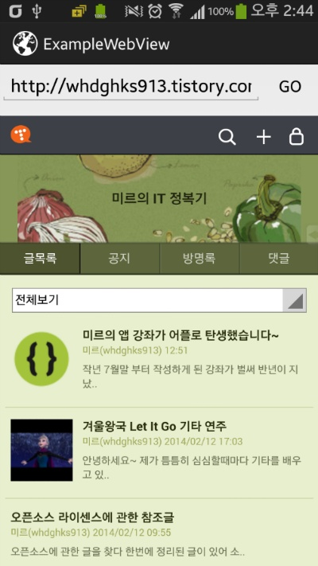

이렇게 해서 기본적인 웹뷰 사용법을 알아봤습니다

더 많은 API는 기회가 되면 알아보도록 하겠습니다

MainActivity.java

package lee.whdghks913.examplewebview;

import android.app.Activity;

import android.content.Context;

import android.graphics.Bitmap;

import android.os.Bundle;

import android.view.KeyEvent;

import android.view.View;

import android.view.inputmethod.InputMethodManager;

import android.webkit.JsResult;

import android.webkit.WebChromeClient;

import android.webkit.WebSettings;

import android.webkit.WebView;

import android.webkit.WebViewClient;

import android.widget.EditText;

import android.widget.ProgressBar;

public class MainActivity extends Activity {

    private String mAddress = "http://itmir.tistory.com/";

    private WebView mWebView;

    private WebSettings mWebSettings;

    private EditText mEditText;

    private ProgressBar mProgressBar;

    private InputMethodManager mInputMethodManager;

    @Override

    protected void onCreate(Bundle savedInstanceState) {

        super.onCreate(savedInstanceState);

        setContentView(R.layout.activity\_main);

        mInputMethodManager = (InputMethodManager) getSystemService(Context.INPUT\_METHOD\_SERVICE);

        mEditText = (EditText) findViewById(R.id.addressInput);

        mProgressBar = (ProgressBar) findViewById(R.id.progressBar);

        mWebView = (WebView) findViewById(R.id.webView);

        mWebSettings = mWebView.getSettings();

        // setSavePassword(false)는 이제 사라질 API이기 때문에 사용하지 않습니다

//        mWebSettings.setSavePassword(false);

//        mWebSettings.setAppCacheMaxSize(10000);

        mWebSettings.setSaveFormData(false);

        mWebSettings.setJavaScriptEnabled(true);

        mWebSettings.setSupportZoom(true);

        mWebSettings.setBuiltInZoomControls(true);

        mWebSettings.setCacheMode(WebSettings.LOAD\_NO\_CACHE);

        mWebView.setWebChromeClient(new webViewChrome());

        mWebView.setWebViewClient(new webViewClient());

        mWebView.loadUrl(mAddress);

        mEditText.setText(mAddress);

    }

    public void GoButton(View v){

        mInputMethodManager.hideSoftInputFromWindow(mEditText.getWindowToken(), 0);

        mAddress = httpaddressCheck(mEditText.getText().toString());

         if(mAddress == null)

             return;

         mWebView.loadUrl(mAddress);

         mEditText.setText(mAddress);

    }

    private String httpaddressCheck(String inputUrl) {

        if(inputUrl.length()==0)

            return null;

        if(inputUrl.indexOf("http://")  != -1)

            return inputUrl;

        else return "http://" + inputUrl;

    }

    public class webViewChrome extends WebChromeClient {

        @Override

        public void onProgressChanged(WebView view, int newProgress) {

            super.onProgressChanged(view, newProgress);

            if(newProgress < 100) {

                mProgressBar.setProgress(newProgress);

            }else{

                mProgressBar.setVisibility(View.INVISIBLE);

            }

        }

        /\*\*

         \* 홈페이지 아이콘이 변경되었을때 호출됩니다

         \* icon은 홈페이지 아이콘

         \*/

        @Override

        public void onReceivedIcon(WebView view, Bitmap icon) {

        super.onReceivedIcon(view, icon);

        }

        /\*\*

         \* 홈페이지의 제목에 변경이 있을때 호출됩니다

         \* title은 <title>타이틀</title> 에서 "타이틀" 입니다

         \*/

        @Override

        public void onReceivedTitle(WebView view, String title) {

        super.onReceivedTitle(view, title);

        }

        /\*\*

         \* 자바스크립트 경고(알림)를 표시할지 여부

         \*/

        @Override

        public boolean onJsAlert(WebView mView, String url, String message, JsResult result) {

        result.confirm();

        return true;

        }

        /\*\*

         \* 자바스크립트의 확인 대화상자를 표시할지 여부

         \*/

        @Override

        public boolean onJsConfirm(WebView view, String url, String msg, JsResult result){

        result.confirm();

        return true;

        }

    }

    public class webViewClient extends WebViewClient {

        @Override

        public void onPageFinished(WebView view, String url) {

            super.onPageFinished(view, url);

            mEditText.setText(url);

        }

        @Override

        public boolean shouldOverrideUrlLoading(WebView mView, String url) {

            mProgressBar.setVisibility(View.VISIBLE);

            mView.loadUrl(url);

            return super.shouldOverrideUrlLoading(mView, url);

        }

    }

    @Override

    public boolean onKeyDown(int keyCode, KeyEvent event){

        if(keyCode == KeyEvent.KEYCODE\_BACK && event.getRepeatCount() == 0){

            if(mWebView.canGoBack()){

                mWebView.goBack();

            }else{

                mWebView.clearCache(false);

                finish();

            }

            return true;

        }

        return super.onKeyDown(keyCode, event);

    }

}

[ExampleWebView.zip](https://github.com/itmir913/archive/releases/download/itmir-attachments/ExampleWebView.zip)

---

## 첨부파일

- [ExampleWebView.zip](https://github.com/itmir913/archive/releases/download/itmir-attachments/ExampleWebView.zip) `584 KB`
