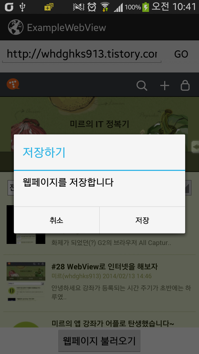
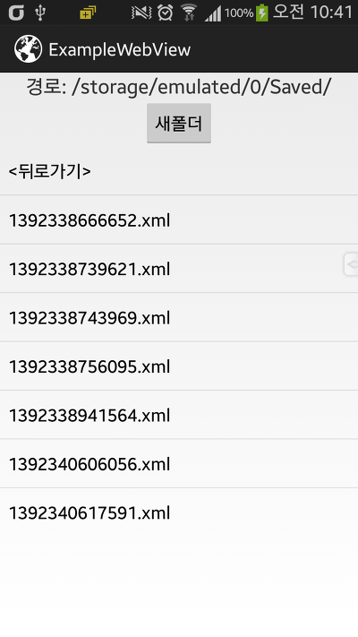

허니콤 이상부터 추가된 WebView의 API중 saveArchive(String)이라는 API가 있습니다

이것은 웹페이지를 저장하는 것으로, 이미지까지 그대로 저장이 가능합니다

(PC의 다른 이름으로 저장과 같다고 이해하시면 됩니다)

그런대 찾아보니 저장하는 방법은 매우 쉬운대 반면 불러들이는 방법이 까다롭고, 자료가 없더라고요

구글링 결과 github에 프로젝트가 있었습니다...+\_+

(1) [https://github.com/gregko/WebArchiveReader/blob/master/src/com/hyperionics/war\_test/WebArchiveReader.java](https://github.com/gregko/WebArchiveReader)  
(2) <https://github.com/dotcool/coolreader/blob/master/src/com/dotcool/reader/helper/WebArchiveReader.java>

(3) <https://github.com/Fengrui/WebView/blob/master/webview/src/com/example/webview/WebArchiveReader.java>

(4) <https://github.com/jcschwartz23/OBD/blob/master/obd-reader/src/eu/lighthouselabs/obd/reader/activity/WebArchiveReader.java>

(5) <https://github.com/Fengrui/Twimight/blob/master/twimight_extended/twimight/src/ch/ethz/twimight/net/Html/WebArchiveReader.java>

이중 (1)번 프로젝트를 사용하였습니다

README를 보면

Hope this is helpful, enjoy!

소스코드에는

License: public domain.

으로 공개 오픈소스 임을 알수 있었습니다

(1)에는 icn이라는 라이브러리가 사용되지만, 없어도 문제가 발생하지 않는것 같아 라이브러리를 제거하였습니다

그래서 이 프로젝트를 조금 수정하여 사용자가 사용하기 편하도록 jar 라이브러리화 했습니다

---

Jar Library

[WebArchiveReader.jar

다운로드](./file/WebArchiveReader.jar)

jar파일은 라이브러리 파일이며, zip은 소스파일 입니다

예제 소스와 함께 git을 올려두었으니 참고해 주세요

<https://github.com/itmir913/webarchivereader>

jar파일만 받으신후 프로젝트/libs에 넣어주세요

-사용방법

(1) WebArchiveReader mWebReader = new WebArchiveReader(mWebView, mWebViewClient);

   - mWebView : 선언한 WebView를 입력하세요

   - mWebViewClient : 선언한 WebViewClient를 입력하세요

(3-1) mWebReader.loadArchive(mFilePath, String defaultUrl);

   - mFilePath : 저장되어 있는 파일의 위치를 입력하세요

     ex)"/sdcard/", 마지막에 "/"을 꼭 붙혀야 합니다

   - defaultUrl : 저장된 파일이 없을경우 로딩될 기본 사이트입니다

(3-2) mWebReader.saveArchive(String FilePath, String FileName);

   - FilePath : 저장할 파일 위치입니다, 마지막에 "/"을 꼭 붙혀야 합니다

   - FileName : 저장할 파일의 이름입니다

(4) Boolean result = mWebReader.saveArchive();

    if(result)

        Toast.makeText(MainActivity.this, "Saved OK", Toast.LENGTH\_SHORT).show();

   - result : 저장이 성공되어 파일이 존재할경우 true를 반환합니다

---

예제 어플 소스

[ExampleWebArchiveReader.apk

다운로드](./file/ExampleWebArchiveReader.apk)

[ExampleWebArchiveReader.zip

다운로드](./file/ExampleWebArchiveReader.zip)

WebArchiveReader 라이브러리를 이용한 예제 어플입니다

WebView예제에 WebArchiveReader저장 기능을 추가했으며, 파일 리스트 예제를 사용해 불러오기 기능을 구현하였습니다

    

WebView를 꾹 누르면 알림이 나타나며, 저장완료후 토스트 알림이 나타납니다

그럼 이만~~

---

## 첨부파일

- [ExampleWebArchiveReader.apk](https://github.com/itmir913/archive/releases/download/itmir-attachments/ExampleWebArchiveReader.apk) `258 KB`
- [ExampleWebArchiveReader.zip](https://github.com/itmir913/archive/releases/download/itmir-attachments/ExampleWebArchiveReader.zip) `624 KB`
- [WebArchiveReader.jar](https://github.com/itmir913/archive/releases/download/itmir-attachments/WebArchiveReader.jar) `6 KB`
