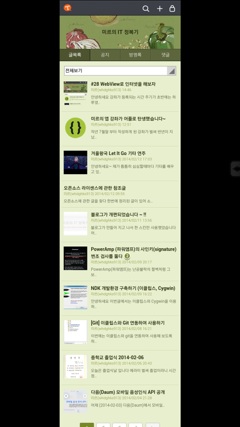

화제가 되었던(?) G2의 브라우저 All Capture기능에 대해 아십니까?

전체 화면 캡쳐로, 스크롤 해야 하는 부분까지 한번에 캡쳐할수 있는 기능입니다

이 기능을 내 WebView에 추가하고 싶다면 이글을 주의깊게 봐주세요

WebView의 전체화면 캡쳐 기능을 Jar 라이브러리로 만들었습니다

이름은 WebViewAllCapture입니다~

현재 WebView의 상태를 저장하는 방법에는 두가지가 있습니다

하나는 허니콤에서 추가된 saveArchive()를 이용하는 방법과

나머지는 이 전체화면 캡쳐 입니다

전자와 후자 모두 필자가 직접 라이브러리화 해서 만든것이 있습니다만

saveArchive()를 불러오는 부분이 제가 짠게 아니라 github에서 프로젝트를 가져와서 튜닝한거라서 조금 더 다듬은다음

라이센스 문제가 없는지 확인후 배포하도록 하겠습니다

---

**라이브러리**

[WebViewAllCapture.jar](https://github.com/itmir913/archive/releases/download/itmir-attachments/WebViewAllCapture.jar)

2014-02-13 : v1 첫 릴리즈

먼저 스크린샷을 저장할때 sdcard를 사용하므로 퍼미션을주어야 합니다

<uses-permission android:name="android.permission.WRITE\_EXTERNAL\_STORAGE" />

이 라이브러리의 사용방법은 아래와 같습니다

WebViewAllCapture mAllCapture = new WebViewAllCapture();

먼저 new를 해주신다음에 아래 코드로 캡쳐합니다

mAllCapture.onWebViewAllCapture(mWebView, mFilePath, mScreenShotName)

또는

mAllCapture.onWebViewAllCapture(mWebView, mFilePath, mScreenShotName, mFormat)

- mWebView : 캡쳐할 화면이 나타나있는 WebView입니다
- mFilePath : 스크린샷 파일이 저장될 위치를 String으로 입력하시면 되며, 마지막에 "/"을 꼭 붙혀야 합니다 ex) "/sdcard/"
- mScreenShotName : 스크린샷 파일의 이름을 입력하시면 되며, 이때 확장자 까지 넣어주셔야 합니다
- mFormat : 캡쳐 파일의 확장자를 따로 지정할때 사용합니다 (기본값은 PNG입니다)

위 두개의 메소드의 차이는 mFormat의 유무입니다

위 메소드를 사용하셔도 캡쳐에 전혀 지장이 없으며 파일 포멧은 PNG파일로 나옵니다

만약 PNG확장자가 아닌 다른 확장자로 내보내고 싶으시다면 mFormat을 사용해 주시면 되는대요

들어갈수 있는 것은 아래와 같습니다

- CompressFormat.PNG : PNG포멧
- CompressFormat.JPEG : JPG 포멧
- CompressFormat.WEBP : WEBP 포멧

onWebViewAllCapture() 메소드를 실행하면 마지막에 스크린샷 파일의 존재 여부를 파악해서 boolean으로 리턴해 줍니다

Boolean result = mAllCapture.onWebViewAllCapture()

이렇게 result값을 받아와서 파일이 존재하는지 여부를 파악할수 있습니다

---

**어플 예제 소스**

[ExampleWebViewAllCapture.zip](https://github.com/itmir913/archive/releases/download/itmir-attachments/ExampleWebViewAllCapture.zip)

[ExampleWebViewAllCapture.apk](https://github.com/itmir913/archive/releases/download/itmir-attachments/ExampleWebViewAllCapture.apk)

저번에 배운 WebView예제에 전체화면 캡쳐 소스를 추가한 소스입니다

아무 화면을 꾹 누르면 전체화면이 캡쳐되도록 코드를 작성하였습니다

정상적으로 저장되면 아래 스크린샷 처럼 사진이 저장됩니다

이 예제와 WebView예제는 전체화면 캡쳐외 차이가 없습니다

ps. 아 API만드는것보다 소개하는게 시간이 더 걸리고 더 힘드네요..

누군가 꼭 유용하게 사용하셨으면 합니다~

---

## 첨부파일

- [ExampleWebViewAllCapture.apk](https://github.com/itmir913/archive/releases/download/itmir-attachments/ExampleWebViewAllCapture.apk) `250 KB`
- [ExampleWebViewAllCapture.zip](https://github.com/itmir913/archive/releases/download/itmir-attachments/ExampleWebViewAllCapture.zip) `691 KB`
- [WebViewAllCapture.jar](https://github.com/itmir913/archive/releases/download/itmir-attachments/WebViewAllCapture.jar) `2 KB`
