안녕하세요.

이강좌가 고등학교에 등교하기전 2월에 쓰는 마지막 강좌가 될것 같습니다.

벌써 29번째 강좌입니다.

이번에는 그동안 배우지 못했던 리스트뷰에 대해 알아보겠습니다.

이 강좌에서 배우는 리스트뷰는 커스텀한 리스트뷰이며, 단지 Text만 표시하려면 이 복잡한 방법을 사용하지 않아도 됩니다.

## 29. 커스텀 리스트뷰 (Custom ListView) - View Holder

### 29-1 리스트뷰(ListView)의 중요성

강좌를 시작하기 전에 이번에 배우는 리스트뷰의 중요성에 대해 알아보겠습니다.

리스트뷰는 매우매우 중요합니다..!

루트 익스플로러 같은 파일 탐색기 앱에, 메세지 목록을 표시해야 하는 SMS앱, 설치된 어플 목록을 표시할때 등

대부분의 앱에서 한번씩 사용되는 정말 유용하고, 중요한 뷰입니다.

그런대 왜 28번의 강좌동안 이 리스트뷰에 대해 배우지 않았고, 언급이 없었냐...

일단 리스트뷰가 매우 중요하지만 이걸 한번에 이해하시는 분은 없을겁니다.

그리고 먼저 제가 이 리스트뷰를 이해하지 못하고 있었기 때문이라고도 변명할수 있겠습니다...;

아무튼 이번 강좌는 눈으로 대충 본다 라고 생각하시는것이 정신건강에 매우 도움이 될것입니다.

### 29-2 리스트뷰란?

29-1에서는 리스트뷰가 이해하기 조금 어렵다고 설명하였습니다.

왜 리스트뷰를 이해하기 어려울까요?

그건 리스트뷰는 일반 위젯(TextView등)이 아니라 선택 위젯이기 때문이며,

선택 위젯은 직접 데이터를 설정할수가 없습니다.

Adapter(어댑터)라는 패턴을 사용해야 하고, 이 어댑터에서 만들어주는 뷰(getView())를 이용해 아이템을 표시합니다.

아래는 일반 위젯의 대표적인 TextView와 선택위젯의 ListView의 데이터 설정 방법을 비교한 그림입니다.

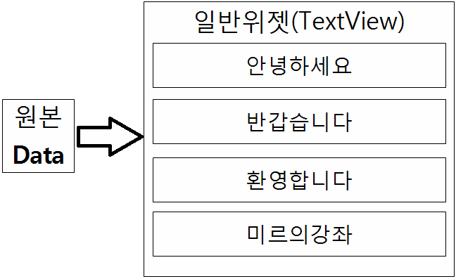

(일반 위젯의 데이터 설정방법 - setText()등 데이터를 직접 설정할수 있다.)

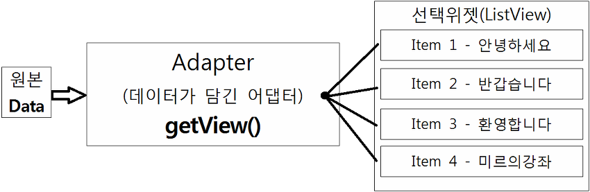

(선택 위젯의 데이터 설정방법 - 직접 설정이 불가능 하고 데이터가 담긴 Adapter를 이용한다.)

이해가 되셨나요?

ListView를 이해하려면 먼저 이 Adapter를 이해해야만 합니다.

한마디로 리스트뷰는 어댑터를 사용하여 데이터를 표시하는 View입니다.

### 29-3 레이아웃

29-1과 29-2에서 리스트뷰는 어뎁터를 이용하여 아이템을 표시한다 라고 배웠습니다.

따라서 리스트뷰는 다른 뷰와는 달리 "한 아이템을 표시할 layout이 따로 필요합니다."

먼저 메인 레이아웃에는 ListView만 넣어주면 됩니다.

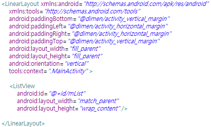

코드 보기

```xml
<LinearLayout xmlns:android="http://schemas.android.com/apk/res/android"
    xmlns:tools="http://schemas.android.com/tools"
    android:paddingBottom="@dimen/activity_vertical_margin"
    android:paddingLeft="@dimen/activity_horizontal_margin"
    android:paddingRight="@dimen/activity_horizontal_margin"
    android:paddingTop="@dimen/activity_vertical_margin"
    android:layout_width="fill_parent"
    android:layout_height="fill_parent"
    android:orientation="vertical"
    tools:context=".MainActivity" >

    <ListView
        android:id="@+id/mList"
        android:layout_width="match_parent"
        android:layout_height="wrap_content" />

</LinearLayout>
```

이제 리스트뷰의 한 아이템에 표시될 레이아웃을 정의해야 합니다.

이 레이아웃 파일의 이름은 listview\_item.xml으로 합시다.

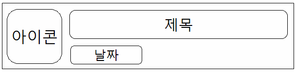

이렇게 리스트뷰의 한 아이템에는 위 그림처럼 정보가 배열될것입니다.

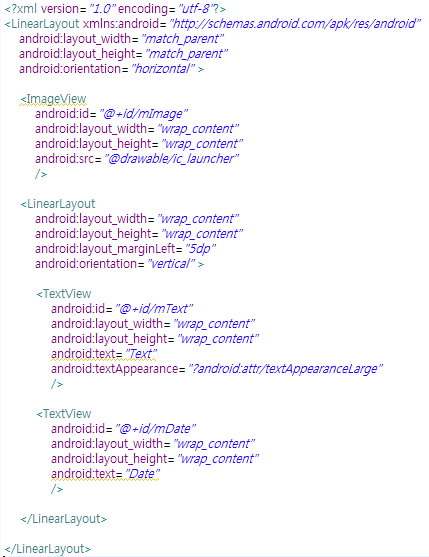

코드보기

```xml
<?xml version="1.0" encoding="utf-8"?>
<LinearLayout xmlns:android="http://schemas.android.com/apk/res/android"
    android:layout_width="match_parent"
    android:layout_height="match_parent"
    android:orientation="horizontal" >

    <ImageView
        android:id="@+id/mImage"
        android:layout_width="wrap_content"
        android:layout_height="wrap_content"
        android:src="@drawable/ic_launcher"
        />

    <LinearLayout
        android:layout_width="wrap_content"
        android:layout_height="wrap_content"
        android:layout_marginLeft="5dp"
        android:orientation="vertical" >

        <TextView
            android:id="@+id/mText"
            android:layout_width="wrap_content"
            android:layout_height="wrap_content"
            android:text="Text"
            android:textAppearance="?android:attr/textAppearanceLarge"
            />

        <TextView
            android:id="@+id/mDate"
            android:layout_width="wrap_content"
            android:layout_height="wrap_content"
            android:text="Date"
            />

    </LinearLayout>

</LinearLayout>
```

### 29-4 MainActivity

먼저 처음에 아래를 추가해 주세요.

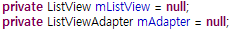

코드 보기

```java
private ListView mListView = null;
private ListViewAdapter mAdapter = null;
```

그럼 ListViewAdapter에 빨간 줄이 생길겁니다.

당황하지 마시고 아직 Adapter class를 작성하지 않아서 생긴 문제이므로 넘어가 주세요.

그다음에 ViewHolder라는 class를 작성해 봅시다.

onCreate()아래에 추가해 주세요.

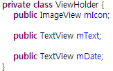

코드 보기

```java
private class ViewHolder {
    public ImageView mIcon;

    public TextView mText;

    public TextView mDate;
}
```

설명은 아래에서 이어서 하겠습니다.

이제는 어댑터를 작성해 봅시다.

어댑터를 통해 리스트뷰의 한 아이템에 표시될 정보를 설정할수 있습니다.

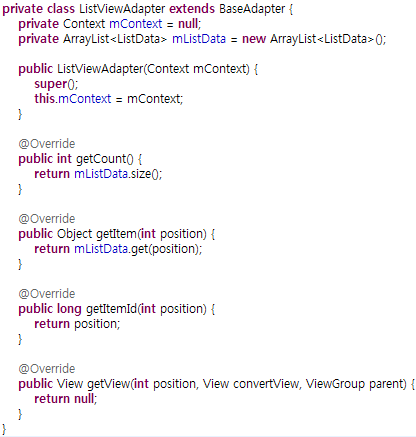

코드 보기

```java
private class ListViewAdapter extends BaseAdapter {
    private Context mContext = null;
    private ArrayList<ListData> mListData = new ArrayList<ListData>();

    public ListViewAdapter(Context mContext) {
        super();
        this.mContext = mContext;
    }

    @Override
    public int getCount() {
        return mListData.size();
    }

    @Override
    public Object getItem(int position) {
        return mListData.get(position);
    }

    @Override
    public long getItemId(int position) {
        return position;
    }

    @Override
    public View getView(int position, View convertView, ViewGroup parent) {
        return null;
    }
}
```

위 코드가 어뎁터 class의 기본 뼈대입니다.

이제 이 뼈대를 가지고 살을 체워나가야 합니다.

위 소스도 아래 부분에서 빨간줄이 있을겁니다.

private ArrayList<**ListData**> mListData = new ArrayList<**ListData**>();

ListData에 빨간 줄이 그어 있을탠데요.

이것도 class를 만들지 않아서 생긴 오류입니다.

먼저 Class를 하나 만들어 봅시다.

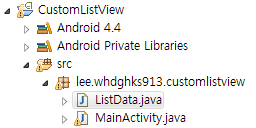

이렇게 ListData.java라는 파일을 만들어주세요.

이 파일의 내용은 아래와 같습니다.

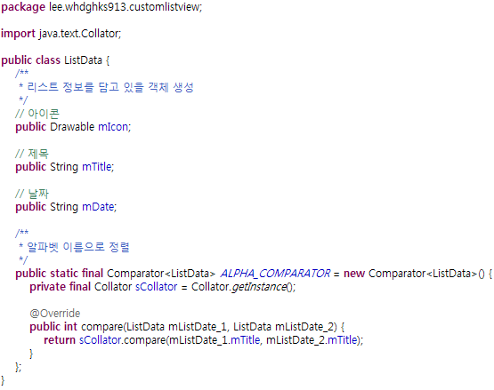

코드 보기

```java
package lee.whdghks913.customlistview;

import java.text.Collator;
import java.util.Comparator;

import android.graphics.drawable.Drawable;

public class ListData {
    /**
     * 리스트 정보를 담고 있을 객체 생성
     */
    // 아이콘
    public Drawable mIcon;
    
    // 제목
    public String mTitle;
    
    // 날짜
    public String mDate;
    
    /**
     * 알파벳 이름으로 정렬
     */
    public static final Comparator<ListData> ALPHA_COMPARATOR = new Comparator<ListData>() {
        private final Collator sCollator = Collator.getInstance();
        
        @Override
        public int compare(ListData mListDate_1, ListData mListDate_2) {
            return sCollator.compare(mListDate_1.mTitle, mListDate_2.mTitle);
        }
    };
}
```

한 아이템의 정보를 담고 있을 java파일을 만들었습니다.

아래에 있는 ALPHA\_COMPARATOR는 리스트뷰의 아이템을 쇼트(알파벳 순서대로 정렬)하기 위한 메소드이며, AppInfo예제를 참조했습니다.

다시 MainActivity.java로 돌아와 보면 빨간줄이 사라져 있을겁니다.

이제 getView()를 손봐줍시다.

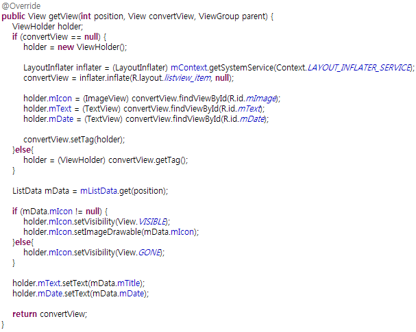

코드 보기

```java
@Override
public View getView(int position, View convertView, ViewGroup parent) {
    ViewHolder holder;
    if (convertView == null) {
        holder = new ViewHolder();

        LayoutInflater inflater = (LayoutInflater) mContext.getSystemService(Context.LAYOUT_INFLATER_SERVICE);
        convertView = inflater.inflate(R.layout.listview_item, null);

        holder.mIcon = (ImageView) convertView.findViewById(R.id.mImage);
        holder.mText = (TextView) convertView.findViewById(R.id.mText);
        holder.mDate = (TextView) convertView.findViewById(R.id.mDate);

        convertView.setTag(holder);
    }else{
        holder = (ViewHolder) convertView.getTag();
    }

    ListData mData = mListData.get(position);

    if (mData.mIcon != null) {
        holder.mIcon.setVisibility(View.VISIBLE);
        holder.mIcon.setImageDrawable(mData.mIcon);
    }else{
        holder.mIcon.setVisibility(View.GONE);
    }

    holder.mText.setText(mData.mTitle);
    holder.mDate.setText(mData.mDate);

    return convertView;
}
```

4번째 줄의 if문을 봐주세요.

getView는 한 아이템에 들어갈 레이아웃을 지정해 주는 메소드라고 배웠습니다.

넘어오는 값은 int position과 View convertView등이 있는데요.

position은 리스트뷰의 순서입니다. (아이템의 순서)

convertView는 한 아이템의 화면 인데요.

convertView가 어떻게 null이 될수 있을까요?

getView는 각각의 아이템 화면을 반환합니다.

만약 리스트가 100개 있다면 100번 반환하는데요.

사용자가 스크롤을 하면 또 getView가 사용되고, 이때 잠시 버벅일수 있습니다.

그래서 convertView가 null이면 새로 레이아웃을 생성하고, **null이 아니면 이미 만들어진 View를 재사용 하는거죠.**

아래 부분은 지금까지 제 강좌를 모두 마스터 하셨다면 이해하는대 문제가 없을거라 생각되어 생략합니다.

마지막으로 Adapter에게 필수는 아니지만 사용하면서 필요한 메소드를 추가해 봅시다.

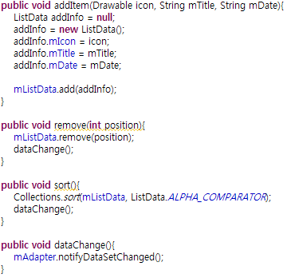

코드 보기

```java
public void addItem(Drawable icon, String mTitle, String mDate){
    ListData addInfo = null;
    addInfo = new ListData();
    addInfo.mIcon = icon;
    addInfo.mTitle = mTitle;
    addInfo.mDate = mDate;
            
    mListData.add(addInfo);
}

public void remove(int position){
    mListData.remove(position);
    dataChange();
}

public void sort(){
    Collections.sort(mListData, ListData.ALPHA_COMPARATOR);
    dataChange();
}

public void dataChange(){
    mAdapter.notifyDataSetChanged();
}
```

각각 사용처는 아래와 같습니다.

addItem() : 아이템을 추가할때 사용합니다.

remove() : 아이템을 제거합니다.

sort() : 아이템을 바르게 배열합니다.

dataChange() : 데이터를 변경한후 호출해야 합니다.

이 4개의 메소드는 다른 어플을 만들때 개발자가 편의상 만드는 기능들 입니다.

마지막으로 onCreate()메소드 안 코드를 작성합니다.

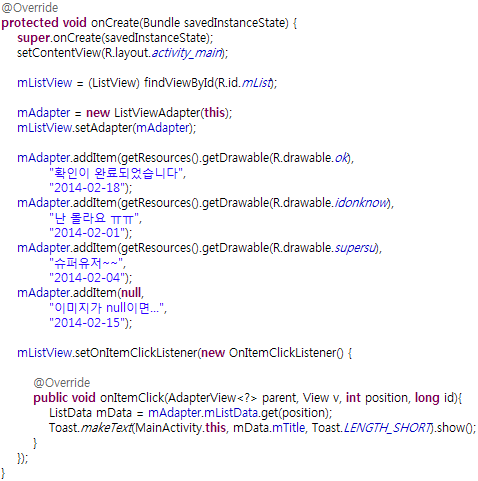

코드 보기

```java
mListView = (ListView) findViewById(R.id.mList);

mAdapter = new ListViewAdapter(this);
mListView.setAdapter(mAdapter);

mAdapter.addItem(getResources().getDrawable(R.drawable.ok),
        "확인이 완료되었습니다",
        "2014-02-18");
mAdapter.addItem(getResources().getDrawable(R.drawable.idonknow),
        "난 몰라요 ㅠㅠ",
        "2014-02-01");
mAdapter.addItem(getResources().getDrawable(R.drawable.supersu),
        "슈퍼유저~~",
        "2014-02-04");
mAdapter.addItem(null,
        "이미지가 null이면...",
        "2014-02-15");

mListView.setOnItemClickListener(new OnItemClickListener() {

    @Override
    public void onItemClick(AdapterView<?> parent, View v, int position, long id){
        ListData mData = mAdapter.mListData.get(position);
        Toast.makeText(MainActivity.this, mData.mTitle, Toast.LENGTH_SHORT).show();
    }
});
```

아까 Adapter에 추가한 addItem()메소드를 onCreate()안에서 사용하여 아이템을 추가하였습니다.

또한 리스트뷰를 터치하면 터치한 아이템의 제목이 나타나도록 하였습니다.

스크린샷을 보겠습니다.

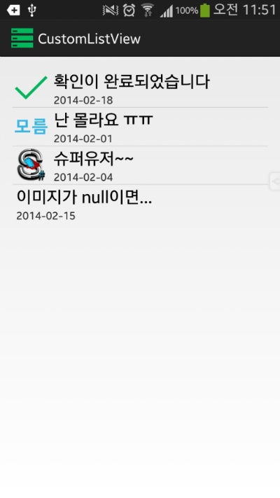
    
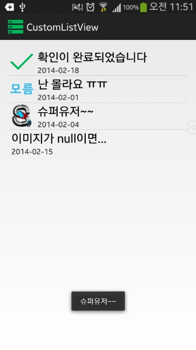

정상적으로 아이템이 나타나며, 터치할경우 제목이 나타나는것을 확인할 수 있습니다.

+ 2015-08-30 내용 보충

여기서 R.drawable.ok 부분은 이미지 파일이며, 직접 이미지를 추가하셔야 합니다.

이 강좌에서 소개한 리스트뷰의 기능은 극히 일부 입니다.

아이템을 터치하면 확장되는 리스트뷰.

스와이프로 아이템 삭제가능한 리스트뷰. - [[Development/App] - ListView에서 Swipe To Dismiss(밀어서 삭제) 사용하기](http://itmir.tistory.com/455)

삭제 취소가 가능한 리스트뷰.

CheckBox가 있어 동시선택이 가능한 리스트뷰.

등 정말 많이 응용이 가능합니다.

여러분의 입맛에 맞게 다양하게 사용하셨으면 합니다~

[CustomListView.zip

다운로드](./file/CustomListView.zip)

---

## 첨부파일

- [CustomListView.zip](https://github.com/itmir913/archive/releases/download/itmir-attachments/CustomListView.zip) `564 KB`
