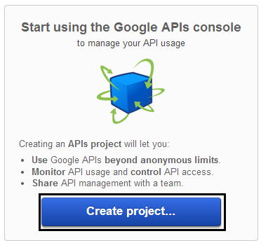
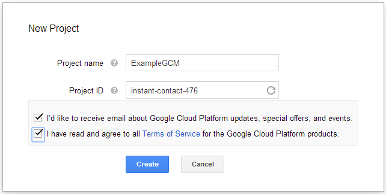
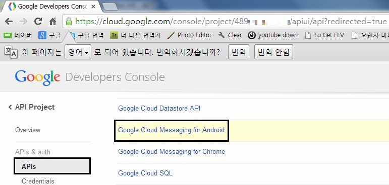
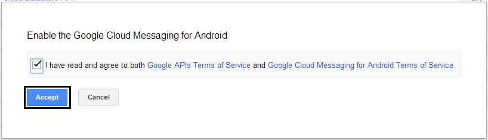
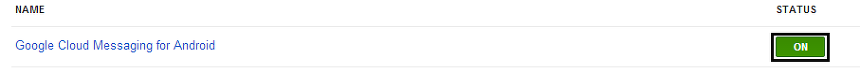
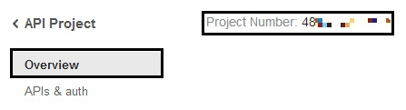
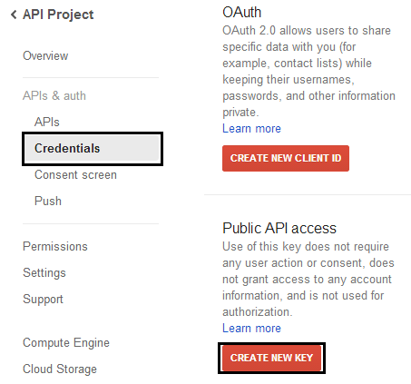
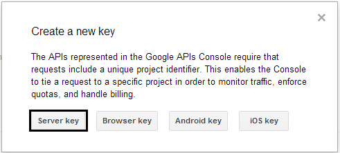
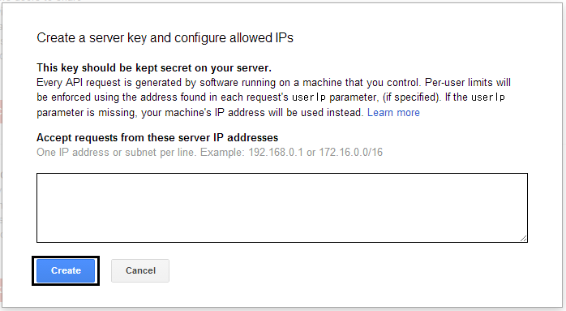
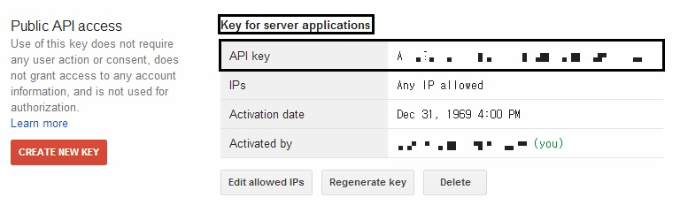

이 글에서는 GCM을 사용하는 방법과, 실제로 기기에 Push메세지를 보내는 방법을 알아보겠습니다

몇개의 큰 목차로 나눠지며, GCM를 사용하려면 구글 개발자 API를 활성화 한뒤 API Key를 발급받아야 합니다

지금부터 GCM의 매력에 빠져보도록 하겠습니다!

**1. GCM(Google Cloud Messaging)이란??**

Google Cloud Messaging, 줄여서 GCM은 구글 서버를 이용해서 "무료"로 Push알림을 보낼수 있도록 해주는 서비스 입니다

구글 2012 I/O에서 그전까지 사용한 C2DM대신 GCM을 들고 나왔습니다

그뒤 구글은 C2DM의 신규 가입을 중단하고, GCM만 사용하도록 권장하고 있습니다

참고 : <http://developer.android.com/google/gcm/index.html>

GCM이 구글 계정을 사용하고, 그 때문에 API 8 (프로요)이상부터만 사용이 가능합니다

최근에 GCM Library가 deprecate되고 Google Play Service로 통합되었습니다

이 강좌에서는 deprecate된 GCM.jar을 사용할것이고, Google Play Service를 사용한 방법은 나중에 따로 소개하겠습니다

참고 : <http://blog.hibrainapps.net/143>

그럼 아래부터 GCM을 활성화 하는 방법을 알아보겠습니다

**2. GCM 활성화 하기**

먼저 Google APIs Console에 접속후 구글 계정으로 로그인 해주세요

<https://code.google.com/apis/console/>

구글 API를 사용한 적이 없으면 아래처럼 나타납니다

Create Project를 클릭해 주세요

New Project에서 프로젝트 이름과, 프로젝트 ID를 모두 입력한뒤 Create를 눌러주시면 완료입니다

그다음 APIs & auth부분의 APIs에 접속하신다음

Google Cloud Messaging for Android를 찾아주세요

스샷이 짤렸지만 오른쪽의 OFF를 클릭해 ON으로 변경해야 합니다

약관 동의가 나오면 Accept를 눌러주세요

정상적으로 활성화된 모습입니다

이제 아래 스샷을 보시면

Overview에 접속하시면 Project Number가 있습니다

이 숫자를 메모해 두시거나 복사해 주세요

저 숫자는 **PROJECT\_ID**입니다

이제 GCM Server Key를 생성해야 합니다

APIs & auth의 Credentials에 들어가 주세요

그다음 Public API access의 Create New Key를 눌러주세요

나타나는 창에는 Server Key를 선택해 주시면 됩니다

아래 스샷은 허용할 IP를 입력하는 곳입니다

아무것도 안쓰면 모든 IP를 허용합니다

아무것도 쓰지 않고 Create를 눌러주세요

이제 Public API access를 다시 보시면 Key for server applications가 생겼을겁니다

이곳의 API Key도 따로 복사해 주세요

이 API Key는 **GOOGLE\_API\_KEY**입니다

이제 API를 활성화 하는 일이 모두 마무리 되었습니다

다음편부터는 이 API키를 가지고 실제로 GCM을 날려보도록 하겠습니다
