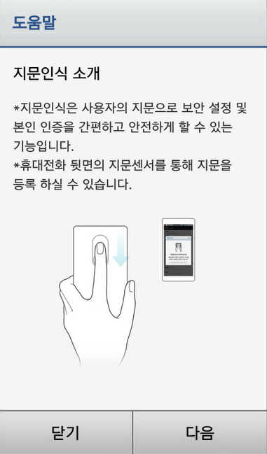
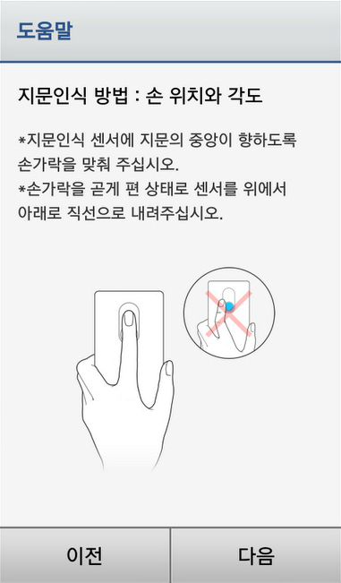
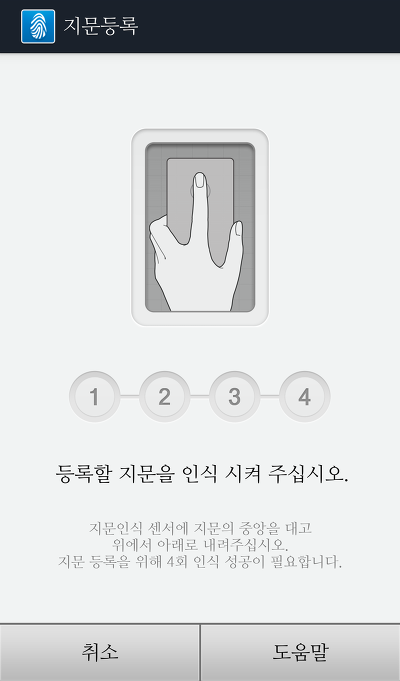
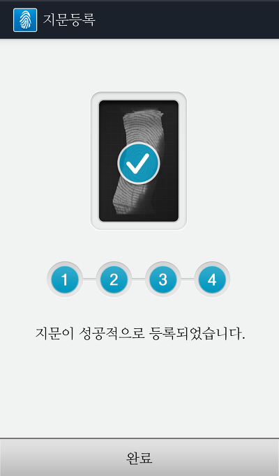
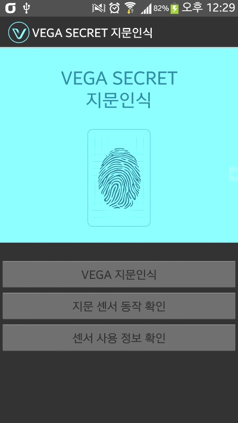
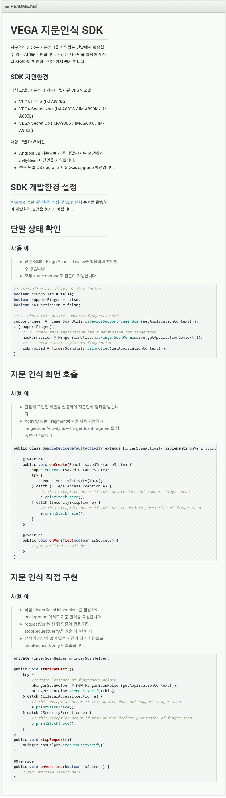

팬택에서 베가 LTE-A, 시크릿 노트, 시크릿 업 세 개의 기기에서 사용이 가능한 지문인식 SDK를 배포하였습니다

SDK는 github에 배포하였으며, 약 1시간 전에 SDK v1.0버전이 push되었습니다

<https://github.com/pantechfingerprint/PantechFingerSDK>

제가 알기로는 지문인식 관련 SDK를 배포한것은 최초라고 생각됩니다

그래서, 이번 포스팅에서는 지문인식 관련 스크린샷과, SDK에 들어있는 샘플 프로젝트에 대한 분석을 해보겠습니다

먼저 지문 인식 관련 스크린샷 입니다

    

지문인식이 탑재된 폰에서 처음에 나오는 인식 안내 화면입니다

아트릭스도 처음에 지문을 사용하려고 하면 안내 문구가 나타났던걸로 기억하네요~

    

지문 인식을 위해서는 4번의 스와이프가 필요합니다

왜 4번인지는 모르겠어요 5번도 될수도 있고 3번도 할수 있을탠대 음...

이렇게 지문인식 관련 스크린샷을 확인해 봤습니다

(항상 느끼는거지만 베가 UI의 밝은 색은 마음에 드네요 ㅋ)

이제부턴 샘플 프로젝트를 살펴보겠습니다

[SampleActivity.apk](https://github.com/itmir913/archive/releases/download/itmir-attachments/SampleActivity.apk)

[SampleFingerScan 주석.zip](https://github.com/itmir913/archive/releases/download/itmir-attachments/480-SampleFingerScan-commented.zip)

[PantechFingerSDK-master.zip](https://github.com/itmir913/archive/releases/download/itmir-attachments/PantechFingerSDK-master.zip)

apk파일은 github에서 샘플 프로젝트를 받아 직접 빌드한것이며,

SampleFingerScan 주석.zip파일은 소스의 설명을 필자가 직접 기록한것 입니다

마지막 파일은 github 프로젝트를 다운받아 첨부한 파일입니다

    

샘플 프로젝트의 실행 화면 입니다

(일부 화면이 안보여 밝기를 조절했습니다)

베가 LTE-A등 지문인식이 가능한 베가 기종 유저분들께서는 한번 테스트 해보심이 어떨가요?ㅋ

S3에서는 당연히 센서가 없기 때문에 알림이 나타납니다

팬택에서는 이 지문인식 SDK를 사용할 개발자들을 위해 README를 통해 설명하고 있습니다

아래는 github의 README를 캡쳐한 스크린샷 입니다

또한 VEGA 지문인식 SDK 설치 가이드도 제공하고 있습니다

<https://docs.google.com/document/d/1-VbIo_Bh5JpGWfXwZUunf3sG63w6Nooz-4QXdR6WHbg>

[VEGA 지문인식 SDK 설치 가이드.pdf](https://github.com/itmir913/archive/releases/download/itmir-attachments/480-VEGA-fingerprint-SDK-guide.pdf)

최초 지문인식을 적용한 아트릭스는 단지 시기가 안맞은것 뿐이라 생각합니다

이제 지문인식등의 생체 인식 기술이 적용된 스마트폰이 많이 등장했으면 좋겠고

지문인식을 이용한 어플들도 많이 생겼으면 합니다~

---

## 첨부파일

- [PantechFingerSDK-master.zip](https://github.com/itmir913/archive/releases/download/itmir-attachments/PantechFingerSDK-master.zip) `425 KB`
- [SampleActivity.apk](https://github.com/itmir913/archive/releases/download/itmir-attachments/SampleActivity.apk) `247 KB`
- [SampleFingerScan 주석.zip](https://github.com/itmir913/archive/releases/download/itmir-attachments/480-SampleFingerScan-commented.zip) `348 KB`
- [VEGA 지문인식 SDK 설치 가이드.pdf](https://github.com/itmir913/archive/releases/download/itmir-attachments/480-VEGA-fingerprint-SDK-guide.pdf) `465 KB`
